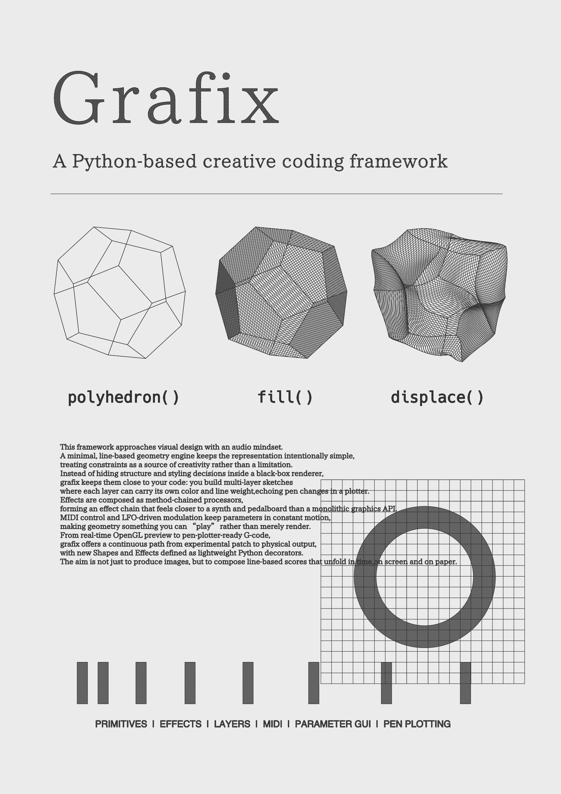

Grafix is a python-based creative coding framework compatible with pen plotter.

## Installation

Install from PyPI:

```bash
pip install grafix
```

## Quick start

```python
from grafix import E, G, run


def draw(t: float):
    poly = G.polygon()
    effect = E.fill().displace()
    return effect(poly)


if __name__ == "__main__":
    run(draw, fps=60.0, canvas_size=(800, 800), render_scale=2.0, parameter_gui=True)
```

## Basic Features

- `G` lets you generate primitives such as `sphere`, `polyhedron`, `grid`, and more.
- `E` lets you modulate primitives such as `affine`, `fill`, `repeat`, and more.
- `run` lets you render a user-defined `draw(t)` function returns on each frame.
- `L` lets you define layers. You can manage stroke colors, thickness per layer.
- `Export` provides a headless export entrypoint (SVG implemented; image/G-code are stubs).
- `Parameter GUI` lets you tweak parameters live while the sketch is running.

## Development

Dev tools (optional):

```bash
pip install -e ".[dev]"
```

Run a sketch:

```bash
python sketch/readme.py
```

## Configuration

Grafix can read a YAML config file to locate external assets (fonts) and to choose where it writes runtime outputs, .svg .png, .mp4, .gcode.

Grafix always starts from the packaged defaults (`grafix/resource/default_config.yaml`), then overlays user configs.

Config overlay order (later wins):

- packaged defaults: `grafix/resource/default_config.yaml`
- `./.grafix/config.yaml` (project-local)
- `~/.config/grafix/config.yaml` (per-user)
- `run(..., config_path="path/to/config.yaml")`

Paths support `~` and environment variables like `$HOME`.

Create a project-local config (starting from the packaged defaults):

```bash
mkdir -p .grafix
python -c "from importlib.resources import files; print(files('grafix').joinpath('resource','default_config.yaml').read_text())" > .grafix/config.yaml
$EDITOR .grafix/config.yaml
```

### Example

```yaml
# ./.grafix/config.yaml
paths:
  font_dirs:
    - "~/Fonts"
  output_dir: "./out"
```

### Keys

- `paths.font_dirs` (list of paths): searched for `G.text(font=...)` and the Parameter GUI font picker.
- `paths.output_dir` (path): base directory for auto-saved outputs (default: `data/output`).
  - Parameter GUI state: `{output_dir}/param_store/{script}.json`
  - Interactive saves: `{output_dir}/svg`, `{output_dir}/png`, `{output_dir}/video`
  - MIDI snapshots: `{output_dir}/midi`
- `ui.window_positions.draw` (2 ints): draw window position `(x, y)` in pixels.
- `ui.window_positions.parameter_gui` (2 ints): Parameter GUI window position `(x, y)` in pixels.
- `ui.parameter_gui.window_size` (2 ints): Parameter GUI window size `(width, height)` in pixels.
- `export.png.scale` (float): PNG output scale multiplier relative to `canvas_size`.

All runtime outputs are written under `paths.output_dir`.

Tip: Parameter persistence stores the selected `font` value. If you move a sketch to another machine and the font is not available, set `paths.font_dirs` (or reset state by deleting the corresponding `{output_dir}/param_store/*.json` file).

## Extending (custom primitives / effects)

You can register your own primitives and effects via decorators:

```python
from grafix.api import effect, primitive


@primitive
def user_prim(*, r=10.0):
    ...


@effect
def user_eff(inputs, *, amount=1.0):
    ...
```

Notes:

- Built-in primitives/effects must provide `meta=...` (enforced).
- For user-defined ops, `meta` is optional. If omitted, parameters are not shown in the Parameter GUI.

## Not implemented yet

- MIDI/CC input, LFOs, keyboard shortcuts, screenshot/video recording
- PNG/G-code actual file generation (export stubs currently raise `NotImplementedError`)

## Dependencies

Core (default):

- numpy
- numba
- shapely
- pyclipper
- moderngl
- pyglet
- imgui
- fontPens
- fontTools
- PyYAML
- mido
- python-rtmidi
- psutil

External:

- resvg (svg to png)
- ffmpeg (video encoding)

Dev (optional):

- pytest
- ruff
- mypy
