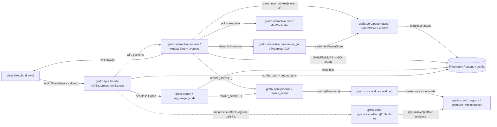
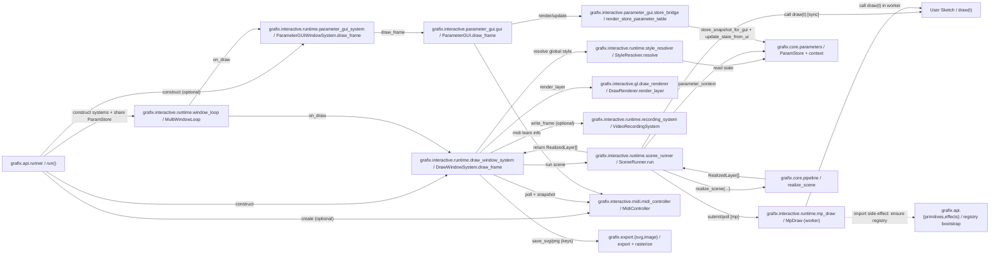

<!--
どこで: `docs/architecture_visualization.md`。
何を: `src/` 配下の実装を基に、Grafix の全体アーキテクチャを Mermaid 図で可視化する。
なぜ: 理解の入口（読める図）と、依存規約の監視（矢印と例外の固定）に使うため。
-->

# Grafix アーキテクチャ可視化（Mermaid）

## 目的

Grafix の全体アーキテクチャを、責務の分離・ディレクトリ構成・依存方向・実行時データフローの観点で、読みやすい図として可視化する。

## スコープ

- 対象: `src/` 配下の Python コード
- 除外: primitive/effect の**個別実装詳細**
  - `src/grafix/core/primitives/**` と `src/grafix/core/effects/**` の中身は追わない
  - ただし「レジストリ登録/API ファサードとしての存在（概念）」は図に載せる
- 重点: レイヤ境界（api/core/interactive/export）・依存方向・1フレームの処理フロー・ParamStore/CC の流れ

## 表記ルール（図の読み方）

- 実行時依存（呼び出し/データフロー）: `-->`
- import 副作用/登録（例外依存）: `-.->`（注釈つき）
- ノード名は原則「パッケージ名 + 役割」で表す（外部アクタ/FS は例外）

---

## 抽出した主要コンポーネント一覧（責務 + 主要 I/O）

| コンポーネント | 責務（1–2文） | 主要な入出力 |
|---|---|---|
| `grafix.api.runner / run()` | ParamStore/MIDI/GUI/描画ウィンドウを配線し、pyglet ループを起動する “実行導線”。 | In: `draw(t)`, 各種設定 → Out: ウィンドウ起動/ループ実行、ParamStore/MIDI/出力の永続化 |
| `grafix.api.primitives / G` | primitive を `Geometry` ノードとして生成するファサード。呼び出し箇所 `site_id` を安定化し、Param 解決/観測を起動する。 | In: kwargs → Out: `Geometry(op, args)` |
| `grafix.api.effects / E` | effect チェーンを `Geometry` DAG として構築するファサード。step 単位の `site_id` と `chain_id` を作り Param 観測に渡す。 | In: kwargs + input `Geometry` → Out: `Geometry` DAG |
| `grafix.api.layers / L` | `Geometry` を `Layer`（style付き）へ包む。Layer style 行の安定キー（site_id）も提供する。 | In: `Geometry`/list, style → Out: `list[Layer]` |
| `grafix.api.preset / @preset` | “公開パラメータだけ GUI に出す” ための境界。関数本体は自動 mute し、内部の `G/E` 観測を遮断する。 | In: preset 関数 args → Out: 関数戻り値（内部は mute） |
| `grafix.core.geometry / Geometry` | 不変な Geometry DAG ノード（内容署名 `id` を生成）。 | In: `op`, `inputs`, `params` → Out: `Geometry(id, ...)` |
| `grafix.core.pipeline / realize_scene` | `draw(t)` の戻り値を Layer 列へ正規化し、style を解決し、Geometry を realize して描画/出力可能な `RealizedLayer[]` を返す共通パイプライン。 | In: `draw(t)`, `t`, defaults → Out: `list[RealizedLayer]` |
| `grafix.core.realize / realize()` | Geometry を評価して `RealizedGeometry` を得る（キャッシュ+inflightで重複計算を抑制）。 | In: `Geometry` → Out: `RealizedGeometry(coords, offsets)` |
| `grafix.core.*_registry` | primitive/effect/preset の “op→関数/meta/defaults/表示情報” を集約し、文字列規約への依存を局所化する。 | In: 登録（import副作用）/参照 → Out: 実行関数や meta/defaults |
| `grafix.core.parameters / ParamStore + context` | 1フレームの snapshot を固定し、`resolve_params`/layer-style 観測結果をフレーム末尾で store にマージする。GUI・永続化・CC を統合する中核。 | In: ParamStore, cc_snapshot, FrameParamRecord → Out: snapshot/GUI 表示、永続 JSON |
| `grafix.interactive.runtime.draw_window_system / DrawWindowSystem.draw_frame()` | 1フレームの “入力→時刻→scene 実行→GL 描画→録画/書き出し” を束ねる。 | In: `ParamStore`, `MidiController`, `draw(t)` → Out: 画面描画/録画/書き出し |
| `grafix.interactive.runtime.scene_runner / SceneRunner.run()` | `parameter_context` 下で `draw(t)`（sync/mp）を実行し、`realize_scene` で `RealizedLayer[]` を得る。 | In: `t`, store, cc_snapshot → Out: `list[RealizedLayer]` |
| `grafix.interactive.parameter_gui / ParameterGUI.draw_frame()` | ParamStore を snapshot→行モデル→UI として描画し、操作結果を store に反映する。 | In: UI イベント + store → Out: 更新された store |
| `grafix.interactive.midi / MidiController` | MIDI CC を `dict[int,float] (0..1)` として供給/永続化し、Param 解決へ流す。 | In: MIDI入力 → Out: `cc_snapshot` |
| `grafix.export.*` | `RealizedLayer[]` を SVG/画像/G-code などへ書き出すヘッドレス出力。 | In: `RealizedLayer[]` → Out: ファイル |

---

## 1) C4 風 Container 図（大枠の層と依存方向）



この図はレイヤ境界（api/core/interactive/export）と依存方向を「入口」として理解するためのもの。`grafix.api` が公開導線（`run`, `Export`）と制作 DSL（`G/E/L/@preset`）を集約し、`grafix.interactive.runtime` がフレームループとサブシステムを回す。`grafix.core.pipeline` が “Scene→RealizedLayer” の共通処理を担い、`grafix.core.parameters` が ParamStore と 1フレーム境界（snapshot 固定→マージ）を担う。

破線は “import しただけでレジストリが更新される” 例外依存。built-in の primitive/effect は `grafix.api.{primitives,effects}` が該当モジュールを import することで登録され、`realize()` は registry を参照して実体評価を行う。例外依存を破線で固定することで、「どこで登録してよいか」を監視対象にできる。

**根拠（主要矢印）**

- `User Sketch → grafix.api`: `src/grafix/__init__.py:7`, `src/grafix/api/__init__.py:18`
- `grafix.api → grafix.interactive.runtime`: `src/grafix/api/__init__.py:21`, `src/grafix/api/runner.py:31`
- `grafix.interactive.runtime → User Sketch`: `src/grafix/interactive/runtime/scene_runner.py:43`
- `grafix.interactive.runtime → grafix.core.parameters`: `src/grafix/interactive/runtime/scene_runner.py:43`, `src/grafix/core/parameters/context.py:71`
- `grafix.interactive.runtime → grafix.core.pipeline`: `src/grafix/interactive/runtime/scene_runner.py:55`, `src/grafix/core/pipeline.py:38`
- `grafix.core.pipeline → grafix.core.realize`: `src/grafix/core/pipeline.py:104`, `src/grafix/core/realize.py:78`
- `grafix.core.realize → grafix.core.*_registry`: `src/grafix/core/realize.py:69`, `src/grafix/core/realize.py:74`
- `grafix.api -.-> built-ins（登録）`: `src/grafix/api/primitives.py:14`, `src/grafix/api/effects.py:15`
- `built-ins -.-> registry（登録）`: `src/grafix/core/primitive_registry.py:184`, `src/grafix/core/effect_registry.py:218`
- `GUI → ParamStore`: `src/grafix/interactive/parameter_gui/store_bridge.py:373`
- `grafix.api.Export → grafix.export → grafix.core.pipeline`: `src/grafix/api/export.py:65`, `src/grafix/api/export.py:68`

---

## 2) Component 図：core 内部（Geometry/DAG、Layer/Style、pipeline、parameters）

```mermaid
flowchart TB
    draw["User draw(t) / returns SceneItem"]

    subgraph CORE["grafix.core (components)"]
      direction TB

      subgraph PIPE["Geometry/Scene Pipeline"]
        direction TB
        pipeline["grafix.core.pipeline / realize_scene"]
        scene["grafix.core.scene / normalize_scene"]
        layer["grafix.core.layer / Layer + resolve_layer_style"]
        realize["grafix.core.realize / realize() + cache"]
        realized["grafix.core.realized_geometry / RealizedGeometry"]
        preg["grafix.core.primitive_registry / primitive_registry"]
        ereg["grafix.core.effect_registry / effect_registry"]
        builtPrim["grafix.core.primitives/* / built-in primitives"]
        builtEff["grafix.core.effects/* / built-in effects"]
      end

      subgraph PARAMS["Parameter System"]
        direction TB
        store["grafix.core.parameters.store / ParamStore"]
        pctx["grafix.core.parameters.context / parameter_context + current_*"]
        psnap["grafix.core.parameters.snapshot_ops / store_snapshot"]
        pbuf["grafix.core.parameters.frame_params / FrameParamsBuffer"]
        pres["grafix.core.parameters.resolver / resolve_params"]
        pmerge["grafix.core.parameters.merge_ops / merge_frame_params"]
        persist["grafix.core.parameters.persistence / load/save JSON"]
      end

      subgraph IO["Runtime Config / Paths"]
        direction TB
        runtimeCfg["grafix.core.runtime_config / runtime_config"]
        paths["grafix.core.output_paths / output_path_for_draw"]
      end
    end

    %% Pipeline execution
    pipeline -->|"call draw(t)"| draw
    draw -->|"SceneItem"| pipeline
    pipeline -->|"normalize_scene(scene)"| scene
    scene -->|"list[Layer]"| pipeline
    pipeline -->|"resolve_layer_style"| layer
    pipeline -->|"evaluate Layer.geometry"| realize
    realize -->|"RealizedGeometry"| realized
    realize -->|"lookup primitive op"| preg
    realize -->|"lookup effect op"| ereg

    %% Import side-effect registrations (conceptual)
    builtPrim -.->|"@primitive registers"| preg
    builtEff -.->|"@effect registers"| ereg

    %% Parameters (frame boundary)
    pctx -->|"store_snapshot(store)"| psnap
    pctx -->|"create"| pbuf
    pres -->|"read current_*"| pctx
    pres -->|"record(...)"| pbuf
    pipeline -->|"current_param_store/current_frame_params"| pctx
    pipeline -->|"record style rows (if in context)"| pbuf
    pipeline -->|"get_state / override"| store
    pctx -->|"finally: merge_frame_params"| pmerge
    pmerge -->|"mutate"| store

    %% Persistence / paths
    persist -->|"load/save"| store
    persist -->|"default path"| paths
    paths -->|"output_dir + sketch_dir"| runtimeCfg
```



この図は core を「(A) シーン→実体化のパイプライン」と「(B) Parameter System」に分割し、実行時の呼び出しとデータの受け渡しを追えるようにしたもの。`realize_scene` は interactive/export の双方から呼ばれる共通関数で、`normalize_scene` により “ユーザーの戻り値の揺れ（Geometry/Layer/ネスト列）” を吸収し、各 Layer の Geometry を `realize()` で評価して `RealizedGeometry` へ落とす。

Parameter System の中心は `parameter_context` のフレーム境界。フレーム冒頭で `store_snapshot(store)` により **読む専用 snapshot** を固定し、`resolve_params`（および Layer style 観測）が `FrameParamsBuffer` に record を積む。フレーム末尾（context の finally）で `merge_frame_params` が store を更新し、永続化/GUI 表示の基礎データ（ordinal/effect chain 等）もここで整合させる。

**根拠（主要矢印）**

- `realize_scene → draw(t)`: `src/grafix/core/pipeline.py:60`
- `realize_scene → normalize_scene`: `src/grafix/core/pipeline.py:61`, `src/grafix/core/scene.py:18`
- `realize_scene → resolve_layer_style`: `src/grafix/core/pipeline.py:67`, `src/grafix/core/layer.py:44`
- `realize_scene → current_param_store/current_frame_params`: `src/grafix/core/pipeline.py:63`, `src/grafix/core/pipeline.py:77`
- `realize_scene → realize(Geometry)`: `src/grafix/core/pipeline.py:104`, `src/grafix/core/realize.py:78`
- `realize → primitive_registry/effect_registry`: `src/grafix/core/realize.py:69`, `src/grafix/core/realize.py:74`
- `parameter_context → store_snapshot + buffer + merge`: `src/grafix/core/parameters/context.py:71`, `src/grafix/core/parameters/context.py:76`, `src/grafix/core/parameters/context.py:87`
- `resolve_params → FrameParamsBuffer.record`: `src/grafix/core/parameters/resolver.py:128`, `src/grafix/core/parameters/resolver.py:187`
- `merge_frame_params → mutate ParamStore`: `src/grafix/core/parameters/merge_ops.py:16`, `src/grafix/core/parameters/store.py:16`
- `persistence → load/save JSON`: `src/grafix/core/parameters/persistence.py:34`, `src/grafix/core/parameters/persistence.py:51`
- `output_path_for_draw → runtime_config`: `src/grafix/core/output_paths.py:66`, `src/grafix/core/runtime_config.py:139`

---

## 3) Component 図：interactive 内部（runtime / gl renderer / parameter_gui / midi）



この図は interactive を「ループ駆動（MultiWindowLoop）」「描画系（DrawWindowSystem + SceneRunner + GL）」「編集系（ParameterGUI）」「入力系（MIDI）」に分解し、実行時の結線（誰が誰を呼ぶか）を固定するためのもの。描画ウィンドウと GUI ウィンドウは同一ループで回り、同一の `ParamStore` を共有する。GUI が store を更新し、次フレーム以降の `parameter_context` 参照に反映される。

mp-draw を有効にした場合、worker は `draw(t)` を実行して “layers + 観測レコード” を返すだけで、store の更新は main 側の `parameter_context`（finally で `merge_frame_params`）に寄る。worker 側で `import grafix.api.effects/primitives` を行うのは、registry 初期化（import 副作用）という例外依存を局所化するためのブートストラップである。

**根拠（主要矢印）**

- `run → MultiWindowLoop`: `src/grafix/api/runner.py:187`, `src/grafix/interactive/runtime/window_loop.py:55`
- `MultiWindowLoop → on_draw`: `src/grafix/interactive/runtime/window_loop.py:70`
- `DrawWindowSystem → MidiController`: `src/grafix/interactive/runtime/draw_window_system.py:145`
- `DrawWindowSystem → StyleResolver`: `src/grafix/interactive/runtime/draw_window_system.py:71`, `src/grafix/interactive/runtime/draw_window_system.py:166`
- `DrawWindowSystem → SceneRunner.run`: `src/grafix/interactive/runtime/draw_window_system.py:186`, `src/grafix/interactive/runtime/scene_runner.py:31`
- `SceneRunner → parameter_context + realize_scene`: `src/grafix/interactive/runtime/scene_runner.py:43`, `src/grafix/interactive/runtime/scene_runner.py:55`
- `MpDraw worker -.-> grafix.api.*（登録ブートストラップ）`: `src/grafix/interactive/runtime/mp_draw.py:46`
- `DrawWindowSystem → DrawRenderer.render_layer`: `src/grafix/interactive/runtime/draw_window_system.py:202`, `src/grafix/interactive/gl/draw_renderer.py:52`
- `DrawWindowSystem → export_svg/rasterize`: `src/grafix/interactive/runtime/draw_window_system.py:112`, `src/grafix/interactive/runtime/draw_window_system.py:222`
- `ParameterGUI → store_snapshot_for_gui + update_state_from_ui`: `src/grafix/interactive/parameter_gui/gui.py:149`, `src/grafix/interactive/parameter_gui/store_bridge.py:373`, `src/grafix/interactive/parameter_gui/store_bridge.py:349`

---

## 4) Sequence 図：1 フレームの実行フロー（run→draw(t)→scene realize→render→param merge）

```mermaid
sequenceDiagram
    participant Sketch as User Sketch / draw(t)
    participant Run as grafix.api.runner / run
    participant Persist as grafix.core.parameters.persistence / load/save
    participant WinLoop as grafix.interactive.runtime.window_loop / MultiWindowLoop
    participant Draw as grafix.interactive.runtime.draw_window_system / DrawWindowSystem
    participant Midi as grafix.interactive.midi / MidiController
    participant StyleR as grafix.interactive.runtime.style_resolver / StyleResolver
    participant SR as grafix.interactive.runtime.scene_runner / SceneRunner
    participant Ctx as grafix.core.parameters.context / parameter_context
    participant Store as grafix.core.parameters.store / ParamStore
    participant MP as grafix.interactive.runtime.mp_draw / MpDraw
    participant Pipe as grafix.core.pipeline / realize_scene
    participant Rz as grafix.core.realize / realize
    participant GL as grafix.interactive.gl.draw_renderer / DrawRenderer
    participant GUI as grafix.interactive.parameter_gui.gui / ParameterGUI

    Sketch->>Run: run(draw, ...)
    Run->>Persist: load_param_store(path) [optional]
    Persist-->>Run: ParamStore
    Run->>WinLoop: MultiWindowLoop.run()

    Note over Ctx,Store: フレーム冒頭で snapshot を固定し<br/>フレーム末尾で record/label を store にマージ

    loop every frame
        par Draw Window
            WinLoop->>Draw: on_draw -> draw_frame()
            Draw->>Midi: poll_pending(); snapshot()
            Draw->>StyleR: resolve()
            StyleR->>Store: get_state(style keys)
            Draw->>SR: run(t, store, cc_snapshot, defaults, recording)

            SR->>Ctx: enter parameter_context(store, cc_snapshot)

            alt mp-draw enabled and not recording
                SR->>MP: submit(t, snapshot, cc_snapshot)
                MP->>Sketch: draw(t) in worker
                Sketch-->>MP: SceneItem
                MP-->>SR: layers + records + labels
                SR->>Ctx: current_frame_params().extend(records/labels)
                SR->>Pipe: realize_scene(layers, t, defaults)
            else sync
                SR->>Sketch: draw(t)
                Sketch-->>SR: SceneItem
                SR->>Pipe: realize_scene(draw_fn, t, defaults)
            end

            Pipe->>Rz: realize(Geometry) [per Layer]
            Rz-->>Pipe: RealizedGeometry
            Pipe-->>SR: RealizedLayer[]

            SR->>Ctx: exit (merge_frame_params/labels)
            SR-->>Draw: RealizedLayer[]
            Draw->>GL: render_layer(...) [per Layer]
        and Parameter GUI (optional)
            WinLoop->>GUI: on_draw -> draw_frame()
            GUI->>Store: store_snapshot_for_gui()
            GUI->>Store: update_state_from_ui(...)
        end
    end
```

このシーケンス図は “1フレーム” を単位に、`run()` がループを起動し、描画側が `draw(t)` を実行して scene を `realize_scene` へ流し込み、GL で描画し、最後に `parameter_context` が観測結果を ParamStore へマージするまでを追う。GUI は同一フレーム内で store を編集できるが、描画側の値解決はフレーム冒頭の snapshot により決定的になる。

mp-draw 有効時でも store 更新は main の `parameter_context` の finally に寄る。worker は `layers + records/labels` を返すだけで、main は `current_frame_params()` に積み直してから `merge_frame_params` を通すため、表示順・reconcile・override 追従などの仕様が 1 箇所（ops）に集約される。

**根拠（主要矢印）**

- `run → load/save ParamStore`: `src/grafix/api/runner.py:117`, `src/grafix/api/runner.py:197`, `src/grafix/core/parameters/persistence.py:34`
- `MultiWindowLoop が on_draw を駆動`: `src/grafix/interactive/runtime/window_loop.py:70`
- `DrawWindowSystem が cc_snapshot を作る`: `src/grafix/interactive/runtime/draw_window_system.py:145`, `src/grafix/interactive/runtime/draw_window_system.py:186`
- `SceneRunner が parameter_context を開始`: `src/grafix/interactive/runtime/scene_runner.py:43`, `src/grafix/core/parameters/context.py:71`
- `mp-draw が snapshot を worker に渡す`: `src/grafix/interactive/runtime/scene_runner.py:57`, `src/grafix/interactive/runtime/mp_draw.py:39`
- `mp-draw 結果を frame_params に積む`: `src/grafix/interactive/runtime/scene_runner.py:69`
- `realize_scene → realize`: `src/grafix/core/pipeline.py:104`, `src/grafix/core/realize.py:78`
- `parameter_context 終了時に merge`: `src/grafix/core/parameters/context.py:86`
- `render_layer`: `src/grafix/interactive/runtime/draw_window_system.py:202`, `src/grafix/interactive/gl/draw_renderer.py:52`
- `GUI が snapshot_for_gui + update_state_from_ui`: `src/grafix/interactive/parameter_gui/store_bridge.py:373`, `src/grafix/interactive/parameter_gui/store_bridge.py:318`

---

## アーキテクチャ規約（依存ルール）案

- `grafix.core` はヘッドレス純コアとし、`grafix.interactive`（pyglet/GL/imgui/MIDI）へ依存しない。
- `grafix.export` は `grafix.core` にのみ依存し、`grafix.interactive` へ依存しない（入力は `RealizedLayer[]`）。
- `grafix.interactive` は `grafix.core` と `grafix.export` へ依存してよいが、逆依存（core/export → interactive）は禁止。
- `grafix.api` は唯一のファサード層とし、ユーザーに必要な導線（`run`, `Export`, `G/E/L/@preset`）を集約する。GUI 依存は遅延 import で隔離する（`src/grafix/api/__init__.py:18`）。
- レジストリ登録（import 副作用）は局所化する。
  - built-in primitive/effect の import（=登録）は原則 `grafix.api.primitives` / `grafix.api.effects` にのみ置く。
  - 例外として mp-draw worker の “registry bootstrap” を許可する（`src/grafix/interactive/runtime/mp_draw.py:46`）。
- ParamStore の更新は原則 `*_ops.py` 経由に集約し、`ParamStore` の内部参照を interactive/api から直接 mutate しない（例外は `grafix.core.parameters` 内部に限定）。
