<!--
どこで: `docs/architecture_visualization.md`。
何を: 現行 `src/grafix/` の依存方向、snapshot、resource ownership、主要 flow の Mermaid 図。
なぜ: 実装を読む前に、state と変更理由の境界を視覚的に確認できるようにするため。
-->

# Grafix アーキテクチャ可視化

## 1. レイヤと依存方向

矢印は compile/runtime dependency の許可方向を表す。user sketch への callback と、decorator が
scoped registration target へ declaration を渡す流れだけはラベルで区別する。

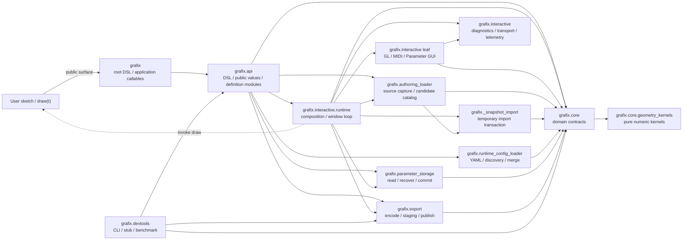
```mermaid
flowchart LR
    sketch["User sketch / draw(t)"]
    root["grafix<br/>root DSL / application callables"]
    api["grafix.api<br/>DSL / public values / definition modules"]
    core["grafix.core<br/>domain contracts"]
    kernels["grafix.core.geometry_kernels<br/>pure numeric kernels"]
    authoring["grafix.authoring_loader<br/>source capture / candidate catalog"]
    snapshot["grafix._snapshot_import<br/>temporary import transaction"]
    configio["grafix.runtime_config_loader<br/>YAML / discovery / merge"]
    paramio["grafix.parameter_storage<br/>read / recover / commit"]
    export["grafix.export<br/>encode / staging / publish"]
    runtime["grafix.interactive.runtime<br/>composition / window loop"]
    leaf["grafix.interactive leaf<br/>GL / MIDI / Parameter GUI"]
    neutral["grafix.interactive<br/>diagnostics / transport / telemetry"]
    tools["grafix.devtools<br/>CLI / stub / benchmark"]

    sketch -->|"public surface"| root
    root --> api
    api --> core
    api --> configio
    api --> paramio
    api --> authoring
    api --> runtime
    api --> export
    runtime --> core
    runtime --> paramio
    runtime --> authoring
    runtime --> snapshot
    runtime --> export
    runtime --> leaf
    runtime --> neutral
    leaf --> core
    leaf --> neutral
    core --> kernels
    authoring --> snapshot
    authoring --> core
    snapshot --> core
    configio --> core
    paramio --> core
    export --> core
    tools --> api
    tools --> core
    tools --> export
    runtime -.->|"invoke draw"| sketch
```

禁止する逆依存:

- `core -> api/export/interactive/runtime_config_loader/parameter_storage/authoring_loader`
- `export -> api/interactive`
- `interactive -> api`
- `interactive` の GL/MIDI/GUI leaf `-> interactive.runtime`
- `core -> YAML/filesystem discovery、candidate compile/exec、ParamStore filesystem mutation、subprocess/fsync/publish/output-path policy`

config authoring の filesystem capture は `grafix.authoring_loader`、config authoring/source reload が
共有する `sys.meta_path` / `sys.modules` transaction は `grafix._snapshot_import` が所有する。export の
output path helper は config discovery を行わず、composition root から `RuntimeConfig` を受け取る。

`tests/architecture/test_dependency_boundaries.py` が import と主要 private reach-through を検査する。

### 標準 namespace と core-only import

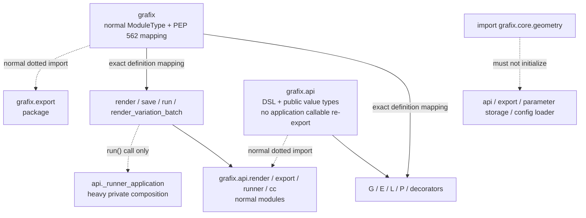
```mermaid
flowchart TB
    root["grafix<br/>normal ModuleType + PEP 562 mapping"]
    dsl["G / E / L / P / decorators"]
    calls["render / save / run / render_variation_batch"]
    exportpkg["grafix.export<br/>package"]
    apimod["grafix.api.render / export / runner / cc<br/>normal modules"]
    apipkg["grafix.api<br/>DSL + public value types<br/>no application callable re-export"]
    heavy["api._runner_application<br/>heavy private composition"]
    coreimport["import grafix.core.geometry"]
    outer["api / export / parameter storage / config loader"]

    root -->|"exact definition mapping"| dsl
    root -->|"exact definition mapping"| calls
    root -.->|"normal dotted import"| exportpkg
    apipkg --> dsl
    apipkg -.->|"normal dotted import"| apimod
    calls --> apimod
    calls -.->|"run() call only"| heavy
    coreimport -.->|"must not initialize"| outer
```

`grafix.export` は package、`grafix.api.export` は module、保存 callable は
`grafix.save` / `grafix.api.export.save` である。`grafix.api.render` は module、
`grafix.render` は callable、`grafix.api.cc` は module、`grafix.cc` は `CcView` object として意味を
分ける。custom `ModuleType`、代入 guard、callable/module の dual behavior はない。
`grafix.core` package initializer は outer capability を importしない。

## 2. Authoring から immutable catalog まで

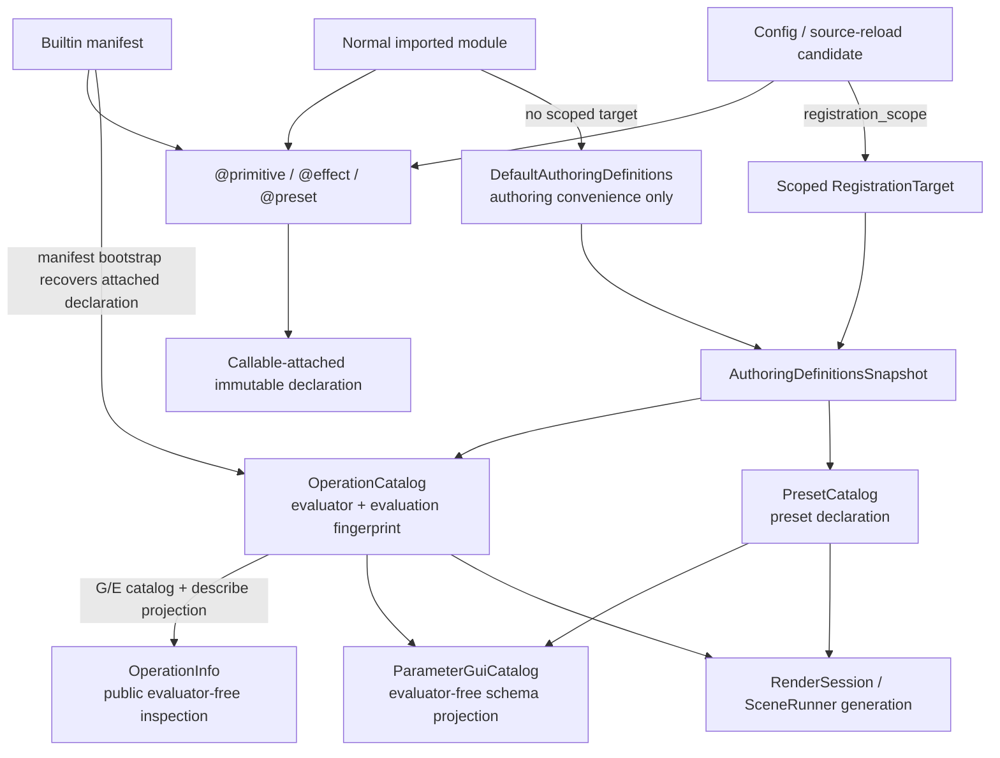
```mermaid
flowchart TB
    builtin["Builtin manifest"]
    module["Normal imported module"]
    candidate["Config / source-reload candidate"]
    decorators["@primitive / @effect / @preset"]
    attached["Callable-attached immutable declaration"]
    defaults["DefaultAuthoringDefinitions<br/>authoring convenience only"]
    target["Scoped RegistrationTarget"]
    snapshot["AuthoringDefinitionsSnapshot"]
    opcat["OperationCatalog<br/>evaluator + evaluation fingerprint"]
    info["OperationInfo<br/>public evaluator-free inspection"]
    presetcat["PresetCatalog<br/>preset declaration"]
    guicat["ParameterGuiCatalog<br/>evaluator-free schema projection"]
    session["RenderSession / SceneRunner generation"]

    builtin --> decorators
    module --> decorators
    candidate --> decorators
    decorators --> attached
    module -->|"no scoped target"| defaults
    candidate -->|"registration_scope"| target
    builtin -->|"manifest bootstrap recovers attached declaration"| opcat
    defaults --> snapshot
    target --> snapshot
    snapshot --> opcat
    snapshot --> presetcat
    opcat -->|"G/E catalog + describe projection"| info
    opcat --> guicat
    presetcat --> guicat
    opcat --> session
    presetcat --> session
```

candidate source の capability flow:

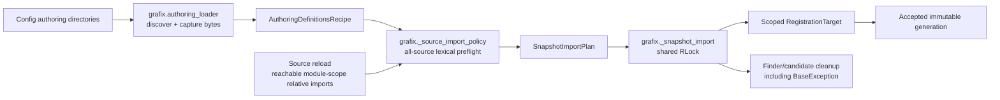
```mermaid
flowchart LR
    dirs["Config authoring directories"]
    loader["grafix.authoring_loader<br/>discover + capture bytes"]
    recipe["AuthoringDefinitionsRecipe"]
    policy["grafix._source_import_policy<br/>all-source lexical preflight"]
    reload["Source reload<br/>reachable module-scope relative imports"]
    plan["SnapshotImportPlan"]
    importer["grafix._snapshot_import<br/>shared RLock"]
    target["Scoped RegistrationTarget"]
    accepted["Accepted immutable generation"]
    cleanup["Finder/candidate cleanup<br/>including BaseException"]

    dirs --> loader --> recipe --> policy --> plan
    reload --> policy
    plan --> importer --> target --> accepted
    importer --> cleanup
```

source discovery、relative-import policy、registration、accept/rollback は caller が所有する。
`_snapshot_import` は確定済み bytes の temporary namespace/finder/module transaction だけを持つ。
config candidate は実行後に module を除去し、reload は採用中 generation だけを保持する。

`preset_module_dirs` の root は synthetic namespace であり、root `__init__.py` は実行前に拒否する。
nested package の `__init__.py` は通常 initializer として一度だけ実行する。relative import は module
直下（module 直下の `if` / `try` / `with` を含む）だけに置ける。function、async function、class の
内側は path/line/scope 付き error で、candidate を一件も実行する前に拒否する。

重要な規則:

- decorator は live evaluator registry を変更しない。
- builtin declaration は default authoring store に入らず、manifest だけが bootstrap する。
- candidate は隔離した target 内で全体を構築し、成功時だけ snapshot を採用する。
- draw の外側の `P` は default authoring preset だけを参照し、config directory を暗黙 load しない。
- session/generation は構築後に default store の変更を観測しない。
- 公開 inspection は `OperationInfo` だけを返す。evaluator/owner を持つ内部
  `OperationCatalogEntry` は公開しない。

## 3. Geometry identity と評価 cache

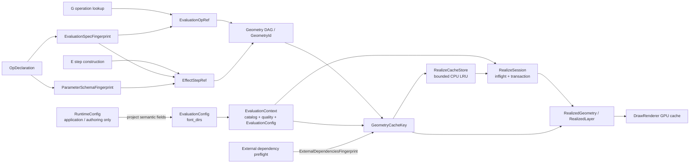
```mermaid
flowchart LR
    declaration["OpDeclaration"]
    evalfp["EvaluationSpecFingerprint"]
    schemafp["ParameterSchemaFingerprint"]
    g["G operation lookup"]
    estep["E step construction"]
    opref["EvaluationOpRef"]
    stepref["EffectStepRef"]
    dag["Geometry DAG / GeometryId"]
    runtimeconfig["RuntimeConfig<br/>application / authoring only"]
    evalconfig["EvaluationConfig<br/>font_dirs"]
    context["EvaluationContext<br/>catalog + quality + EvaluationConfig"]
    ext["External dependency preflight"]
    key["GeometryCacheKey"]
    cache["RealizeCacheStore<br/>bounded CPU LRU"]
    rs["RealizeSession<br/>inflight + transaction"]
    realized["RealizedGeometry / RealizedLayer"]
    gpu["DrawRenderer GPU cache"]

    declaration --> evalfp
    declaration --> schemafp
    g --> opref
    evalfp --> opref
    estep --> stepref
    evalfp --> stepref
    schemafp --> stepref
    opref --> dag
    stepref --> dag
    dag --> key
    runtimeconfig -->|"project semantic fields"| evalconfig
    evalconfig --> context
    context --> key
    ext -->|"ExternalDependenciesFingerprint"| key
    key --> cache
    context --> rs
    cache --> rs
    rs --> realized
    key --> realized
    realized --> gpu
```

`GeometryId` は使用した operation ref を推移的に含む。realize は catalog の exact ref を検証し、
同名別 version へ fallback しない。schema だけの変更や未使用 operation の変更は geometry cache
identity に含めない。full `RuntimeConfig` は DAG evaluator へ入れず、現行では `font_dirs` だけを
`EvaluationConfig` へ射影する。YAML/探索は `runtime_config_loader` が所有する。output/parameter/video/
workspace path helper は ambient discovery を行わず、entry point が解決した同じ `RuntimeConfig` を
必須 `config=` で受け取る。

## 4. Session / generation の resource ownership

### Headless composition

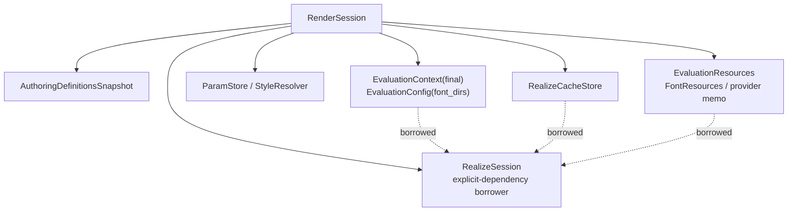
```mermaid
flowchart TB
    render["RenderSession"]
    defs["AuthoringDefinitionsSnapshot"]
    context["EvaluationContext(final)<br/>EvaluationConfig(font_dirs)"]
    store["ParamStore / StyleResolver"]
    cache["RealizeCacheStore"]
    resources["EvaluationResources<br/>FontResources / provider memo"]
    child["RealizeSession<br/>explicit-dependency borrower"]

    render --> defs
    render --> context
    render --> store
    render --> cache
    render --> resources
    render --> child
    context -.->|"borrowed"| child
    cache -.->|"borrowed"| child
    resources -.->|"borrowed"| child
```

close 順は `RealizeSession -> RealizeCacheStore -> EvaluationResources`。
`RenderSession` の公開 property は `options`、`config`、`runtime_limits`、`metadata` の immutable
value に限定する。mutable `ParamStore` と catalog/context/session/cache/resource のような
mutation/close capability を持つ child owner は内部に保つ。

### Low-level RealizeSession

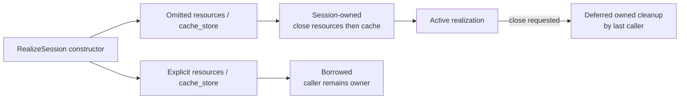
```mermaid
flowchart LR
    ctor["RealizeSession constructor"]
    omitted["Omitted resources / cache_store"]
    injected["Explicit resources / cache_store"]
    owned["Session-owned<br/>close resources then cache"]
    borrowed["Borrowed<br/>caller remains owner"]
    active["Active realization"]
    deferred["Deferred owned cleanup<br/>by last caller"]

    ctor --> omitted --> owned
    ctor --> injected --> borrowed
    owned --> active -->|"close requested"| deferred
```

`resources` と `cache_store` はそれぞれ独立に owned/borrowed を選ぶ。active caller がなければ
owned cleanup は `close()` で直ちに行う。`EvaluationContext` は immutable value で close 対象ではない。
constructor/body/close の `BaseException` でも後続 owned cleanup を試し、最初の error を保持する。

### Interactive reload

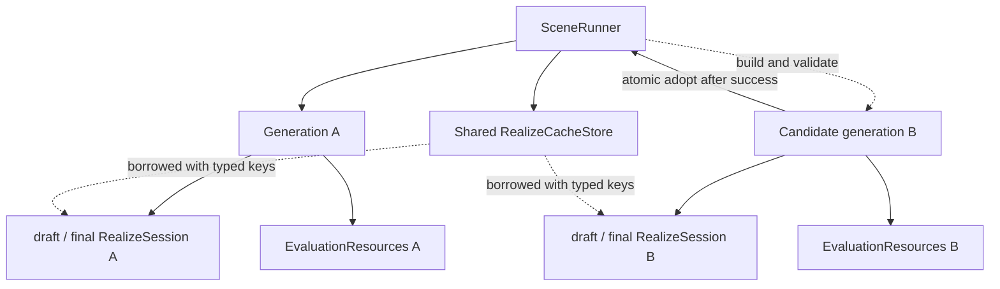
```mermaid
flowchart TB
    runner["SceneRunner"]
    cache["Shared RealizeCacheStore"]
    genA["Generation A"]
    genB["Candidate generation B"]
    ares["EvaluationResources A"]
    asessions["draft / final RealizeSession A"]
    bres["EvaluationResources B"]
    bsessions["draft / final RealizeSession B"]

    runner --> cache
    runner --> genA
    runner -.->|"build and validate"| genB
    genA --> ares
    genA --> asessions
    genB --> bres
    genB --> bsessions
    cache -.->|"borrowed with typed keys"| asessions
    cache -.->|"borrowed with typed keys"| bsessions
    genB -->|"atomic adopt after success"| runner
```

新 generation の構築に失敗した場合は A を維持する。採用後に旧子 session、旧 resource を閉じ、
共有 cache は `SceneRunner` 終了時だけ閉じる。

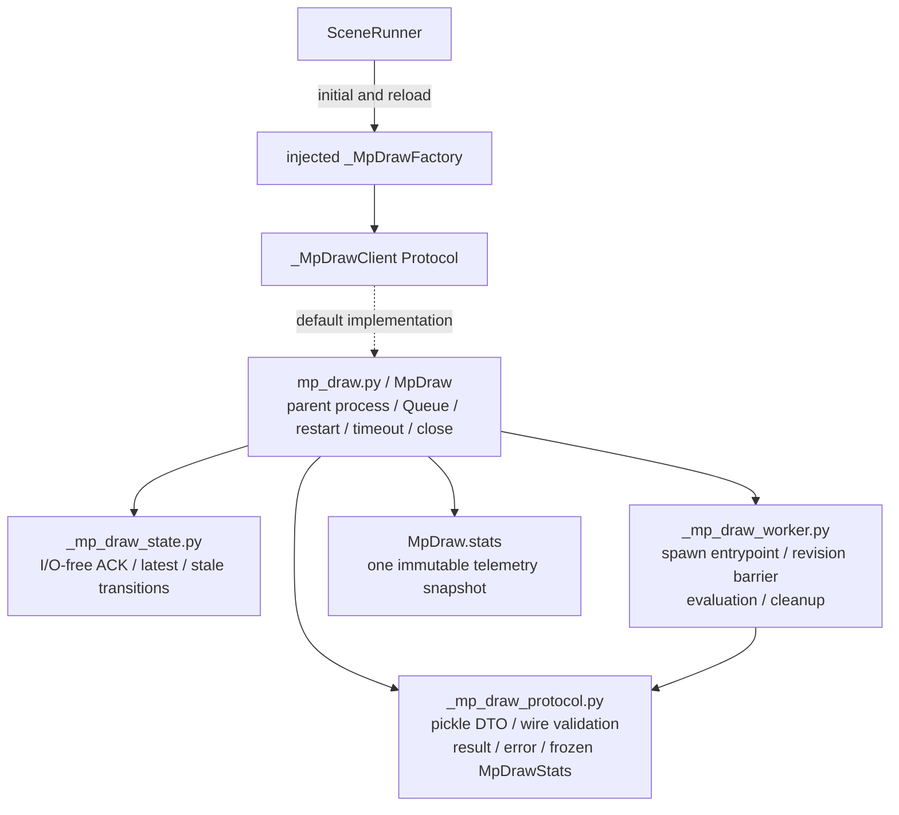
```mermaid
flowchart TB
    sr["SceneRunner"]
    factory["injected _MpDrawFactory"]
    client["_MpDrawClient Protocol"]
    mp["mp_draw.py / MpDraw<br/>parent process / Queue / restart / timeout / close"]
    protocol["_mp_draw_protocol.py<br/>pickle DTO / wire validation<br/>result / error / frozen MpDrawStats"]
    state["_mp_draw_state.py<br/>I/O-free ACK / latest / stale transitions"]
    worker["_mp_draw_worker.py<br/>spawn entrypoint / revision barrier<br/>evaluation / cleanup"]
    stats["MpDraw.stats<br/>one immutable telemetry snapshot"]

    sr -->|"initial and reload"| factory --> client
    client -.->|"default implementation"| mp
    mp --> state
    mp --> protocol
    mp --> worker
    mp --> stats
    worker --> protocol
```

test fake は constructor の `mp_draw_factory` から渡し、`SceneRunner._mp_draw` を直接差し替えない。
transition state は process、Queue、thread、clock、close capability を所有しない。protocol の private
DTO path は永続/external wire contract ではない。telemetry の scalar forwarding property はなく、
制御に必要な `generation` / `evaluation_timeout` 等だけを parent owner に残す。
worker は task payload を current snapshot 更新にだけ使い、requested revision と worker current
revision が一致する場合だけ worker-owned snapshot/effect-order pair を評価する。

## 5. Parameter の読み取りと更新

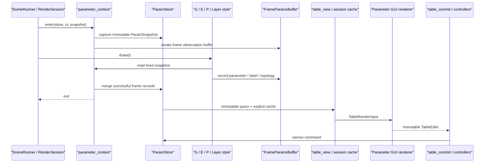
```mermaid
sequenceDiagram
    participant App as "SceneRunner / RenderSession"
    participant Ctx as "parameter_context"
    participant Store as "ParamStore"
    participant DSL as "G / E / P / Layer style"
    participant Buffer as "FrameParamsBuffer"
    participant View as "table_view / session cache"
    participant GUI as "Parameter GUI renderer"
    participant Commit as "table_commit / controllers"

    App->>Ctx: enter(store, cc snapshot)
    Ctx->>Store: capture immutable ParamSnapshot
    Ctx->>Buffer: create frame observation buffer
    App->>DSL: draw(t)
    DSL->>Ctx: read fixed snapshot
    DSL->>Buffer: record parameter / label / topology
    Ctx->>Store: merge successful frame records
    Ctx-->>App: exit

    Store->>View: immutable query + explicit cache
    View->>GUI: TableRenderInput
    GUI-->>Commit: immutable TableEdits
    Commit->>Store: narrow command
```

GUI table cache の lifetime:

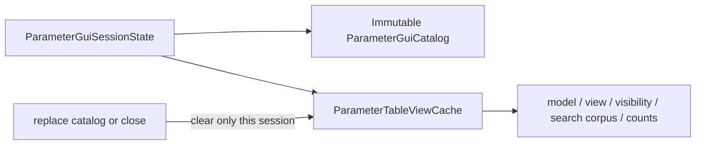
```mermaid
flowchart LR
    session["ParameterGuiSessionState"]
    catalog["Immutable ParameterGuiCatalog"]
    cache["ParameterTableViewCache"]
    owned["model / view / visibility / search corpus / counts"]
    close["replace catalog or close"]

    session --> catalog
    session --> cache --> owned
    close -->|"clear only this session"| cache
```

query は `cache=` を必須とし、module-global cache/default catalog/counter を参照しない。同じ store を
表示する二 GUI session でも cache identity と invalidation は独立する。

通常 command:

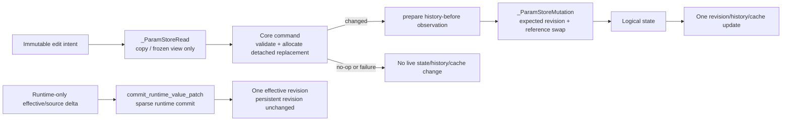
```mermaid
flowchart LR
    intent["Immutable edit intent"]
    read["_ParamStoreRead<br/>copy / frozen view only"]
    plan["Core command<br/>validate + allocate detached replacement"]
    history["prepare history-before observation"]
    mutation["_ParamStoreMutation<br/>expected revision + reference swap"]
    state["Logical state"]
    rev["One revision/history/cache update"]
    runtime_delta["Runtime-only effective/source delta"]
    sparse["commit_runtime_value_patch<br/>sparse runtime commit"]
    effective["One effective revision<br/>persistent revision unchanged"]

    intent --> read --> plan
    plan -->|"changed"| history --> mutation --> state --> rev
    plan -->|"no-op or failure"| done["No live state/history/cache change"]
    runtime_delta --> sparse --> effective
```

sibling command は `_ParamStoreMutation` だけを write port として使う。`ParamStore` 自身が所有する
構築/contents replacement/transient rollback を除き、mutable container は store boundary の外へ
出さず、mutation batch API は持たない。一つの plan は一つの domain commit で対象の
revision/history/cache を確定する。runtime-only path は full store plan と runtime identity 交換を避ける。
commit 中に domain validation、replacement allocation、外部 callback を行わない。

一時 rollback:

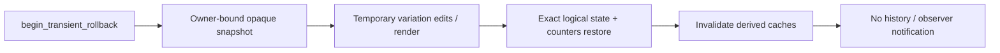
```mermaid
flowchart LR
    begin["begin_transient_rollback"]
    token["Owner-bound opaque snapshot"]
    temporary["Temporary variation edits / render"]
    restore["Exact logical state + counters restore"]
    invalidate["Invalidate derived caches"]
    silent["No history / observer notification"]

    begin --> token --> temporary --> restore --> invalidate --> silent
```

API/interactive が `ParamStore` の live/private container を取得する経路はない。
`ParamRuntimeView` は生成時に runtime mapping を浅く copy した時点固定 snapshot であり、後続 frame の
mutation を既存 view が観測しない。mapping 内の key/value/source は canonical immutable value である。

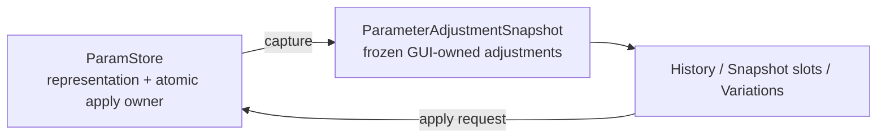
```mermaid
flowchart LR
    store["ParamStore<br/>representation + atomic apply owner"]
    adjustment["ParameterAdjustmentSnapshot<br/>frozen GUI-owned adjustments"]
    consumers["History / Snapshot slots / Variations"]

    store -->|"capture"| adjustment --> consumers
    consumers -->|"apply request"| store
```

`ParameterAdjustmentSnapshot` は state/meta、collapse、effect order、topology signature の immutable
value だけを持つ。live `ParamState` / mutable mapping や旧 `ParamStoreMemento` は渡さない。

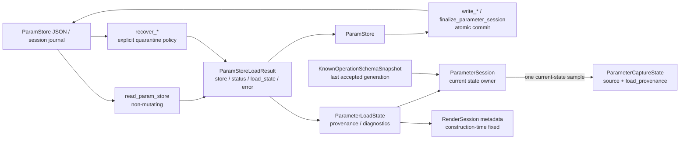
```mermaid
flowchart LR
    file["ParamStore JSON / session journal"]
    read["read_param_store<br/>non-mutating"]
    recover["recover_*<br/>explicit quarantine policy"]
    result["ParamStoreLoadResult<br/>store / status / load_state / error"]
    loadstate["ParameterLoadState<br/>provenance / diagnostics"]
    schema["KnownOperationSchemaSnapshot<br/>last accepted generation"]
    capture["ParameterCaptureState<br/>source + load_provenance"]
    commit["write_* / finalize_parameter_session<br/>atomic commit"]
    store2["ParamStore"]
    interactive["ParameterSession<br/>current state owner"]
    headless["RenderSession metadata<br/>construction-time fixed"]

    file --> read --> result
    file --> recover --> result
    result --> store2
    result --> loadstate
    loadstate --> interactive
    schema --> interactive
    interactive -->|"one current-state sample"| capture
    loadstate --> headless
    store2 --> commit --> file
```

この filesystem 境界は `grafix.parameter_storage` が所有する。read は rename/write/unlink をせず、
recovery と commit は呼び出し側が明示的に選ぶ。load metadata は `ParamStore` / runtime/history/
rollback に格納しない。interactive の Keep/Discard は新 result を session が一箇所で採用し、capture は
current provider を frame ごとに一度だけ読む。Keep は action dispatch 時の current schema を使い、
source reload 成功時だけ schema を交換する。headless は構築時 state を metadata/provenance に固定する。

## 6. Interactive の一 frame

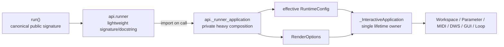
```mermaid
flowchart LR
    public["run()<br/>canonical public signature"]
    wrapper["api.runner<br/>lightweight signature/docstring"]
    heavy["api._runner_application<br/>private heavy composition"]
    config["effective RuntimeConfig"]
    options["RenderOptions"]
    app["_InteractiveApplication<br/>single lifetime owner"]
    owned["Workspace / Parameter / MIDI / DWS / GUI / Loop"]

    public --> wrapper
    wrapper -->|"import on call"| heavy
    heavy --> config
    heavy --> options
    config --> app
    options --> app
    app --> owned
```

`run` の参照/signature inspection では GUI/runtime を importしない。private heavy composition が
config/options を確定して owner を実行する。部分構築 failure では
`_InteractiveApplication` が取得済み resource だけを逆順に close し、root error を保持する。

MIDI persistence path:

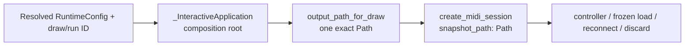
```mermaid
flowchart LR
    app["_InteractiveApplication<br/>composition root"]
    config["Resolved RuntimeConfig + draw/run ID"]
    path["output_path_for_draw<br/>one exact Path"]
    factory["create_midi_session<br/>snapshot_path: Path"]
    leaf["controller / frozen load / reconnect / discard"]

    config --> app --> path --> factory --> leaf
```

leaf は部分的な location input から path を再構築せず、CWD/HOME/YAML を探索しない。全経路と
reconnect closure は同じ exact path を使う。

```mermaid
sequenceDiagram
    participant Loop as "MultiWindowLoop"
    participant DWS as "DrawWindowSystem"
    participant Transport as "TransportClock"
    participant MIDI as "MidiSession"
    participant SR as "SceneRunner"
    participant Pipe as "realize_scene"
    participant Presented as "PresentedFrameState"
    participant GL as "DrawRenderer"
    participant Rec as "RecordingSession"
    participant Capture as "CaptureQueue"
    participant GUI as "ParameterGUIWindowSystem"

    loop every frame
        par Preview window
            Loop->>DWS: draw_frame()
            DWS->>Transport: sample time
            DWS->>MIDI: poll and immutable snapshot
            DWS->>SR: run(t, quality, ParamStore, MIDI)
            SR->>Pipe: draw / normalize / style / realize
            Pipe-->>SR: RealizedLayer tuple
            SR-->>DWS: last-good or fresh scene
            DWS->>Presented: accept + prepare
            DWS->>GL: begin_frame + render presentation
            DWS->>Presented: publish after successful draw
            Presented-->>DWS: FramePublication
            DWS->>Rec: optional provenance + frame
            DWS->>Capture: bind capture snapshot
        and Inspector window
            Loop->>GUI: draw_frame()
            GUI->>GUI: backend begin_frame -> panels -> render
        end
    end
```

`DrawWindowSystem` は順序と配線を担当し、capture path/publish、recording restore、workspace policy は
それぞれ `CaptureQueue`、`RecordingSession`、`WorkspaceWindowController` が所有する。表示 layer/t、
revision/frame ID、fresh serial、export snapshot、provenance token は `PresentedFrameState` が一括して
accept/prepare/publish する。

Parameter GUI の `ParameterGuiSessionState` は instance ごとの `WidgetSessionState` と
`ParameterTableViewCache` を所有する。font/choice filter、snippet popup、catalog/table view/cache は
widgets/table へ明示的に渡され、module-global dict/cache/counter や global reset path はない。

variation の prepare/capture/commit:

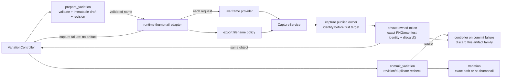
```mermaid
flowchart LR
    gui["VariationController"]
    prepare["prepare_variation<br/>validate + immutable draft + revision"]
    runtime["runtime thumbnail adapter"]
    provider["live frame provider"]
    capture["CaptureService"]
    publish["capture publish owner<br/>identity before first target"]
    policy["export filename policy"]
    artifact["private owned token<br/>exact PNG/manifest identity + discard()"]
    commit["commit_variation<br/>revision/duplicate recheck"]
    variation["Variation<br/>exact path or no thumbnail"]
    rollback["controller on commit failure<br/>discard this artifact family"]

    gui --> prepare
    prepare -->|"validated name"| runtime
    runtime -->|"each request"| provider
    provider --> capture
    runtime --> policy --> capture
    capture --> publish --> artifact
    artifact -->|"same object"| gui
    gui --> commit --> variation
    commit -->|"failure"| rollback
    artifact --> rollback
    runtime -->|"capture failure: no artifact"| gui
```

GL/MIDI/Parameter GUI leaf は `grafix.export` を importしない。adapter は古い frame を固定せず、
publish 前に identity を固定した exact token を再構築せず GUI へ返す。domain validation failure
では capture せず、capture failure では thumbnail なしで同じ draft を commitする。callback は同期中に
store を変更しない contract で、revision が変われば commit は state を変更せず artifact を rollbackする。

## 7. Render と capture publish

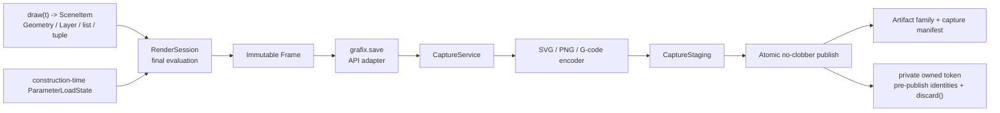
```mermaid
flowchart LR
    draw["draw(t) -> SceneItem<br/>Geometry / Layer / list / tuple"]
    render["RenderSession<br/>final evaluation"]
    load["construction-time ParameterLoadState"]
    frame["Immutable Frame"]
    adapter["grafix.save<br/>API adapter"]
    service["CaptureService"]
    encoder["SVG / PNG / G-code encoder"]
    staging["CaptureStaging"]
    publish["Atomic no-clobber publish"]
    files["Artifact family + capture manifest"]
    token["private owned token<br/>pre-publish identities + discard()"]

    draw --> render --> frame
    load --> render
    frame --> adapter --> service
    service --> encoder --> staging --> publish --> files
    publish --> token
```

`RenderSession.render()` はファイル I/O を行わない。publish は完成済み private staging を使い、
late collision では再 encode せず別 version を試す。失敗時は今回の generation だけを rollback する。
通常 export は token を public result へ変換して generation を acceptし、Variation thumbnail だけが
commit まで token を保持する。runtime は publish 後に identity を取り直さない。
`SceneItem` の再帰 container は list/tuple だけで、custom `Sequence`、set、generator、str/bytes は
runtime/type contract の対象外である。

named variation batch の transaction boundary:

```mermaid
flowchart LR
    request["API<br/>order / request validation"]
    rollback["item transient rollback"]
    callback["render + capture callback<br/>partial failure"]
    exporttx["export.variation_batch<br/>private workspace transaction"]
    encode["relocate manifests<br/>contact sheet + summary"]
    publish["no-clobber retry<br/>or overwrite restore"]

    request --> rollback --> callback --> exporttx --> encode --> publish
```

API は fsync/link/replace/staging codec を持たず、export transaction は API/interactive を importしない。
batch directory 全体を一 generation として公開する。

## 8. G-code の semantic boundary

```mermaid
flowchart LR
    source["Input polyline in original order"]
    clip["Clipping"]
    fragments["Fragments tagged by source polyline"]
    local["Reorder / reverse / bridge within one source only"]
    emit["Deterministic G-code"]

    source --> clip --> fragments --> local --> emit
```

異なる input polyline 間は並べ替え、向き反転、pen-down bridge の対象にしない。頂点数や閉曲線
らしさから face/group を推測しない。

## 9. Grid diagnostic と validation owner

```mermaid
flowchart LR
    effects["metaball / growth / reaction_diffusion / isocontour"]
    adapter["grid_spec_from_bbox_with_diagnostic<br/>single diagnostic adapter"]
    planner["plan_grid_from_bbox<br/>pure GridPlanResult"]
    diagnostic["OperationDiagnostic"]
    spec["GridSpec<br/>point_count / max_points"]

    effects --> adapter --> planner
    planner --> adapter
    adapter --> diagnostic
    adapter --> spec
```

validation は public API、filesystem/IPC deserialize、custom evaluator output に置く。trusted
`_DrawTask` の入力は `MpDraw.submit()` が canonical 化し、同じ field validation を DTO で繰り返さない。
export request の共通 invariant は `_validate_export_request()` が一つの定義として所有する。

## 10. Benchmark harness の一方向 DAG

矢印は compile dependency の向き（依存元から依存先）を表す。

```mermaid
flowchart TB
    schema["schema.py<br/>immutable result / JSON contract"]
    definition["definition.py<br/>CaseDefinition / source identity"]
    metrics["metrics.py<br/>checksum / typed aggregation"]
    workloads["workload providers<br/>setup / workload / postprocess"]
    catalog["catalog.py<br/>collect / validate / stable select"]
    executor["executor.py<br/>measure / calibrate / child lifecycle"]
    runner["runner.py<br/>composition / child entrypoint"]

    definition --> schema
    metrics --> schema
    workloads --> definition
    workloads --> metrics
    workloads --> schema
    catalog --> definition
    catalog --> workloads
    executor --> definition
    executor --> metrics
    executor --> schema
    runner --> catalog
    runner --> executor
    runner --> definition
    runner --> schema
```

`runner.py` の公開 symbol は `run_case_isolated` だけである。親側は definition と executor を配線し、
child entrypoint は catalog で case ID を解決して executor へ渡す。executor は catalog/workload を
知らず、workload は catalog/executor/runner を知らない。workload layer 内で許可する依存は
`interactive_scenario -> parameter_hotpath / renderer` と `parameter_edit -> parameter_hotpath` の
public helperだけで、private provider symbol参照をarchitecture testが拒否する。旧runner symbolの
re-export shimはない。

## 11. Test taxonomy

```mermaid
flowchart LR
    unit["unit<br/>unmarked / local deterministic"]
    integration["integration marker<br/>MP / subprocess / resource lifecycle"]
    e2e["e2e marker<br/>public CLI / application round trip"]
    benchmark["benchmark CLI<br/>deterministic smoke / full"]
```

pytest は unmarked unit、`integration`、`e2e` の三 lane に分ける。performance は pytest marker ではなく
benchmark CLI で検査する。正本は `docs/agent_docs/testing.md`。

## 12. 主な source of truth

| 概念 | 正本 |
|---|---|
| standard public namespace / core-only import | `grafix/__init__.py`, `api/__init__.py`, `core/__init__.py` |
| operation authoring | `core/operation_authoring.py`, `core/operation_declaration.py` |
| registration / immutable snapshot | `core/authoring_definitions.py`, `core/authoring_recipe.py` |
| authoring source policy / capture / temporary import | `_source_import_policy.py`, `authoring_loader.py`, `_snapshot_import.py` |
| operation/preset catalog | `core/operation_catalog.py`, `core/preset_catalog.py` |
| public operation inspection | `api/operation_info.py`, `api/_operation_info.py` |
| runtime config loading / evaluation config | `runtime_config_loader.py`, `core/runtime_config.py`, `core/evaluation_config.py` |
| evaluation/cache/resource | `core/evaluation_context.py`, `core/realize.py`, `core/font_resources.py` |
| parameters / filesystem load state | `core/parameters/`, `parameter_storage.py`, `interactive/runtime/parameter_session.py` |
| parameter adjustment snapshot | `core/parameters/adjustment_snapshot.py`, `core/parameters/store.py` |
| SceneItem / scene pipeline | `core/scene.py`, `core/pipeline.py` |
| headless session public surface | `api/render.py`, `api/__init__.pyi` |
| interactive composition / public wrapper | `api/runner.py`, `api/_runner_application.py` |
| MP protocol / state / worker / parent owner | `interactive/runtime/_mp_draw_protocol.py`, `_mp_draw_state.py`, `_mp_draw_worker.py`, `mp_draw.py` |
| MIDI exact snapshot path | `api/_runner_application.py`, `interactive/midi/factory.py`, `interactive/midi/midi_controller.py` |
| presented frame state | `interactive/runtime/presented_frame.py` |
| GUI schema / effective-source badge / session-owned table cache | `interactive/parameter_gui/catalog.py`, `source_badge.py`, `session_state.py`, `table_view.py` |
| GUI table rendering / commit | `interactive/parameter_gui/table.py`, `table_commit.py` |
| capture lifecycle | `export/capture.py`, `export/capture_staging.py`, `export/capture_publish.py` |
| variation prepare/commit / thumbnail ownership / batch transaction | `core/parameters/variations.py`, `interactive/parameter_gui/variation_controller.py`, `interactive/runtime/variation_thumbnail_capture.py`, `export/variation_batch.py` |
| numeric kernels / grid diagnostic adapter | `core/geometry_kernels/`, `core/operation_diagnostics.py` |
| validation owner | `interactive/runtime/_mp_draw_protocol.py`, `interactive/runtime/mp_draw.py`, `interactive/runtime/export_job_system.py` |
| test taxonomy | `docs/agent_docs/testing.md`, `pyproject.toml`, `.github/workflows/ci.yml` |
| benchmark definition/catalog/metrics/execution | `devtools/benchmarks/definition.py`, `catalog.py`, `metrics.py`, `executor.py` |
| benchmark workload/composition | `devtools/benchmarks/*_benchmark.py`, `devtools/benchmarks/runner.py` |
