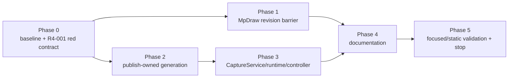

# `src/grafix` R4 局所実装改善計画（2026-07-23）

- 根拠レビュー:
  `docs/review/src_grafix_architecture_simplicity_review_2026-07-23_r4.md`
- 計画作成時 HEAD: `e3d3324`
- 計画作成時 branch: `main`
- 計画作成時 working tree: clean
- 実装対象: R4-001、R4-002、R4-006 の文書同期部分
- 状態: **完了**

本書は新しい全面リファクタリング計画ではない。レビューで実害を確認した Medium 2 件だけを局所修正し、
現行 ownership を文書へ同期した時点で終了する。

R4-003〜R4-005 と architecture test の整理は今回の実装対象へ入れない。未完の作業として
チェックボックスを残すのではなく、再検討条件付き watchlist とする。

本書のチェックボックスは承認後の進捗を表す。計画作成時点ではすべて未完了であり、production code、
test、文書、検証まで完了した項目だけを `[x]` にする。

## 1. 目的

次の二つの不整合を、新しい framework を追加せず既存の owner 境界内で修正する。

1. **task revision と worker-owned revision を一致させる**
   - task payload は snapshot 配送の最適化に限定する。
   - worker が評価する唯一の値は、worker-owned current snapshot/effect-order pair とする。
   - requested revision と current revision が一致しない task は、評価開始前に拒否する。
2. **publish 時に確定した file identity をそのまま rollback ownership にする**
   - publish 後に runtime で `stat()` し直さない。
   - identity の取得と identity-match unlink の実装を export layer に閉じる。
   - token の保持と `discard()` を起動する順序は、Variation transaction coordinator に限定する。
   - runtime adapter と controller は typed internal contract を信頼し、hostile input 向け防御を削る。

改善後も次を維持する。

- Variation の `prepare -> capture -> commit`。
- capture failure 時は thumbnail なしで Variation 保存を成功させる。
- commit failure 時は今回 publish した artifact family だけを discard する。
- public `CaptureService.export()`、`ExportResult`、`grafix.save()` の意味と署名。
- `MpDraw` の protocol DTO、wire union、parent scheduler、stats field。
- no-clobber publish、overwrite rollback、recording、variation batch の既存意味。

## 2. 承認境界と進行規則

- 本計画への明示承認を得るまで、production code、test、既存文書は変更しない。
- 承認後は Phase 0 から順に進め、各 Phase の semantic test が成功してから次へ進む。
- 各 Phase 完了時に本書のチェックボックスと実施記録を更新する。
- 実装開始時に HEAD、branch、`git status --porcelain` を改めて記録する。
- 対象 file に並行差分がある場合は最新内容を読み直す。意味が衝突する場合は停止して確認する。
- 依存追加・更新、snapshot 更新、破壊的操作、commit、push、release は別途承認を得る。
- full pytest、長時間 benchmark、GUI/process soak は、この計画の承認に含めず、必要時に別途確認する。
- compatibility alias、wrapper、旧型 re-export、dual return、dual write は作らない。
- source-shape test を増やさず、revision、ownership、cleanup、公開結果の意味を behavior test で固定する。
- Medium 2 件と必要な文書同期が完了したら、新しい改善対象を探索せず終了する。

次の場合は対象 Phase を停止し、計画との差分と影響を報告して確認を求める。

- R4-001 が worker の局所分岐だけで直らず、queue 構成、wire field、parent scheduler の変更を要する。
- R4-002 が package-private token の伝播だけで直らず、公開 API、capture manifest schema、
  filesystem lock、process-crash journalを要する。
- variation thumbnail が PNG と manifest 以外の artifact family を正式に所有している。
- OS の `stat -> unlink` 間の race まで解消するため、platform-specific descriptor API が必要になる。
- R4-003〜R4-005 の変更を同時に行わないと Medium finding を修正できない。
- 既存の正式利用例が `PublishedCaptureGeneration` を public contract として利用していることが判明する。
- focused test の既存 failure、依頼外差分、型/APIの意味衝突が判明する。

## 3. 計画時 baseline

### 3.1 作業状態

```text
HEAD: e3d3324
branch: main
git status --porcelain: clean
```

### 3.2 focused/static baseline

計画作成時に次を実行した。

```text
対象 focused + architecture:
139 passed in 16.70s

ruff check src/grafix tests/architecture:
All checks passed

mypy src/grafix:
Success: no issues found in 290 source files
```

139 件の対象:

- `tests/interactive/runtime/test_mp_draw_stress.py`
- `tests/interactive/runtime/test_variation_thumbnail_capture.py`
- `tests/interactive/parameter_gui/test_variation_controller.py`
- `tests/core/test_capture_manifest.py`
- `tests/export/test_capture_service.py`
- `tests/architecture`

前計画には full pytest 4047 passed の記録があるが、この R4 計画の独立 baseline として full suite は
再実行していない。

### 3.3 R4-001 の再現

1 worker を revision 5 へ進めた後、private task queue へ revision 4 の payload 付き task を決定的に
投入した。

```text
first 1 5 ((59196, 5),)
second 10000 4 rejections 0 ack (4, 5, 'stale')
```

現行 worker は revision 4 を `stale` と ACK しながら revision 4 の `DrawResult` を返し、
rejection count を増やさない。

これは問題の protocol 分岐を決定的に再現したものであり、通常の `submit()` だけで競合頻度を測った
benchmark ではない。

### 3.4 対象規模

```text
_mp_draw_worker.py:                         241 lines
capture_publish.py:                         292 lines
capture.py:                                 508 lines
variation_thumbnail_capture.py:             227 lines
variation_controller.py:                    473 lines
test_mp_draw_stress.py:                     357 lines
test_variation_thumbnail_capture.py:        474 lines
test_variation_controller.py:               544 lines
test_capture_manifest.py:                   434 lines
test_capture_service.py:                    583 lines
```

行数削減は完了条件にしない。ただし R4-002 では runtime/controller から責務が移った後も、削除可能な
identity acquisition、owner-construction、hostile callback 向け分岐を残さない。

## 4. この計画で固定する設計判断

### 4.1 `MpDraw` の evaluation barrier

`_draw_worker_main()` は次の順で task を処理する。

1. task の `snapshot_revision` を requested revision として読む。
2. task に snapshot payload がある場合は、現在どおり `_SnapshotUpdate` として `apply_snapshot()` する。
3. ACK の後、worker-owned `snapshot_revision` と requested revision の一致を確認する。
4. 一致しない場合は、評価前に `_TaskRejected` を返す。
   - current が未到達、または requested の方が新しい: `reason="unknown"`
   - requested の方が古い: `reason="stale"`
5. 一致した場合だけ、worker-owned `snapshot` と `effect_order_snapshot` を評価に使う。

task payload 自体を evaluation snapshot として保持しない。

```python
requested_revision = task.snapshot_revision

if task.snapshot is not None:
    apply_snapshot(...)

if snapshot_revision != requested_revision:
    result_q.put(_TaskRejected(...))
    continue

assert snapshot is not None
assert effect_order_snapshot is not None
evaluation_snapshot = snapshot
evaluation_effect_order_snapshot = effect_order_snapshot
```

次の意味を維持する。

- 新しい payload は worker current へ適用後、同じ task で直ちに評価できる。
- 同 revision payload は `current` ACK 後、既存の worker-owned pair を使う。
- payload 省略 task は current revision と一致する時だけ評価する。
- stale payload にも `stale` ACK を返し、その後 `stale` rejection を返す。
- stale task を current snapshot へ自動昇格しない。
- rejected task は `_TaskStarted`、`DrawResult`、draw side effect を生成しない。

`_SnapshotUpdate`、`_DrawTask`、`DrawResult`、`_MpDrawState.accept_result()`、parent-side validator は
変更しない。

### 4.2 publish-owned generation

`src/grafix/export/capture_publish.py` の `PublishedCaptureGeneration` は削除し、互換 alias を残さない。
代わりに package-private な一つの owned token を定義する。

```python
_FileIdentity = tuple[int, int]

@dataclass(frozen=True, slots=True)
class _OwnedCaptureGeneration:
    artifact_paths: tuple[Path, ...]
    manifest_path: Path
    _identities: tuple[_FileIdentity, ...]

    @property
    def path(self) -> Path: ...

    def discard(self) -> None: ...
```

固定する契約:

- `_identities` は artifact 順、その後 manifest の device/inode である。
- staged source の identity は publish 前に一度だけ取得する。
- token は最初の target を link/replace する前に、完成済みの immutable value として作る。
- `path` は non-empty artifact family の primary artifact を返す。
- `publish_capture_generation()` は成功時に exact token を返す。
- token は `__all__`、root/API facade、stub へ出さない。
- 通常 export が token を捨てることは、公開 generation の accept を意味する。
- `release()`、active flag、context manager、finalizer、`__del__` は追加しない。

publish 失敗時と明示的 discard 時の error policy は分ける。

| 経路 | cleanup policy |
|---|---|
| publish 途中の失敗 | 今回 link 済み identity だけを best-effort rollbackし、元の publish error を優先 |
| 呼び出し側が要求した `discard()` | 全 member を最後まで試し、最初の cleanup error を送出、後続を note に記録 |

strict `discard()` は次を no-op とする。

- member が既に存在しない。
- 同名 path が非通常ファイルへ変わった。
- device/inode が token の identity と一致しない。

`stat()` または `unlink()` 自体の I/O error は `CleanupErrors` で集約する。
best-effort rollback helper と strict discard helper は、異なる error contract を一つの関数へ押し込まない。

正常 publish 後の private staged-manifest cleanup は best-effort とし、generation 公開後から token return
までに通常の cleanup error を新たな publish failure として送出しない。
publish 失敗時にも同じ private staged-manifest cleanup は best-effort で最後まで試し、元の publish error を
置き換えない。

`overwrite=True` で成功した token の `discard()` は、今回 publish した新しい generation を削除する操作で
あり、置換前の generation を復元する操作ではない。Variation thumbnail は従来どおり
`overwrite=False` だけを使う。

### 4.3 `CaptureService` の private owned path

現行 `CaptureService.export()` の encode/publish 本体を、default を持たない private method へ移す。

```python
def _export_owned(
    self,
    frame: CaptureFrame,
    path: str | Path,
    *,
    overwrite: bool,
    split_gcode_layers: bool,
    output_size: tuple[int, int] | None,
    gcode_params: GCodeParams | None,
) -> _OwnedCaptureGeneration:
    ...
```

- `_export_owned()` を validation、encode、staging、publish の唯一の実装 owner とする。
- public `export()` は現在の signature/default を保ったまま `_export_owned()` へ委譲し、その結果だけを
  `ExportResult(path=owned.path, format=ExportFormat.from_path(owned.path),
  manifest_path=owned.manifest_path)` へ写す。
- `CaptureService.export()` の署名、default、例外、`ExportResult` は変更しない。
- pure な `ExportResult` 構築を broad `try` で囲み、失敗時に token を discard する分岐は追加しない。
- `publish_staged*` と recording publish の内部戻り型も `_OwnedCaptureGeneration` に統一する。
- `export_job_system`、recording、通常 save は token の `artifact_paths` / `manifest_path` だけを使い、
  現在と同じ generation を accept する。
- variation thumbnail flow だけが `_export_owned(..., overwrite=False, ...)` の token を直ちに
  accept せず、adapter は同一 token を controller へ返し、controller が commit 完了まで保持する。
- public rollback API は追加しない。

### 4.4 runtime adapter と controller

`make_variation_thumbnail_capture()` は live frame、output path、thumbnail size の policy だけを所有し、
`CaptureService._export_owned()` が返した token をそのまま `VariationThumbnailArtifact` として返す。

export token は `path` と `discard()` を持つため、GUI の structural Protocol を満たす。
runtime は concrete token 型を importしない。

`variation_thumbnail_capture.py` から次を削除する。

- `_OwnedVariationThumbnail`
- `_new_owned_thumbnail()`
- `_owned_thumbnail()`
- runtime 側の `_regular_file_identity()`
- runtime 側の `_unlink_if_identity()`
- post-publish identity acquisition
- same-path、partial identity acquisition、owner-construction rollback

`VariationController` は typed private callback を信頼する。

- `_ThumbnailArtifactOwnership`
- `_validated_thumbnail_artifact()`
- `_discard_invalid_thumbnail()`

を削除し、`VariationThumbnailArtifact | None` と一度だけ読んだ `thumbnail_path: Path | None` を local に
保持する。

維持する flow:

```text
prepare failure -> captureしない、Variationなし
capture failure -> thumbnailなしでcommit
capture success + commit success -> exact pathをVariationへ保存
capture success + commit failure -> token.discard()
commit failure + discard failure -> commit errorを主診断、cleanup errorもnoticeへ残す
```

### 4.5 test の責務配置

identity と cleanup の test owner を runtime から export publish へ移す。

既存の low-level publish test owner である `tests/core/test_capture_manifest.py` に、次の
semantic contract を追加する。新しい publish 専用 test file は作らない。

- duplicate target path を一件も publish する前に拒否する。
- owned generation の全 artifact と manifest を discard する。
- artifact または manifest が外部置換済みなら、その member だけ保持する。
- 一件の cleanup failure 後も残りの member を試す。
- 複数 cleanup failure は最初を送出し、後続を exception note に残す。
- staged manifest cleanup failure が成功済み publish を失敗へ変えない。
- publish failure と staged manifest cleanup failure が重なっても、元の publish error を主診断にする。

`tests/export/test_capture_service.py` では次を固定する。

- `_export_owned()` が実際の no-clobber path と manifest を含む token を返す。
- public `export()` は従来どおり exact `ExportResult` を返す。
- overwrite、split G-code、recording publish の既存結果を維持する。

`tests/interactive/runtime/test_variation_thumbnail_capture.py` は次へ縮める。

- request ごとに live frame を読む。
- portable path と thumbnail size を渡す。
- no-frame を明示的に拒否する。
- capture service が返した exact token object を再構築せず返す。

次の runtime fault-matrix test は削除し、一対一の代替 test を作らない。

- same-path `ExportResult` 3 件
- post-publish identity acquisition failure 3 件
- pure owner constructor failure 2 件
- runtime helper monkeypatchによる cleanup failure 2 件
- runtime での artifact/manifest 外部置換 2 件

外部置換と strict cleanup の本質的な test は、publish-owned token test として export 層へ移す。

`tests/interactive/parameter_gui/test_variation_controller.py` から次を削除する。

- raw `Path` を返す不正 callback の runtime validation
- path が非 `Path` の不正 artifact を discard する test
- 呼び出すたび値が変わる動的 `path` property の test

次は維持する。

- domain validation が capture より先である。
- capture failure は thumbnail なし保存になる。
- callback 中の store mutationで commit が失敗し、artifactをdiscardする。
- commit error と discard error の両方を notice で観測できる。

## 5. 非対象と watchlist

| Finding/候補 | 今回の扱い | 再検討トリガー |
|---|---|---|
| R4-003 visibility tracked set | 実装しない | parameter runtime/store の次回機能変更、hidden hook による実不具合、または同境界の変更摩擦 |
| R4-004 source reload `ContextVar` | 実装しない | runner/source reload composition の次回変更、ambient dependency が test・再利用を妨げる場合 |
| R4-005 variation batch test seam | 実装しない | public option 追加・改名、または同じ二重 signature の再変更 |
| R4-006 tombstone/source-shape test | 削除しない | 同等以上の semantic/capability test が先に存在すると個別に確認できた場合 |
| `export_job_system.py` 分割 | 実装しない | export job の protocol/worker/lifecycle を同時に大きく変更する場合 |

R4-003 は mutation counter から commit generation への semantic change と O(group 数) の比較を伴う。
単純化だけを理由に今回へ混ぜない。

## 6. Finding と Phase の対応

| Finding | Phase | 完了の要点 |
|---|---|---|
| R4-001 | 0, 1, 5 | payload 付き stale task を評価前に拒否し、ACK/rejection/current state を固定 |
| R4-002 | 2, 3, 5 | publish 時 identity を private token として伝播し、runtime で再取得しない |
| R4-006 文書部分 | 4 | parameter aggregate と新しい capture ownership を現行文書へ同期 |

依存順:



## 7. Phase 0 — baseline と regression contract

### 7.1 作業状態

- [x] 実装開始時の HEAD、branch、`git status --porcelain` を本書へ記録する。
- [x] 対象 file に並行差分がないことを確認する。
- [x] 計画作成時から HEAD または対象 file が変わっている場合だけ、focused 139 tests、Ruff、mypy
  baseline を再実行する。変化がなければ本書の計画時 baseline を採用する。
- [x] full pytest、benchmark、GUI/process soak を今回の必須 gate にしないことを確認する。

実装開始時:

```text
HEAD: e3d3324
branch: main
git status --porcelain:
?? docs/plan/src_grafix_architecture_simplicity_improvement_plan_2026-07-23_r4.md
```

HEAD と対象 production/test file は計画作成時から不変だったため、3.2 の baseline を採用した。

### 7.2 R4-001 の先行失敗 test

- [x] `tests/interactive/runtime/test_mp_draw_stress.py` に
  `test_worker_rejects_stale_task_even_when_it_carries_snapshot_payload` を追加する。
- [x] 1 worker を revision 5 へ進め、worker current revision が 5 であることを確認する。
- [x] private task queue へ revision 4、snapshot/effect-order payload 付きの一意な task を投入する。
  `generation`、`epoch`、frame id は current owner state から取得し、固定値へ依存しない。
- [x] result または rejection のどちらかを terminal event として待ち、現行 test を短時間で失敗させる。
- [x] 現行では revision 4 の `DrawResult`、rejection 0 になることを Red として記録する。

実装後に固定する assertion:

- 対象 frame の `DrawResult` を受信しない。
- completed result count が増えない。
- rejected task count が一件増える。
- `last_rejection == (4, 5, "stale")`。
- `last_snapshot_ack == (4, 5, "stale")`。
- worker revision は 5 のまま。
- 対象 task の `_TaskStarted`/draw side effect がない。既存 event 観測だけで確認できない場合、
  この一点のための shared process fixture は追加せず、no-result/completed-count と control flow で固定する。

R4-002 はレビュー時の決定的な再現で原因が確定しているため、旧 runtime boundary へ使い捨ての Red test を
追加しない。Phase 2 で authoritative token の permanent behavior test を直接追加する。

Phase 0 完了条件:

- [x] R4-001 が既存の無関係な failure や固定長 timeout に依存しない決定的な Red test で表現される。
- [x] R4-002 の回帰契約は旧 runtime の実装詳細ではなく、Phase 2 の publish behavior で固定すると確認する。

## 8. Phase 1 — `MpDraw` worker revision barrier（R4-001）

対象:

- `src/grafix/interactive/runtime/_mp_draw_worker.py`
- `tests/interactive/runtime/test_mp_draw_stress.py`

### 8.1 worker の局所修正

- [x] task payload を evaluation local の初期値へ代入する処理を削除する。
- [x] payload がある場合は、既存 `apply_snapshot()` で ACK と worker current state を先に確定する。
- [x] `snapshot_revision == requested_revision` を唯一の evaluation barrier にする。
- [x] mismatch は既存規則で `unknown` / `stale` に分類し、`_TaskRejected` 後に `continue` する。
- [x] equality 後だけ worker-owned snapshot/effect-order pair を evaluation context へ渡す。
- [x] rejected task が `_TaskStarted`、draw、`DrawResult` へ到達しないことを確認する。
- [x] stale task を current snapshot で評価する自動昇格を追加しない。

### 8.2 既存 concurrency contract

- [x] payload 付き new/current、payload なし current/unknown/stale の既存経路を再実行する。
- [x] rapid revision と multi-worker churn が latest revision へ収束することを確認する。
- [x] 1-worker の通常 task-carried snapshot 経路では `rejected_task_count == 0` を維持する。
- [x] 2-worker の churn test は zero rejection を要求せず、latest-wins、単調 revision、
  bounded backlog、最終成功を要求する契約へ狭く更新する。
- [x] 2-worker で `last_rejection` がある場合は `reason == "stale"` かつ
  applied revision が requested revision より新しいことを確認する。
- [x] この finding 専用の new/current/unknown/stale × single/multi-worker matrix は追加せず、
  新規 regression 1 件と既存 suite の代表経路で固定する。

Phase 1 完了条件:

- [x] payload 付き stale task は ACK と rejection を返し、評価されない。
- [x] worker-owned revision/pair は stale task で変更されない。
- [x] protocol DTO、wire field、parent state、public API を変更していない。
- [x] 新しい class/helper/scheduler を追加していない。

## 9. Phase 2 — publish-owned generation（R4-002）

対象:

- `src/grafix/export/capture_publish.py`
- `tests/core/test_capture_manifest.py`

### 9.1 authoritative token

- [x] package-private `_OwnedCaptureGeneration` を frozen/slots value として追加する。
- [x] `artifact_paths`、`manifest_path`、artifact順+manifestの `_identities` だけを保持する。
- [x] primary `path` property と strict `discard()` だけを capability として持たせる。
- [x] `PublishedCaptureGeneration` を削除し、alias/wrapper/re-export を残さない。
- [x] staged source identity を一度だけ取得し、最初の target publish 前に token を構築する。
- [x] publish 成功時は同じ token を返し、成功後に targetを `stat()` して ownership を取り直さない。
- [x] token を `__all__`、root/API、stub へ公開しない。

### 9.2 cleanup policy

- [x] publish failure の best-effort rollback と、tokenの strict discard を別の明示経路にする。
- [x] strict discard は artifact 順、その後 manifest の順で全 member を最後まで試す。
- [x] missing、非通常 file、identity mismatch は削除しない。
- [x] stat/unlink failure は最初を送出し、後続 error を note に残す。
- [x] 成功/失敗の両方で private staged manifest cleanup を best-effort にし、成功済み generation または
  元の publish error の意味を変えない。
- [x] target path 一意性は引き続き publish 前に検証する。
- [x] OS-level `stat -> unlink` raceを解く新しい platform abstraction は追加しない。

### 9.3 publish-layer tests

- [x] artifact 全件と manifest の通常 discard を固定する。
- [x] artifact 外部置換と manifest 外部置換を parametrize し、置換 member を保持する。
- [x] 一件目の cleanup failure 後も後続 member を試す。
- [x] 複数 cleanup failure の primary/note 順を固定する。
- [x] duplicate target を一件も公開する前に拒否する。
- [x] no-clobber、late collision、overwrite rollback の既存 test を変更せず通す。
- [x] staged manifest cleanup failure 後も成功 token を返すことを固定する。
- [x] publish failure と staged manifest cleanup failure が重なる場合も元の publish error を固定する。
- [x] 既存 low-level publish tests を新規 file へ一括移動しない。

Phase 2 完了条件:

- [x] rollback authority が publish 時 identity に一意である。
- [x] publish return と ownership取得の間に外部置換可能な窓がない。
- [x] explicit discard と publish rollback の error semantics が混ざっていない。
- [x] overwrite 成功後の discard を旧 generation 復元へ拡張していない。
- [x] public rollback API、generic transaction、finalizer を追加していない。

## 10. Phase 3 — CaptureService伝播とruntime/controller簡素化（R4-002）

対象:

- `src/grafix/export/capture.py`
- `src/grafix/interactive/runtime/variation_thumbnail_capture.py`
- `src/grafix/interactive/parameter_gui/variation_controller.py`
- `tests/export/test_capture_service.py`
- `tests/interactive/runtime/test_variation_thumbnail_capture.py`
- `tests/interactive/parameter_gui/test_variation_controller.py`
- `tests/interactive/runtime/test_recording_session.py`
- 関連する export job / recording tests

### 10.1 `CaptureService`

- [x] 現行 export 本体を defaultsなしの `_export_owned()` へ移す。
- [x] `_export_owned()` を format validation、encode、staging、publish retry の唯一の実装にする。
- [x] public `export()` を `_export_owned()` から
  `ExportResult(..., format=ExportFormat.from_path(owned.path), ...)` への薄い変換にする。
- [x] public signature、default、format inference、exception、exact output path を維持する。
- [x] pure な `ExportResult` 構築 failure を token discard へ結び付ける broad catch を追加しない。
- [x] `publish_staged*`、recording publish の内部 return annotation を private token へ統一する。
- [x] fake/subclass test の annotation を更新するためだけにprivate tokenを公開しない。
- [x] normal export、export job、recording は tokenを捨ててgenerationをacceptする。
- [x] variation thumbnail だけが commit完了までtokenを保持する。

### 10.2 runtime adapter

- [x] live frame、portable path、thumbnail size、no-frame policyを維持する。
- [x] `CaptureService._export_owned(..., overwrite=False, ...)` の tokenを同一objectのまま返す。
- [x] runtime 側のowner dataclass、identity/stat/unlink helper、`CleanupErrors` orchestrationを削除する。
- [x] same-path、identity acquisition、owner constructor failureのproduction branchを削除する。
- [x] concrete private token 型を GUI/runtime contractへ importしない。

### 10.3 controller

- [x] typed `VariationThumbnailArtifact` を直接保持し、pathを一度だけ読む。
- [x] `_ThumbnailArtifactOwnership` と dynamic runtime contract validationを削除する。
- [x] invalid private callback向けdiscard recoveryを削除する。
- [x] prepare/capture/commitの順とcapture failure fallbackを維持する。
- [x] commit failureではexact tokenをdiscardする。
- [x] commit errorを主診断、discard errorを追加診断とする現行noticeを維持する。

### 10.4 test整理

- [x] publish identity/strict cleanup testsをexport層へ移す。
- [x] runtimeの12件の人工的fault matrixを削除する。
- [x] controllerのinvalid/dynamic callback 3件を削除する。
- [x] valid callback、capture failure、commit競合、cleanup診断のtestsを維持する。
- [x] test削除数を新しいmock permutationで埋め合わせない。
- [x] public `ExportResult`、recording、export job の既存 testsを通す。

Phase 3 完了条件:

- [x] `variation_thumbnail_capture.py` がownershipを再構築しない。
- [x] controller がtyped internal callbackをhostile inputとして検証しない。
- [x] external replacement、strict cleanup、commit rollbackのsemantic coverageは低下していない。
- [x] public export/recording/batchの結果とpath policyが変わっていない。

## 11. Phase 4 — 文書同期（R4-006 文書部分）

### 11.1 worker/capture ownership

- [x] `architecture.md` にworker current revision barrierを記載する。
- [x] `architecture.md` のthumbnail/capture節を、identity取得ownerはpublish層、
  runtimeはlive frame/path/size adapterという説明へ直す。
- [x] `docs/architecture_visualization.md` のMermaidをpublish-owned tokenの流れへ同期する。
- [x] `docs/developer_guide.md` のvariation thumbnail説明を同じowner境界へ同期する。
- [x] `docs/migration_2026-07-23_r3.md` の現行 contract 表から post-publish owner-construction
  failure を除き、publish 時 token を説明する。
- [x] `docs/migration_2026-07-23.md` は現行 owner 境界と明確に矛盾する記述がある場合だけ、該当箇所を
  最小更新する。
- [x] public API変更がないため新しいmigration文書は作らない。

### 11.2 `ParamStore` 文書

- [x] `src/grafix/core/parameters/architecture.md` の「薄いデータの入れ物」という旧説明を更新する。
- [x] opsをvalidate/plan、`ParamStore`をlogical state、commit/revision、history integration、
  snapshot/favorite cache invalidation、transient rollbackのownerとして説明する。
- [x] `ParamStore` class docstringを同じ説明へ同期する。
- [x] mutation port入力はterminal ownership transferであり、callerはcommit後に再利用・変更しないと明記する。
- [x] `docs/glossary.md` の `_ParamStoreMutation` 項目に同じtransfer contractが必要か確認し、必要な場合だけ追記する。

### 11.3 test guard

- [x] architecture testのtombstone、exact path、private name assertionを今回は削除しない。
- [x] 新しいsource-shape assertionを追加しない。
- [x] layer、capability、raw mutation禁止のsemantic guardを維持する。

Phase 4 完了条件:

- [x] worker revision barrier、publish identity owner、runtime adapter、GUI contractの説明が実装と一致する。
- [x] parameter局所文書が現行aggregate ownershipと一致する。
- [x] 過去の実装計画書を現行仕様書として書き換えていない。

## 12. Phase 5 — 検証と終了

### 12.1 R4-001 focused

- [x] 新規 process regression testを単独でRed/Green確認する。
- [x] 新規 process regression testを最大3回実行し、Queue timing依存のflakeがないことを確認する。
- [x] 次をまとめて実行する。
  - `tests/interactive/runtime/test_mp_draw_stress.py`
  - `tests/interactive/runtime/test_mp_draw_worker.py`
  - `tests/interactive/runtime/test_mp_draw_messages.py`
  - `tests/interactive/runtime/test_mp_draw_state.py`
  - `tests/interactive/runtime/test_mp_draw_scheduler.py`
  - `tests/interactive/runtime/test_mp_draw_effect_order.py`
  - `tests/interactive/runtime/test_mp_draw.py`
  - `tests/interactive/runtime/test_scene_runner_mp_draw.py`

### 12.2 R4-002 focused

- [x] 次をまとめて実行する。
  - `tests/core/test_capture_manifest.py`
  - `tests/export/test_capture_service.py`
  - `tests/interactive/runtime/test_variation_thumbnail_capture.py`
  - `tests/interactive/parameter_gui/test_variation_controller.py`
  - `tests/interactive/runtime/test_recording_session.py`
  - `tests/interactive/runtime/test_export_job_system.py`
  - `tests/interactive/runtime/test_capture_export_safety.py`

### 12.3 static/architecture

- [x] `tests/architecture` を実行する。
- [x] baseline と同じ `ruff check src/grafix tests/architecture` を実行する。変更した test file がこの
  範囲外の場合は、その file も対象へ明示追加する。
- [x] `mypy src/grafix` を実行する。
- [x] `git diff --check` を実行する。
- [x] public API/stubにprivate owned tokenが現れていないことを確認する。
- [x] 次の旧 runtime ownership helper参照が0件であることを一回限りのinventoryとして確認する。
  - `_OwnedVariationThumbnail`
  - `_new_owned_thumbnail`
  - `_owned_thumbnail`
  - `_validated_thumbnail_artifact`
  - `_discard_invalid_thumbnail`
- [x] `PublishedCaptureGeneration` のproduction/test参照が0件で、互換aliasがないことを確認する。

### 12.4 今回実行しない検証

- parameter hot pathを変更しないためparameter benchmarkは実行しない。
- worker common pathにはrevision equality checkしか追加しないため、専用benchmarkを必須にしない。
- focused stress testに明確なthroughput/timeout退行が出た場合だけ、既存short `MpDraw` benchmarkの
  実行許可を別途確認する。
- GUI描画、GL、capture final evaluationを変更しないためmanual GUI smoke/process soakは実行しない。
- full pytestはfocused/static成功後の任意追加確認とし、実行前に別途承認を得る。
- full pytest未実行は、上記formal gateがすべて成功していれば本計画の未完了扱いにしない。

### 12.5 終了監査

- [x] R4-001、R4-002の根拠箇所を再検索し、原因が削除されたことを確認する。
- [x] R4-003〜R4-005を実装差分へ混入させていない。
- [x] architecture test整理、`export_job_system`分割、周辺長大file整理を開始していない。
- [x] 完了内容、未実行の任意検証、残るwatchlistを実施記録へ記載する。
- [x] Medium 2件と文書同期の完了時点で作業を終了する。

## 13. 最終 Definition of Done

- [x] R4-001: payload付きstale taskは`stale` ACKと`stale` rejectionを返し、drawを評価しない。
- [x] R4-001: 新規 regression は payload 付き stale task の1件に留め、既存 suite の代表経路で
  new/current/unknown/stale、single/multi-worker、latest revision収束を維持する。
- [x] R4-001: protocol DTO、wire field、parent scheduler、public APIを変更していない。
- [x] R4-002: publish前に確定したidentityがprivate tokenとして後段へ伝播する。
- [x] R4-002: publish成功後にruntimeがidentityを再取得する経路がない。
- [x] R4-002: external replacementを保持し、今回のmemberだけをstrict discardする。
- [x] R4-002: 一件のcleanup failure後も全memberを試し、primary/secondary errorを保持する。
- [x] R4-002: public `CaptureService.export()`、`ExportResult`、save/recording/export jobの意味が不変である。
- [x] runtime/controllerから到達不能なdefensive branchとfault-matrix testが削除されている。
- [x] architecture、developer、migration、parameter局所文書が現行ownershipと一致する。
- [x] focused tests、architecture tests、Ruff、mypy、`git diff --check`が成功する。
- [x] dependency、schema、stub/public surface、compatibility shimを追加していない。
- [x] R4-003〜R4-005とtombstone test整理を実装していない。
- [x] 新しい全面改善項目を探索せず、計画対象の完了時点で終了する。

## 14. 実施記録

| Phase | 状態 | 完了内容 | 未完了・判断 |
|---|---|---|---|
| 0 | 完了 | 開始状態確認、R4-001 の決定的 Red contract | なし |
| 1 | 完了 | worker revision barrier、新規 process regression、multi-worker contract 更新 | なし |
| 2 | 完了 | publish-owned token、strict discard、staged cleanup error policy | なし |
| 3 | 完了 | `_export_owned()` 伝播、runtime/controller 簡素化、過剰 fault matrix 削除 | なし |
| 4 | 完了 | architecture/developer/migration/parameter 文書同期 | なし |
| 5 | 完了 | focused/static検証、inventory、終了監査 | full pytest は計画どおり任意・未実行 |

最終検証記録:

```text
R4-001 regression Red:
payload 付き revision 4 task が DrawResult を返し、rejection count 0（修正前）

R4-001 regression Green:
単独成功、最大3回反復すべて成功

R4 focused + architecture:
401 passed in 43.46s

ruff:
All checks passed!

mypy src/grafix:
Success: no issues found in 290 source files

git diff --check:
success
```

最終状態:

- 完了: R4-001、R4-002、R4-006 文書同期、focused/static検証、独立監査
- 未完了: なし
- 任意未実行: full pytest、benchmark、manual GUI smoke/process soak
- watchlist: R4-003〜R4-005、architecture tombstone test整理
