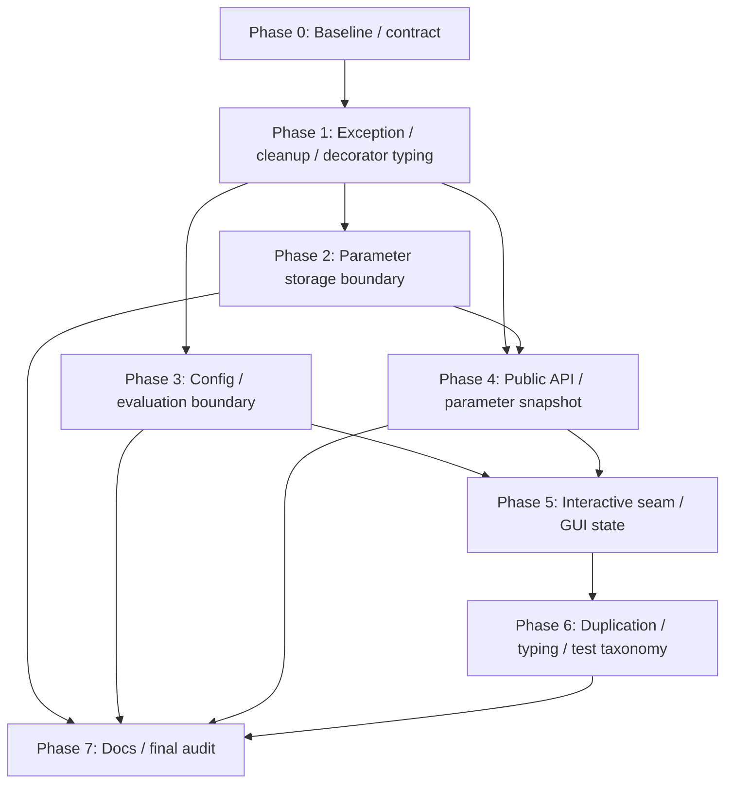

# `src/grafix` コードレビュー改善 実装計画（2026-07-22）

- 作成日: 2026-07-22
- 基準 HEAD: `b3d04a0`
- 根拠レビュー: `docs/review/src_grafix_code_review_2026-07-22.md`
- ステータス: **実装完了（2026-07-22）**

計画作成開始時の `git status --porcelain`:

```text
?? docs/review/src_grafix_code_review_2026-07-22.md
```

上記レビュー文書は直前の依頼で作成した関連成果物であり、本計画では内容を変更しない。本計画書の追加後は
同レビュー文書と本計画書の 2 ファイルだけが未追跡である状態を維持する。

## 1. 目的

レビューの CR-001〜CR-012 を、依存関係と失敗時の rollback 単位に沿って段階的に改善する。

最終的に次の状態を目指す。

- `core` は parameter filesystem mutation や config discovery を所有しない。
- process-control exception と cleanup error の優先順位が public owner 間で一致する。
- `@primitive` / `@effect` 適用後も利用者の callable signature が保持される。
- 公開 catalog inspection から evaluator に、`RenderSession` から close 可能な子 owner に到達できない。
- ParamStore の GUI-owned snapshot は一つの immutable value として module 境界を越える。
- `SceneRunner`、`DrawWindowSystem`、GUI state の composition seam と lifetime owner が明示される。
- trusted internal path の重複 validation と grid diagnostic adapter の clone がなくなる。
- runtime の受理契約、型契約、mypy、pytest marker、CI command が一致する。

Geometry DAG、catalog generation、cache/resource ownership、render/export の中心設計は維持する。改善のために
別の大規模 framework を追加する計画ではない。

## 2. 承認境界と進行規則

- [x] ユーザーが本計画を承認する。
- [x] 承認後、実装開始時の HEAD と `git status --porcelain` を本書へ追記する。
- [x] 承認前には production code、test、stub、設定、既存文書を変更しない。
- [x] 各実装単位は characterization/regression test、production 変更、focused verification の順で行う。
- [x] 一つの実装単位で変更する owner または capability boundary は一つに限定する。
- [x] 各 Phase の完了項目を `[x]` に更新し、実測 command/result を本書へ追記する。
- [x] 依頼外差分を restore、reset、move、delete、overwrite、stage しない。
- [x] 依存追加、長時間 full suite、headed GUI、長時間 benchmark は実行時の許可境界を再確認する。
- [x] commit、push、release は明示依頼がない限り行わない。

共通の停止条件:

- on-disk schema や cache correctness を決めないまま file/module 移動を始める必要がある。
- compatibility wrapper、旧 import path の re-export、dual path、feature flag が必要になる。
- generic DI container、service locator、event bus、Repository/DAO framework が必要になる。
- 依頼外差分へ触れないと focused test を実行できない。
- baseline の既存 failure と今回の regression を区別できない。
- data-loss window、process-control exception の置換、resource leak が fault-injection test に残る。

このいずれかに該当した場合は実装を止め、未決事項、最小の選択肢、影響範囲を本書へ追記して確認を求める。

## 3. この計画で固定する設計判断

### 3.1 例外と cleanup

- source reload が failure result へ変換するのは `Exception` だけとする。
- `KeyboardInterrupt`、`SystemExit`、その他の非 `Exception` は candidate cleanup 後に同じ instance/type で
  再送出する。
- cleanup は取得済み resource を全て逆順に試し、body/constructor の root error を優先する。
- body/root error がない場合は最初の cleanup error を送出する。
- secondary cleanup error は既存 logger、exception note、diagnostic のうち owner に適した一経路で
  観測可能にする。secondary を root と置き換えない。
- 新しい例外階層や lifecycle framework は作らず、既存 `CleanupErrors` を必要最小限だけ拡張する。

### 3.2 parameter storage boundary

- 新規の application-neutral infrastructure module を `src/grafix/parameter_storage.py` に一つだけ置く。
- `src/grafix/core/parameters/persistence.py` は削除し、互換 re-export は残さない。
- `core.parameters` には codec、decode result、memento/snapshot、prune decision だけを残す。
- `parameter_storage.py` が file read、atomic write、quarantine、recovery journal、primary/recovery 選択、
  finalize/unlink を所有し、既存 `grafix.file_io` の atomic primitive を利用する。
- 非変更 read、pure decode、filesystem mutation を伴う recover/commit を名前と API で分ける。
- `ParamStoreAutosave` を core に残す場合、save callback を必須注入とし、storage implementation を default
  argument に持たせない。
- ParamStore JSON schema/version、recovery 選択規則、quarantine rollback の安全性は維持する。
- 複数 backend や汎用 storage protocol は作らない。

### 3.3 runtime config と evaluation identity

- `RuntimeConfig` value、ContextVar binding、pure mapping validation は core に残す。
- YAML/package resource read、CWD/HOME discovery、fallback、表示用 report は新規
  `src/grafix/runtime_config_loader.py` へ移す。
- `run()`、`render()`、CLI などの application root が config を一度解決し、subsystem へ明示注入する。
- `RealizeSession`、`realize()`、`realize_scene()` などの低水準評価は暗黙 discovery を行わない。
- user `draw` / authoring scope には full `RuntimeConfig` を渡す。DAG evaluator scope には新しい
  `EvaluationConfig` だけを渡す。
- `EvaluationConfig` の初期 field は built-in geometry が実際に観測する `font_dirs` とし、根拠のない
  UI/export/MIDI field は加えない。
- custom evaluator が外部状態を必要とする場合は operation argument または既存
  `external_dependency_hook` へ明示する。full `RuntimeConfig` の暗黙参照を cache contract にしない。
- fingerprint を狭めるのは evaluator scope の分離後だけとする。先に key だけを変更しない。

### 3.4 公開 API と parameter snapshot

- `G/E.catalog()` と `describe()` は evaluator-free の frozen `OperationInfo` を返す。
- `OperationInfo` は inspection に必要な name、kind、description、arity、parameter schema/source 情報だけを
  持つ。一つの DTO で primitive/effect を扱う。
- `RenderSession` の public property は allowlist 方式で決める。
  - 維持: `options`、`param_store`、`config`、`runtime_limits`、`metadata`。
  - 削除候補: `style_resolver`、`realize_session`、`evaluation_context`、`definitions`、
    `evaluation_resources`、`cache_store`。
- 実利用がある query だけを immutable value として追加し、owner object や「念のため」の view は返さない。
- `Frame` / `RealizedLayer` のような既存の安定した immutable domain value は API wrapper で二重化しない。
- `ParamStoreMemento` と新 snapshot を並存させず、canonical な `ParameterAdjustmentSnapshot` へ一括置換する。
- ParamStore は revision/history/rollback の aggregate root のまま維持し、field ごとの micro-class へ
  分解しない。

### 3.5 interactive composition と state lifetime

- `SceneRunner` にだけ狭い internal `MpDraw` Protocol/factory seam を設ける。公開 DI API にはしない。
- `MpDraw` の process、queue、restart、close は一つの aggregate に残す。
- ACK、known revision、latest-wins、stale result など副作用を持たない判断だけを内部 collaborator へ分ける。
- presented frame、provenance token、capture binding は同じ frame lifetime を持つ一つの state owner にする。
- `DrawWindowSystem.draw_frame()` は poll、evaluate、present、publish/record の順序を配線する。
- `api.runner.run()` は public validation と effective config の確定後、必要なら一つの private application
  lifetime owner へ委譲する。LOC 削減だけを目的に class は作らない。
- GUI filter/popup state は既存 `ParameterGuiSessionState`、またはその一つの子
  `WidgetSessionState` が所有する。global reset hook は作らない。

### 3.6 validation、typing、test taxonomy

- validation を残す境界は public API、filesystem/IPC deserialize、custom evaluator output とする。
- trusted producer が作った private DTO は、constructor が意味的 invariant を一度だけ検証する。
- exact-type check の総数削減は目標にせず、確認済みの submit/DTO 重複だけを対象にする。
- grid planner は pure kernel のままとし、diagnostic/spec 変換だけを effects-side の一 helper にする。
- mypy は `check_untyped_defs = true` を全体に適用し、`disallow_untyped_defs` は変更対象から段階的に
  広げる。最終的に全 23 files / 68 defs を解消してから global gate にする。
- pytest marker は「件数を作るため」に付けない。
  - `integration`: multiprocessing、subprocess、real resource lifecycle。
  - `e2e`: public CLI/application round trip。
  - performance は既存 benchmark CLI/CI lane を正とし、実 pytest performance test が無ければ
    `perf` marker の文書記述を削除する。

## 4. 非目標

- Geometry DAG、catalog generation、Geometry ID、packed geometry の再設計。
- numerical kernel のアルゴリズム変更や高速化。
- ParamStore 全体の細分化、history/rollback owner の移動。
- `MpDraw` を複数の close 可能な service へ分解すること。
- GUI layout、見た目、shortcut、操作仕様の変更。
- ParamStore JSON schema/version、config.yaml schema の変更。
- capture/export format、G-code ordering、provenance schema の変更。
- repository 全体の validation、comment、docstring の機械的削除。
- 全 3,824 tests の全面的な再分類や file 分割。
- 外部依存の追加。
- compatibility wrapper、deprecated alias、旧 file の re-export。
- 各 Phase での長時間 benchmark、100-cycle GUI/OS soak。

## 5. 意図する破壊的変更

リポジトリ方針に従い、次の変更には compatibility shim を作らない。

1. `grafix.core.parameters.persistence` の import path を削除し、内部 consumer を
   `grafix.parameter_storage` へ同時移行する。
2. non-mutating read と recovery mutation を別 API にし、headless の `parameter_source="saved"` は
   原本を変更しない。
3. `G/E.catalog()` / `describe()` の戻り値を `OperationInfo` に変更する。
4. `RenderSession` から close 可能な子 resource owner と evaluator catalog へ到達する property を削除する。
5. `SceneItem` の container を runtime/type とも `list` / `tuple` の再帰構造に限定する。
6. unbound の低水準評価による config discovery を削除し、explicit context/config を必須にする。
7. evaluator 中の full `current_runtime_config()` 参照を廃止し、`EvaluationConfig` または明示 dependency を使う。

すべて repository 内 consumer、test、stub、migration document を同じ Phase で更新する。

## 6. Finding と Phase の対応

| Finding | 主 Phase | 補助 Phase | 完了の要点 |
|---|---:|---:|---|
| CR-001 | 2 | 7 | core から parameter filesystem capability を排除 |
| CR-002 | 5 | 7 | test seam 後に frame/application state を寿命単位で移動 |
| CR-003 | 1 | 4, 7 | decorator signature と catalog property の型を固定 |
| CR-004 | 1 | 7 | process-control exception を cleanup 後に保持 |
| CR-005 | 4 | 7 | immutable adjustment snapshot を唯一の越境表現にする |
| CR-006 | 3 | 7 | loader/discovery と evaluation-semantic config を分離 |
| CR-007 | 4 | 7 | evaluator-free DTO、close 可能な owner の非公開化 |
| CR-008 | 1 | 7 | root error 優先・全 cleanup 実行を共通化 |
| CR-009 | 6 | 7 | grid adapter と validation owner を一つにする |
| CR-010 | 5 | 7 | `MpDrawFactory` を注入し private test patch を削除 |
| CR-011 | 5 | 7 | GUI state を session lifetime に揃える |
| CR-012 | 4, 6 | 7 | SceneItem、mypy、marker/CI の契約を一致させる |

## 7. 依存順



- Phase 2、3 は Phase 1 後に独立して進められるが、同じ worktree では順番に行う。
- Phase 4 の codec/snapshot 変更は persistence module の移動後に行い、同じ diff へ混在させない。
- CR-010 の factory seam を先に作り、その test seam を使って CR-002 の coordinator 整理を行う。
- structural change が終わった後に mypy/marker/test file を固定し、途中の file layout を gate にしない。

## 8. Phase 0 — baseline と契約固定

### 8.1 作業状態

- [x] 実装開始 HEAD、branch、`git status --porcelain` を記録する。
- [x] 本計画対象 file と依頼外差分を分離して記録する。
- [x] CR ごとの production callsite、public export、stub export、test private access を `/tmp` に保存する。
- [x] `runner._mp_draw = cast(Any, ...)`、`parameter_snapshot._*`、GUI mutable global、
  `_grid_spec_from_bbox` clone の件数と path を記録する。

### 8.2 baseline verification

- [x] `ruff check src/grafix tests` を実行して結果を記録する。
- [x] fresh cache の `mypy src/grafix` を実行して結果を記録する。
- [x] `mypy --disallow-untyped-defs src/grafix` の file/error inventory を保存する。
- [x] `pytest -q -p no:cacheprovider tests/architecture` を実行する。
- [x] source reload、RenderSession、persistence、runtime config、MpDraw、GUI session state の focused suite を
  実行する。
- [x] full pytest は所要時間と許可境界を確認後に baseline を一度取得する。

### 8.3 characterization contracts

- [x] initial/subsequent reload の `KeyboardInterrupt` / `SystemExit` 現行挙動を再現する。
- [x] RenderSession constructor/body/複数 close failure の call order と例外優先順位を記録する。
- [x] bare/引数付き `@primitive` / `@effect` の外部 mypy probe を恒久 fixture にする。
- [x] parameter read が正常、部分破損、完全破損で変更する path/bytes/mtime/directory entries を記録する。
- [x] RuntimeConfig の UI/output/MIDI/font 変更に対する evaluation fingerprint を記録する。
- [x] DWS 1 frame の reload/evaluate/present/capture/record 順を fake event log で固定する。

Phase 0 完了条件:

- [x] 全 CR に before contract または明示的な static inventory がある。
- [x] intentional breaking change と保持すべき runtime/on-disk behavior を区別できる。
- [x] 後続 Phase の failure が既存 failure か regression か判断できる。

## 9. Phase 1 — exception、cleanup、authoring typing

対象: CR-003、CR-004、CR-008

### 9.1 `RenderSession` cleanup contract（CR-008）

主対象:

- `src/grafix/core/lifecycle.py`
- `src/grafix/api/render.py`
- `tests/core/test_lifecycle.py`
- `tests/api/test_render_session.py`

アクション:

- [x] `CleanupErrors` で constructor failure、`__exit__`、`close()` の child cleanup を統一する。
- [x] constructor が途中失敗しても、取得済み resource を全て逆順に解放する。
- [x] body/root error がある場合は同じ error instance を優先する。
- [x] body error がない複数 cleanup failure では最初の error を優先する。
- [x] secondary failure を logger/note の一経路で全件観測可能にする。
- [x] close idempotency と partially-built owner の cleanup 順を固定する。

回帰 test:

- [x] constructor の各取得段階 × 各 cleanup failure の fault matrix。
- [x] body `Exception` / `KeyboardInterrupt` + 複数 close failure。
- [x] body なし + 複数 close failure。
- [x] 全 step が exactly once 呼ばれ、root traceback/cause が失われないこと。

### 9.2 source reload exception contract（CR-004）

主対象:

- `src/grafix/interactive/runtime/source_reload.py`
- `tests/interactive/runtime/test_source_reload.py`

アクション:

- [x] candidate cleanup と source path tracking を一つの cleanup path に保つ。
- [x] reload failure result へ変換する catch を `Exception` に限定する。
- [x] non-`Exception` は module/catalog/config cleanup 後に bare `raise` する。
- [x] initial load の通常 error は起動用 `RuntimeError` の `__cause__` に保持する。
- [x] subsequent の通常 error は last-good generation を維持した failed result にする。

回帰 test:

- [x] initial/subsequent の `KeyboardInterrupt` / `SystemExit` が同じ instance/type で届く。
- [x] `sys.modules`、candidate definition、ContextVar、source path tracking が cleanup される。
- [x] 通常 `Exception` と process-control exception の contract が混ざらない。
- [x] cleanup も失敗した場合に root process-control exception が優先される。

### 9.3 decorator と catalog property の型（CR-003）

主対象:

- `src/grafix/core/operation_authoring.py`
- `src/grafix/core/operation_catalog.py`
- `src/grafix/devtools/generate_stub.py`
- `src/grafix/api/__init__.pyi`
- `tests/stubs/`

アクション:

- [x] `ParamSpec` / `TypeVar` / overload で bare decorator と configured decorator の両方を型付けする。
- [x] decorated callable の positional、keyword-only、必須引数、戻り値を元 signature のまま保持する。
- [x] `OperationCatalogEntry.schema/evaluator/cache_policy/defaults/meta` に具体型を付ける。
- [x] runtime wrapper、`cast(Any, ...)`、型だけの別 callable を追加しない。
- [x] fresh stub を再生成し checked-in stub と同期する。

型 test:

- [x] valid primitive/effect call は mypy 成功。
- [x] 不正な argument name/type、必須引数欠落は mypy non-zero。
- [x] `reveal_type` が decorated 前後で同じ callable signature を示す。
- [x] runtime では元 callable identity と declaration attachment を維持する。

Phase 1 gate:

- [x] 対象 tests、architecture tests、Ruff、fresh mypy、stub sync が成功する。
- [x] process-control exception、body/root error、decorated signature の三契約が恒久 test になっている。

## 10. Phase 2 — parameter storage boundary

対象: CR-001

### 10.1 core と infrastructure の分離

主対象:

- 新規 `src/grafix/parameter_storage.py`
- 削除 `src/grafix/core/parameters/persistence.py`
- `src/grafix/core/parameters/codec.py`
- `src/grafix/core/parameters/autosave.py`
- `src/grafix/api/render.py`
- `src/grafix/interactive/runtime/parameter_session.py`
- `src/grafix/interactive/runtime/parameter_recovery.py`

アクション:

- [x] codec の decode result を filesystem path に依存しない pure value にする。
- [x] `read_param_store(...)` は read/decode だけを行い、rename/write/unlink を一切行わない。
- [x] 部分破損、完全破損、unsupported schema、read error を typed result/error で区別する。
- [x] `recover_param_store_session(...)` が quarantine、journal、primary/recovery 選択を明示的に行う。
- [x] `write_param_store*()` と `finalize_parameter_session()` が atomic write/unlink policy を所有する。
- [x] `ParamStoreAutosave` の save callback を必須注入にする。
- [x] API render の `parameter_source="saved"` は non-mutating read を使う。
- [x] interactive `ParameterSession` と明示 `parameter_source="recovery"` だけが recovery command を使う。
- [x] 全 internal consumer を一括移行し、旧 module/import path を削除する。

### 10.2 data-safety tests

- [x] non-mutating read の前後で原本 bytes、mtime、directory entries が不変である。
- [x] 正常、missing、部分破損、完全破損、unsupported schema、permission/read error を検査する。
- [x] rename、journal write、primary write、unlink の各 fault で原本を失わない。
- [x] quarantine 後の journal failure では原本を復元する。
- [x] recovery/finalize の再実行が定義済みの結果へ収束する。
- [x] JSON schema、round-trip、prune、未観測 group 保持が変更前と一致する。

### 10.3 architecture gate

- [x] `core -> grafix.file_io` と `core -> grafix.parameter_storage` を禁止する。
- [x] core parameters 内の `os.replace`、unlink、fsync、tempfile、atomic writer import を禁止する。
- [x] module 名の付け替えだけで通らないよう filesystem mutation capability を検査する。
- [x] filesystem test を `tests/core` から application/infrastructure 境界の test へ移す。

Phase 2 完了条件:

- [x] core に parameter filesystem mutation がない。
- [x] read/decode は filesystem を変更せず、recover/commit だけが変更する。
- [x] failure injection の全経路で primary/recovery の少なくとも一方から復元できる。
- [x] focused tests、architecture tests、Ruff、fresh mypy が成功する。

## 11. Phase 3 — runtime config loader と evaluation identity

対象: CR-006

### 11.1 loader/discovery の外出し

主対象:

- `src/grafix/core/runtime_config.py`
- 新規 `src/grafix/runtime_config_loader.py`
- `src/grafix/api/render.py`
- `src/grafix/api/runner.py`
- config を使う CLI/devtools
- `tests/core/test_runtime_config.py`
- 新規 loader test

アクション:

- [x] immutable value、binding、pure mapping validation と I/O loader を分離する。
- [x] YAML import、package resource read、CWD/HOME discovery、layer merge、fallback/reporting を outer module
  へ移す。
- [x] pure parser test では `open`、package resource、CWD/HOME access を fail-fast monkeypatch する。
- [x] loader test で packaged default、CWD、HOME、explicit path の precedence と path resolution を固定する。
- [x] `run/render/CLI` が一度だけ load し、同じ immutable snapshot を全 subsystem へ渡す。
- [x] unbound `current_runtime_config()` は discovery せず、明示的な未束縛 error を返す。

### 11.2 draw scope と evaluator scope の分離

主対象:

- 新規 `src/grafix/core/evaluation_config.py`
- `src/grafix/core/evaluation_context.py`
- `src/grafix/core/realize.py`
- `src/grafix/core/pipeline.py`
- `src/grafix/core/font_resolver.py`
- `src/grafix/core/primitives/text.py`
- `src/grafix/interactive/runtime/scene_runner.py`
- `src/grafix/interactive/runtime/mp_draw.py`

アクション:

- [x] `EvaluationConfig(font_dirs=...)` を immutable value として導入する。
- [x] `EvaluationContext` と evaluation fingerprint は full `RuntimeConfig` ではなく
  `EvaluationConfig` を保持する。
- [x] user draw/preset authoring の短い scope だけ full RuntimeConfig を bind する。
- [x] DAG evaluator は `current_evaluation_config()` だけを bind/参照する。
- [x] text/font built-in を新しい evaluation config と external font fingerprint の組み合わせへ移す。
- [x] low-level `RealizeSession/realize/realize_scene` は explicit context/config を要求する。
- [x] custom evaluator の config 依存 test/docs を argument または `external_dependency_hook` へ移す。
- [x] fingerprint change を intentional breaking change として migration document に記録する。

correctness test:

- [x] window position、GUI shortcut、output path、PNG/G-code、MIDI の変更では geometry key が同じ。
- [x] `font_dirs` の変更では evaluation fingerprint/key が変わる。
- [x] font file bytes の変更は external-dependency fingerprint/key を変える。
- [x] 同じ geometry key の evaluator は同じ config input だけを観測する。
- [x] low-level evaluation は CWD/HOME discovery、YAML read、package default read を行わない。
- [x] parent/worker、draft/final、headless/interactive で同じ EvaluationConfig contract を使う。

Phase 3 停止条件:

- custom evaluator が除外予定の RuntimeConfig field を観測可能なまま fingerprint だけを狭める。
- draw scope と evaluator scope を分けると operation identity/external dependency の owner が不明になる。
- config.yaml schema change や新しい dependency declaration framework が必要になる。

Phase 3 完了条件:

- [x] core の config value/parser から filesystem discovery がなくなる。
- [x] low-level evaluation に ambient I/O がない。
- [x] evaluation fingerprint は評価意味論と font asset だけで変わる。
- [x] focused config/cache/font/worker tests、architecture tests、Ruff、fresh mypy が成功する。

## 12. Phase 4 — public API と parameter snapshot boundary

対象: CR-005、CR-007、CR-012 の SceneItem 部分

### 12.1 evaluator-free catalog API（CR-007）

主対象:

- 新規 `src/grafix/api/operation_info.py`、または evaluator を import しない同等の neutral module
- `src/grafix/api/primitives.py`
- `src/grafix/api/effects.py`
- `src/grafix/api/render.py`
- public root exports / stub generator / stub

アクション:

- [x] frozen `OperationInfo` と必要最小限の parameter inspection value を定義する。
- [x] `catalog()` / `describe()` が同 DTO を返す。
- [x] public DTO から `declaration`、`evaluation`、`evaluator` に到達できない。
- [x] `RenderSession` property の repository/doc callsite を棚卸しし、固定 allowlist 以外を削除する。
- [x] `realize_session`、`evaluation_resources`、`cache_store` と evaluator catalog へ至る property を削除する。
- [x] 実需要がある場合だけ owner を返さない stats/query/command を追加する。
- [x] fresh public stub、API docstring、migration document を更新する。

### 12.2 canonical adjustment snapshot（CR-005）

主対象:

- 新規 `src/grafix/core/parameters/adjustment_snapshot.py`
- `src/grafix/core/parameters/memento.py`
- `src/grafix/core/parameters/variations.py`
- `src/grafix/core/parameters/codec.py`
- `src/grafix/core/parameters/store.py`

アクション:

- [x] `ParameterAdjustmentSnapshot` を frozen value とし、mutable dict/live `ParamState` を露出しない。
- [x] snapshot は GUI-owned adjustment、collapse、effect order/topology signature の必要値だけを持つ。
- [x] store が snapshot capture/apply の唯一の private representation owner になる。
- [x] variations は snapshot の public iteration/query/diff API だけを使う。
- [x] variation JSON encode/decode を codec に集約し、`codec -> variations._encode_variation` を削除する。
- [x] `ParamStoreMemento` を削除し、alias/re-export を残さない。
- [x] revision/history/rollback の atomicity と event granularity を維持する。
- [x] serialized ParamStore schema/version を変更しない。

回帰 test:

- [x] snapshot immutability、alias 非共有、capture/apply、encode/decode round-trip。
- [x] empty/unknown key、kind change、collapse、effect order、variation diff/morph/duplicate。
- [x] snapshot 適用を observer が partial state として観測しない。
- [x] revision/history entry が従来どおり一 command 一回だけ進む。
- [x] memento/variation/codec から `store._states/_meta` と snapshot private field への参照が 0。

### 12.3 `SceneItem` の型/runtime 一致（CR-012）

- [x] recursive alias を `Geometry | Layer | list[SceneItem] | tuple[SceneItem, ...]` にする。
- [x] `normalize_scene()` の runtime acceptance も list/tuple に揃える。
- [x] Geometry/Layer/list/tuple/nested は runtime/mypy とも成功する。
- [x] `str`、`bytes`、custom Sequence、set、generator は runtime/mypy とも拒否する。
- [x] `draw() -> str` が public `run/render` type fixture で失敗する。

Phase 4 gate:

- [x] public type tests、parameter tests、codec golden/round-trip、stub sync が成功する。
- [x] public stub に `OperationCatalogEntry`、close 可能な child owner が現れない。
- [x] architecture tests、Ruff、fresh mypy が成功する。

## 13. Phase 5 — interactive seam、coordinator、GUI session state

対象: CR-002、CR-010、CR-011

### 13.1 `MpDraw` Protocol/factory seam（CR-010）

主対象:

- `src/grafix/interactive/runtime/scene_runner.py`
- `src/grafix/interactive/runtime/mp_draw.py`
- runtime test fixtures

アクション:

- [x] `submit`、`poll_latest`、`latest_successful_result`、`last_submitted_frame_id`、`begin_epoch`、`close`
  だけの internal Protocol を定義する。
- [x] callable factory を `SceneRunner` constructor へ internal dependency として注入する。
- [x] initial construction と reload replacement が同じ factory と引数 contract を使う。
- [x] default factory だけが concrete `MpDraw(...)` を構築する。
- [x] tests は Protocol 準拠 fake を factory から渡す。
- [x] `runner._mp_draw = cast(Any, fake)` と同種の private assignment を全て削除する。

回帰 test:

- [x] initial/reload の factory call count、config、epoch、generation。
- [x] reload 成功時の旧 worker close、replacement failure 時の last-good 保持。
- [x] sync/mp parity、timeout、restart、stale result、close idempotency。
- [x] fake の Protocol 適合を mypy で検査する。

### 13.2 `MpDraw` 内部判断の分離（CR-002/009）

- [x] process/queue/restart/close owner は `MpDraw` に残す。
- [x] snapshot ACK/known revision と latest-task/stale-result の純粋な state transition を抽出する。
- [x] 抽出 collaborator は close、queue、process、thread を所有しない。
- [x] latest-wins、generation replacement、snapshot copy/ACK count の既存 contract を維持する。
- [x] class 数/LOC を acceptance criterion にしない。

### 13.3 presented frame state（CR-002）

主対象:

- 新規 `src/grafix/interactive/runtime/presented_frame.py`
- `src/grafix/interactive/runtime/draw_window_system.py`
- capture/provenance runtime tests

アクション:

- [x] presented revision/frame ID、fresh serial、last layers/t、export snapshot、provenance token を
  一つの `PresentedFrameState` が所有する。
- [x] token 作成、current 判定、materialize、commit、capture snapshot 昇格を同 owner へ移す。
- [x] `DrawWindowSystem` は renderer/SceneRunner/CaptureQueue/RecordingSession の command を順に呼ぶ。
- [x] existing `SourceReloadController` を配線し、新しい reload coordinator は作らない。
- [x] `draw_frame()` から provenance/capture state の直接 mutation を削除する。
- [x] fresh/stale/error/recording/pending-capture の transition matrix を pure/fake test にする。

### 13.4 runner composition（CR-002）

- [x] nested closure/state のうち既存 `ParameterSession`、`WorkspaceWindowController`、GUI system が所有できる
  ものを先に移す。
- [x] その後も独立した application lifetime state が残る場合だけ、一つの private
  `InteractiveApplication` owner を導入する。
- [x] `run()` は public validation、effective config/RenderOptions の確定、application 実行に限定する。
- [x] 部分構築 failure では取得済み owner だけを逆順に close し、root error を保持する。
- [x] DI container、generic application framework、class-per-function は作らない。

### 13.5 GUI widget session state（CR-011）

主対象:

- `src/grafix/interactive/parameter_gui/session_state.py`
- `src/grafix/interactive/parameter_gui/widgets.py`
- `src/grafix/interactive/parameter_gui/table.py`
- `src/grafix/interactive/parameter_gui/gui.py`

アクション:

- [x] font/choice filter と snippet popup text/focus を session-owned state へ移す。
- [x] widget/table render input から state を明示的に渡す。
- [x] close で一括解放し、module-global dict と `global` 文を削除する。
- [x] global reset API や別の service locator を追加しない。

回帰 test:

- [x] 同じ widget key を使う同時/逐次 2 session の状態が分離される。
- [x] 選択時の個別削除が別 session/key に影響しない。
- [x] close 後に旧 state が新 session へ現れない。
- [x] open -> edit/filter -> close -> reopen の GUI lifecycle を fake backend で確認する。
- [x] 実 GUI smoke は許可境界を確認後に filter/focus UX だけを確認する。

Phase 5 gate:

- [x] tests 内の `SceneRunner._mp_draw` 直接代入とそのための `cast(Any, ...)` が 0。
- [x] DWS に presented/provenance の mutable field が戻らない architecture gate がある。
- [x] widgets/table の対象 module-global mutable state が 0。
- [x] runtime focused tests、architecture tests、Ruff、fresh mypy が成功する。
- [x] short interactive/MpDraw benchmark の hard contract/checksum が一致する。

## 14. Phase 6 — 局所重複、validation、typing、test taxonomy

対象: CR-009、CR-012 の tooling 部分

### 14.1 grid diagnostic adapter（CR-009）

- [x] 4 個の `_grid_spec_from_bbox` の数値/診断 contract を parameterized test で固定する。
- [x] pure `geometry_kernels.grid.plan_grid_from_bbox` は変更しない。
- [x] plan result を operation diagnostic と grid spec に変換する effects-side helper を一つだけ作る。
- [x] metaball、growth、reaction_diffusion、isocontour を同 helper へ移行する。
- [x] 旧 4 clone を削除し、`effects/util.py` や新しい catch-all helper package を作らない。
- [x] `cell_count` / `MAX_GRID_CELLS` を実体に合わせて point/sample naming へ一括変更し、alias は残さない。

### 14.2 duplicate validation の整理（CR-009）

- [x] public/deserialize/trusted/semantic invariant の validation matrix を文書化する。
- [x] `_DrawTask` / export job DTO と `submit()` 間で同じ field を検査する箇所を一つにする。
- [x] snapshot の排他、revision 非負、success/error payload 排他などの意味的 invariant は残す。
- [x] IPC receive/decode、filesystem、custom evaluator output の検証は弱めない。
- [x] rejected/accepted payload、error type/message の public/untrusted contract を維持する。
- [x] submit hot path と process integration の short benchmarkを比較する。

### 14.3 mypy gate（CR-003/012）

- [x] `check_untyped_defs = true` を全体設定へ追加する。
- [x] 変更対象 module へ `disallow_untyped_defs = true` を段階適用する。
- [x] baseline の 23 files / 68 defs を通常 Python と Numba kernel に分類する。
- [x] 通常 Python function へ具体的な引数/戻り値型を付ける。
- [x] Numba は typed Python wrapper と annotated compiled kernel の shape/dtype contract を固定する。
- [x] blanket `Any`、module-wide ignore、型を通すだけの cast を追加しない。
- [x] `mypy --disallow-untyped-defs src/grafix` が成功してから global `disallow_untyped_defs = true` を固定する。
- [x] Numba compile/runtime/数値 parity と short benchmark を確認する。

### 14.4 pytest marker と CI/docs（CR-012）

- [x] 現 tests を unit、integration、e2e、benchmark CLI contract に分類する。
- [x] `integration` と `e2e` を `pyproject.toml` に登録し、実依存に基づいて付与する。
- [x] `pytest --collect-only -m integration` と `-m e2e` が意図した非 0 件を選択する。
- [x] unit selector、integration、e2e の和が意図した automated suite と一致する。
- [x] 実 pytest performance test がなければ `perf` marker の実行例を docs から削除し、既存
  `python -m grafix benchmark` command を案内する。
- [x] CI で unit、integration、e2e を別 command として実行し、最終 full suite も維持するかを実測時間で
  決める。単なる重複実行で timeout を増やさない。
- [x] `docs/agent_docs/testing.md` を実際の marker/benchmark contract に合わせる。

### 14.5 test file の責務整理

- [x] Phase 5 の Protocol fixture を使い、`test_mp_draw.py` を message、lifecycle、scheduler、SceneRunner、
  stress/integration の責務単位へ分ける。
- [x] test 名と対象 production owner を対応させる。
- [x] private layout を共有するためだけの helper/fixture は削除する。
- [x] 他の巨大 test file の機械的分割へ scope を広げない。

Phase 6 完了条件:

- [x] grid adapter implementation が一つで、pure kernel に diagnostic side effect がない。
- [x] 対象 submit path の各 invariant owner が一つである。
- [x] `mypy --disallow-untyped-defs src/grafix`、通常 mypy、Ruff が成功する。
- [x] marker command と docs/CI の記述が一致する。
- [x] runtime/数値/capture contract と short benchmark に regression がない。

## 15. Phase 7 — document、migration、最終監査

### 15.1 architecture / migration

- [x] `architecture.md` に `grafix.parameter_storage`、config loader、EvaluationConfig、
  PresentedFrameState/application owner の依存方向と寿命を反映する。
- [x] architecture diagram と `docs/architecture_visualization.md` を実装に合わせる。
- [x] migration document に次の破壊的変更を記録する。
  - parameter persistence import/API と saved/recovery の副作用差。
  - `OperationInfo` と catalog inspection。
  - `RenderSession` property allowlist。
  - explicit low-level evaluation config と custom evaluator dependency。
  - `SceneItem` の list/tuple contract。
- [x] README/public docstring/stub の例を新 contract に合わせる。
- [x] compatibility shim が存在しないことを source/tests/typings 全体で確認する。

### 15.2 final verification

- [x] `ruff check src/grafix tests`。
- [x] fresh cache の `mypy src/grafix`。
- [x] `mypy --disallow-untyped-defs src/grafix`。
- [x] `pytest -q -p no:cacheprovider tests/architecture`。
- [x] `pytest -q tests/stubs/test_api_stub_sync.py` と fresh generated stub の byte exact 比較。
- [x] unit、integration、e2e の各 selector。
- [x] 許可確認後の full pytest。
- [x] config fingerprint、parameter recovery、source reload、RenderSession cleanup の focused fault probe。
- [x] short benchmark の status/checksum/hard contract。
- [x] 許可確認後の実 GUI open/filter/close/reopen smoke。
- [x] `git diff --check` と最終 `git status --porcelain`。

### 15.3 traceability audit

- [x] CR-001〜CR-012 をそれぞれ「解消 / 一部 / 保留」と判定する。
- [x] 各 CR に production path、test、architecture/static gate、実行結果を対応付ける。
- [x] 未完了項目と理由を本書から削除せず明記する。
- [x] 全必須項目が完了し、必要作業が残っていない場合だけステータスを「実装完了」にする。

## 16. 最終 Definition of Done

- [x] core から parameter filesystem mutation capability と config discovery への依存がない。
- [x] read/decode は原本を変更せず、recover/commit だけが filesystem を変更する。
- [x] reload 中の `KeyboardInterrupt` / `SystemExit` が同じ型/instance で caller へ届く。
- [x] public owner の cleanup は全 step 実行、root error 優先、secondary 観測可能で統一される。
- [x] decorator 後の callable signature が保持され、不正引数が mypy error になる。
- [x] `G/E.describe()` の戻り値に declaration/evaluator がない。
- [x] `RenderSession` から close 可能な child owner を取得できない。
- [x] evaluation fingerprint が UI/export/MIDI/output 設定を含まず、評価入力だけで変わる。
- [x] ParamStore snapshot を別 module が private field 経由で読まない。
- [x] tests に `runner._mp_draw` 直接代入と、そのための `cast(Any, ...)` がない。
- [x] DWS の presented/provenance state と GUI filter/popup state の lifetime owner が一つである。
- [x] grid adapter が一つで、trusted submit path に同一 validation が重複しない。
- [x] SceneItem の static/runtime acceptance が一致する。
- [x] repo-wide untyped def が 0 で、marker/docs/CI command が実態と一致する。
- [x] focused/full tests、architecture tests、Ruff、mypy、stub sync、short benchmark が成功する。
- [x] public/on-disk/geometry behavior の意図しない差分がない。

## 17. 実施記録（承認後に更新）

- ユーザー承認: 2026-07-22（「ok、最後まで完了させて」）
- 実装開始日: 2026-07-22
- 実装開始 HEAD: `b3d04a0`（branch: `main`）
- 実装開始時 status:
  - `?? docs/plan/src_grafix_code_review_implementation_plan_2026-07-22.md`
  - `?? docs/review/src_grafix_code_review_2026-07-22.md`
- Phase 0 baseline:
  - `ruff check src/grafix tests`: 成功。
  - fresh `mypy src/grafix`: 成功（275 files）。
  - `mypy --disallow-untyped-defs src/grafix`: 23 files / 68 errors を
    `/tmp/grafix-mypy-untyped-baseline.txt` に保存。
  - `pytest -q -p no:cacheprovider tests/architecture`: 22 passed。
  - focused baseline: 389 passed。
  - clean archive full suite: 3792 passed / 32 failed。31件は archive に含まれない ignored
    `.grafix/config.yaml` と project asset 不在、1件はその config 由来 operation が無い stub 差分で、
    実 workspace の最終 suite で再判定する。
  - static/callsite inventory: `/tmp/grafix-review-baseline-inventory-2026-07-22.txt`。
- Phase 1:
  - `RenderSession` cleanup は `CleanupErrors` に統一し、constructor/body/複数 close failure と
    secondary note を fault injection で固定。
  - source reload の `KeyboardInterrupt` / `SystemExit` を cleanup 後に同じ root として再送出。
  - decorator の bare/configured 両形を ParamSpec で型付けし、外部 mypy probe 追加。
- Phase 2:
  - `grafix.parameter_storage` へ filesystem read/recovery/write/finalize を移し、旧 core persistence
    module/import を削除。
  - focused storage/parameter tests 512 passed、architecture 27 passed、Ruff 成功。
- Phase 3:
  - core を immutable config value / pure parser / binding に限定し、YAML・package resource・CWD/HOME
    discovery を `grafix.runtime_config_loader` へ移動。
  - `EvaluationConfig(font_dirs)` を評価入力とし、UI/export/MIDI/output 設定を geometry fingerprint から除外。
  - loader 44、core/architecture 114、font/pipeline 101、render/runner/mp/scene 403 tests passed。
  - 対象 mypy、Ruff、compileall/import 成功。
- Phase 4:
  - evaluator-free の frozen `OperationInfo` を公開 catalog/describe の唯一の DTO とし、
    `RenderSession` は `options`、`param_store`、`config`、`runtime_limits`、`metadata` の固定 allowlist に限定。
  - `ParameterAdjustmentSnapshot` を canonical snapshot とし、store/variation/codec 間の private representation
    横断と旧 `ParamStoreMemento` を削除。既存 JSON schema/version は維持。
  - `SceneItem` の static/runtime acceptance を再帰的な `list` / `tuple` に統一し、拒否対象も type fixture で固定。
  - snapshot、variation、catalog、scene、stub を含む統合 focused suite で確認し、最終 full suite でも成功。
- Phase 5:
  - `SceneRunner` に private `MpDraw` Protocol/factory seam を追加し、初期生成と reload replacement を同じ
    factory contract に統一。tests の `runner._mp_draw` 直接代入を 0 件にした。
  - `_MpDrawState`、`PresentedFrameState`、`_InteractiveApplication` を、process owner を増やさず純粋な判断・
    frame lifetime・application lifetime ごとに抽出。
  - GUI の font/choice filter と snippet popup state を `WidgetSessionState` に移し、close 時の `clear()` と
    fake backend の open/edit/close/reopen test を追加。
  - 実 native GUI で `Grafix` / `Grafix Inspector` を開き、search input を focus して `radius` を入力、
    close event で Inspector が hide され、Cmd+I で再表示されることを確認。smoke harness は確認後に削除。
- Phase 6:
  - grid diagnostic 変換を `grid_spec_from_bbox_with_diagnostic()` 一つへ集約し、point/sample naming に統一。
    pure grid planner には diagnostic side effect を追加していない。
  - `_DrawTask` は `MpDraw.submit()` を producer/validation owner とし、export は同じ validation helper を
    public submit と direct DTO boundary から利用する形に統一。untrusted decode の検査は維持。
  - baseline 23 files / 68 untyped defs を通常 callback/wrapper と Numba kernel に分けて型付けし、最後の
    `LineMesh.__init__` を含め repo-wide untyped def を 0 件にした。
  - `integration` / `e2e` marker、CI lane、testing document を一致させ、`test_mp_draw.py` の責務を
    message/state/scheduler/stress/SceneRunner に限定分割。
- Phase 7:
  - `README.md`、`architecture.md`、`docs/architecture_visualization.md`、`docs/developer_guide.md`、
    `docs/migration_2026-07-22.md`、public docstring/stub を新 contract に更新。
  - 旧 persistence/memento import、compatibility alias、grid clone、private MpDraw test mutation が無いことを
    source/tests/typings と architecture gate で確認。

### 17.1 最終 verification

| Gate | 実測結果 |
|---|---|
| `compileall -q src/grafix tests` | 成功 |
| `ruff check src/grafix tests typings` | All checks passed |
| fresh `mypy --no-incremental src/grafix` | 280 source files、成功 |
| fresh `mypy --no-incremental --disallow-untyped-defs src/grafix` | 280 source files、成功 |
| `pytest -q -p no:cacheprovider tests/architecture` | 37 passed |
| stub sync/generator tests + fresh stub byte exact 比較 | 7 passed、byte exact |
| focused config/cache/storage/recovery/reload/session fault probe | 244 passed |
| unit selector `-m "not integration and not e2e"` | 3721 passed、163 deselected |
| integration selector `-m integration` | 110 passed、3774 deselected |
| e2e selector `-m e2e` | 53 passed、3831 deselected |
| full `pytest -q -p no:cacheprovider` | 3884 passed in 261.73s |
| short benchmark | 11/11 cases `status=ok`、全 case checksum あり、全 hard contract passed |
| actual GUI smoke | open / filter focus+edit / close-hide / Cmd+I reopen、成功 |
| `git diff --check` | 成功 |

benchmark result:

- `/tmp/grafix-benchmark-code-review-final/runs/20260722_code_review_final.json`: 6/6 `ok`。
- `/tmp/grafix-benchmark-code-review-final/runs/20260722_mp_final.json`: 2/2 `ok`、slider churn の 8 hard
  contracts を含め全て成功。
- `/tmp/grafix-benchmark-code-review-final/runs/20260722_numba_final.json`: 3/3 `ok`、reaction diffusion の
  exact checksum contract を含め成功。

marker partition は `3721 + 110 + 53 = 3884` で full collection と一致し、integration/e2e の重複は 0。
最終 suite は baseline archive で不足していた project-local config/assets を含む実 workspace で全件成功した。

### 17.2 Finding traceability

| Finding | 判定 | 主な production path | test / static gate |
|---|---|---|---|
| CR-001 | 解消 | `grafix/parameter_storage.py`、`core/parameters/codec.py`、`autosave.py` | `tests/test_parameter_storage.py`、`test_parameter_recovery.py`、dependency boundary |
| CR-002 | 解消 | `runtime/mp_draw.py`、`presented_frame.py`、`draw_window_system.py`、`api/runner.py` | MpDraw state/scheduler/stress、presented-frame、DWS、runner composition tests |
| CR-003 | 解消 | `core/operation_authoring.py`、`api/primitives.py`、`api/effects.py` | `test_operation_authoring_typing.py`、fresh normal/strict mypy |
| CR-004 | 解消 | `runtime/source_reload.py` | 49 source-reload tests。同一 exception instance と初期 error cause を検査 |
| CR-005 | 解消 | `adjustment_snapshot.py`、`store.py`、`variations.py`、`codec.py` | adjustment snapshot/history/variation/codec tests、旧名/private crossing grep |
| CR-006 | 解消 | `runtime_config_loader.py`、`evaluation_config.py`、`realize.py`、font modules | config/loader/cache/font/worker tests、ambient discovery architecture gate |
| CR-007 | 解消 | `api/_operation_info.py`、`operation_info.py`、`render.py` | operation catalog/render-session tests、stub sync、public owner gate |
| CR-008 | 解消 | `core/lifecycle.py`、`api/render.py` | lifecycle/render-session fault injection。全 cleanup・root 優先・secondary note を検査 |
| CR-009 | 解消 | `operation_diagnostics.py`、`geometry_kernels/grid.py`、`mp_draw.py`、`export_job_system.py` | grid/validation tests、`test_implementation_quality.py`、short benchmark |
| CR-010 | 解消 | `runtime/scene_runner.py` の Protocol/factory | `scene_runner_fixture.py`、SceneRunner/MpDraw tests、private assignment grep |
| CR-011 | 解消 | `parameter_gui/session_state.py`、`widgets.py`、`table.py`、`gui.py` | GUI session/lifecycle/widget tests、fake backend と actual GUI smoke |
| CR-012 | 解消 | `core/scene.py`、`pyproject.toml`、CI、testing docs、型注釈対象全体 | SceneItem type/runtime tests、strict mypy、3 marker lane と full suite |

- 完了 Phase: 0〜7
- 未完了 Phase: なし。
- 未解消 Finding: なし。CR-001〜CR-012 はすべて「解消」。
- 外部依存追加: なし。
- commit / push: 明示依頼がないため未実施。
- 最終判定: **実装完了**。
