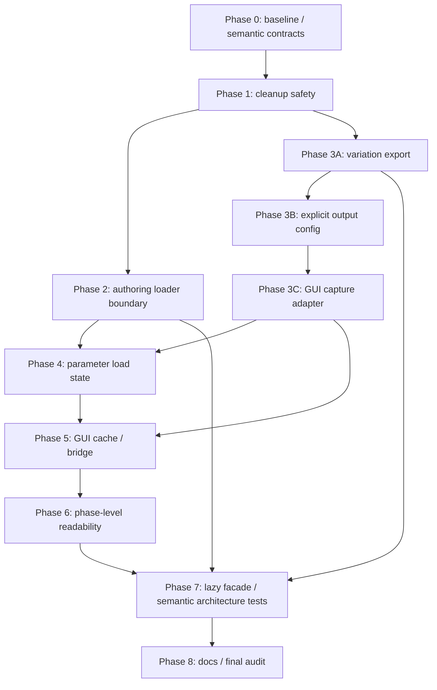

# `src/grafix` コードレビュー実装改善計画（2026-07-23）

- 根拠レビュー: `docs/review/src_grafix_code_review_2026-07-23.md`
- 計画作成時 HEAD: `4bc4cf6`
- 計画作成時 working tree: 本計画ファイルのみ未追跡（その他差分なし）
- 対象 Finding: R2-001〜R2-010
- 状態: **実装・検証完了**
- 完了日: 2026-07-23

本書のチェックボックスは実装の進捗を表す。計画作成時点ではすべて未完了であり、実装、対象 test、
文書更新まで完了した項目だけを `[x]` にする。

## 1. 目的

前回改善で明示された package boundary、resource owner、composition root を、現在残っている副作用経路と
状態寿命へ最後まで適用する。優先順位は次のとおりとする。

1. constructor/reload/standalone helper の resource safety を先に確定する。
2. filesystem、Python import、encode/publish を正しい外層 owner へ戻す。
3. load metadata と GUI cache を実際の session lifetime へ移す。
4. 長い numerical/UI 関数を意味のある処理 phase に分ける。
5. root import と architecture test を、実装形ではなく capability/behavior 契約へ揃える。

全面 rewrite は行わない。既存の `CleanupErrors`、immutable DTO、catalog generation、parameter command、
export staging を再利用し、新しい汎用 framework は追加しない。

## 2. 承認境界と進行規則

- 本計画への承認を得るまで production code と test は変更しない。
- 承認後も Phase 単位で実装し、対象 test が成功してから次の Phase へ進む。
- 各 Phase の完了時に、本書の完了項目と未完了項目を更新する。
- 依頼外差分が生じた場合は触らず、対象差分と分離する。
- dependency 追加、snapshot 更新、破壊的な repository 操作、commit/push は別途明示承認を得る。
- full pytest が長時間実行に当たる場合は、最終実行前に改めて確認する。
- compatibility wrapper、deprecated alias、旧 module の re-export shim、dual-write 移行期間は作らない。
- public facade として意図している `grafix` / `grafix.api` の再 export は維持するが、削除する deep import
  path の互換目的では使わない。

次の場合は実装を止め、本書へ未決事項と影響範囲を追記して確認を求める。

- Geometry ID、cache identity、parameter JSON schema、capture manifest schema の変更が必要になる。
- source reload の last-good/rollback 意味論を変更しないと loader を共通化できない。
- batch publish で既存の no-clobber/overwrite rollback 契約を維持できない。
- ParamStore から load metadata を外す際、interactive と headless で provenance を一意に決められない。
- numerical refactor で同じ seed/input の出力または RNG 消費順が変わる。
- GUI cache の instance 化で安定 frame の再構築回数が増える。
- 実装に外部依存追加、長時間 benchmark、OS/GUI soak が必要になる。

## 3. この計画で固定する設計判断

### 3.1 cleanup と ownership

- cleanup は既存 `CleanupErrors` へ統一する。新しい lifecycle framework は作らない。
- root/body/startup error がある場合は同じ error instance を優先する。
- secondary cleanup error は logger/exception note の既存経路で観測可能にし、無条件に捨てない。
- standalone `RealizeSession` は、省略された `EvaluationResources` と `RealizeCacheStore` を自ら所有する。
- shared generation では session は shared resource/cache を借用し、generation owner が一度だけ閉じる。
- constructor では resource 取得直後から rollback 対象にし、正常構築時だけ所有権を確定する。

### 3.2 authoring source loader

- `AuthoringDefinitionsRecipe`、source bytes DTO、definition/catalog snapshot、registration target は core value
  として残す。
- filesystem capture、config root 選択、candidate 実行、draw に対応する definition 選択は、新しい
  top-level `grafix.authoring_loader` が所有する。
- `grafix.core.authoring_loader` は削除し、shim は残さない。
- initial authoring load と source reload が共有するのは、private top-level
  `grafix._snapshot_import` の次の capability だけとする。
  - source bytes の compile/exec
  - module content fingerprint の付与
  - finder と synthetic namespace package
  - 一つの `RLock` 下での `sys.meta_path` / `sys.modules` install/remove
- source discovery、reload polling、diagnostics、generation accept/rollback は各 owner に残す。
- config candidate module は実行後に除去し、accepted reload generation の module lifetime は
  `SourceReloadController` が管理する。二つの lifetime を無理に統一しない。

### 3.3 variation batch、output path、GUI capture

- `api.variation_batch` は public validation、variation 選択、ParamStore transient rollback、render 順、
  item 単位の partial failure 化だけを持つ。
- 新しい `export.variation_batch` は frozen result/artifact DTO、filename component、thumbnail 名、
  contact-sheet/summary codec、manifest relocation、staging、publish、overwrite rollback を所有する。
- export 側は `RenderSession` を import しない。export の batch transaction が working directory を callback
  へ渡し、API callback が render/capture item を返す構成にする。
- batch staging は一つの context/lifetime owner にする。prepare/publish/discard を API に分散しない。
- `output_path_for_draw()` と wrapper は明示的な `RuntimeConfig` を受け、下層で config discovery を行わない。
- config discovery は `api` / `interactive.runtime` / `devtools` の入口で一度だけ行う。
- Parameter GUI leaf には `VariationThumbnailCapture` / `VariationThumbnailPreview` の callable contract と
  表示 state だけを残す。
- `CaptureService` adapter、base path、thumbnail size、filename policy は
  `interactive.runtime` の小さな composition module が所有する。

### 3.4 parameter load metadata

- load provenance と diagnostics は filesystem/session の事実であり、ParamStore の論理 parameter state から
  外す。
- private setter を追加せず、core には I/O を持たない frozen `ParameterLoadState` だけを置く。
- `parameter_storage` は `store + load state + status/error` を持つ frozen
  `ParamStoreLoadResult` を返す。
- `read_param_store()`、`recover_primary_param_store()`、`recover_param_store_session()` の戻り値を同じ result
  contract へ揃える。旧 `ParamStoreReadResult` の alias は残さない。
- interactive では `ParameterSession` が現在の load state を所有し、Keep/Discard 後に一箇所で差し替える。
- headless `RenderSession` は構築時の load result を metadata/provenance に固定する。
- interactive capture は `ParameterSession` の現在値を provider 経由で取得し、古い constructor 値を
  capture しない。
- load state を parameter JSON、adjustment snapshot、history、transient rollback へ混入させない。

### 3.5 Parameter GUI table state

- `ParameterTableViewCache` を一つの mutable owner とし、model/view/visibility/search corpus と build counter を
  まとめる。
- cache constructor は immutable `ParameterGuiCatalog` を受ける。query path で ambient catalog を探索しない。
- `ParameterGuiSessionState` が cache を所有し、catalog 交換と close はその session の cache だけを破棄する。
- module-global `WeakKeyDictionary`、default-catalog map、global clear/build-count API は削除する。
- `store_bridge.py` は次の責務へ分割し、旧 file は削除する。
  - `table_view.py`: snapshot から model/view/search/visibility を作る query と cache owner
  - `table_commit.py`: renderer の edit DTO を core command/history へ commit する mutation
- `table_model.py` は immutable model、`table.py` は ImGui renderer の責務を維持する。
- service locator、class-per-function、汎用 GUI event bus は作らない。

### 3.6 長大関数の分割

- 行数目標は置かない。上位関数が「validate → plan → execute → pack/render」と読めることを基準にする。
- public signature、operation metadata、GUI 表示文言、RNG 消費順、packed geometry を変えない。
- phase helper は入力と出力が明示できる pure function を基本とする。
- `Strategy` class 階層、visitor、Python callback を numerical hot loop に追加しない。
- Numba path は小さな `@njit` helper だけで整理し、Python 多態化へ戻さない。
- 一関数ずつ characterization test → refactor → parity/benchmark の順で完了させる。

### 3.7 lazy facade と architecture test

- root `grafix.__init__` は PEP 562 `__getattr__` で公開名を遅延解決し、解決後は `globals()` へ cache する。
- `grafix.api.__init__` は render/export/variation/run の重い group だけを遅延化し、巨大な汎用 registry は
  作らない。
- `__all__`、`from grafix import *`、root/api の object identity、checked-in stub surface は維持する。
- architecture test は import graph、cycle、危険 capability、resource behavior を検査する。
- private helper 名、正確な call 数、現在の private attribute 名だけを固定する test は behavior/capability
  test へ置き換える。
- refactor を妨げる source-shape test は、その refactor の直前に semantic test へ置換する。

## 4. 非目標と後続候補

### 4.1 非目標

- Geometry DAG、operation/preset catalog、cache key、packed geometry format の再設計。
- parameter JSON schema/version、capture manifest schema、workspace schema の変更。
- numerical algorithm、見た目、GUI layout、shortcut、MIDI 操作仕様の変更。
- `MpDraw` の process/queue/restart/close ownership の分散。
- ParamStore の parameter aggregate 自体の細分化。
- output path の source introspection/CWD 補正規則の再設計。
- repository 全体の comment/docstring/validation の機械的整理。
- 外部 dependency の追加。

### 4.2 本計画内での局所改善

- `api/effects.py` の同一 if/else は単一代入へ直す。
- `radius_f = radius` のような無変換別名は、この計画で実際に触る file 内に限り、型 narrowing、単位変換、
  Numba 上の意味がないことを確認して除く。59 箇所の一括 cleanup はしない。
- selector の再正規化は独立 checkpoint とし、同じ immutable selector を freeze/resolve へ渡しても
  catalog generation、arity、stale schema error が維持できる場合だけ実施する。

### 4.3 後続の独立計画へ送る候補

- `MpDraw` から IPC DTO と spawned worker entrypoint を module 分離すること。
- scalar telemetry property を immutable `MpDrawStats` snapshot へ一括移行すること。
- repository 全体に残る無変換型接尾辞別名の監査。

これらは R2-001〜R2-010 の完了条件に含めない。主要 boundary 変更と同じ change set に混ぜない。

## 5. 意図する破壊的変更

repository 方針に従い、次の変更には compatibility shim を作らない。

1. `grafix.core.authoring_loader` を削除し、repository 内 consumer を `grafix.authoring_loader` へ移す。
2. `output_path_for_draw()`、`default_param_store_path()`、`default_png_output_path()`、
   `default_video_output_path()`、workspace path helper の config を必須化する。
3. `ParamStoreReadResult` を `ParamStoreLoadResult` へ置換し、recovery API も store ではなく result を返す。
4. `ParamStore.load_provenance` / `load_diagnostics` と `ParamStoreRuntime` の対応 field を削除する。
5. Parameter GUI の internal query API に session-owned cache の明示注入を要求する。
6. `interactive.parameter_gui.store_bridge` を削除し、repository 内 import を `table_view` / `table_commit` へ
   一括移行する。
7. variation batch result 型の実装 module を `grafix.export.variation_batch` へ移す。root/api facade の公開名は
   維持するが、型の `__module__` は変わり得る。
8. GUI thumbnail の concrete adapter deep import path を削除し、runtime composition module へ移す。

public/deep import、stub、README/developer guide、migration document、repository 内 consumer は、該当 Phase で
同時に更新する。

## 6. Finding と Phase の対応

| Finding | 主 Phase | 補助 Phase | 完了の要点 |
|---|---:|---:|---|
| R2-001 | 2 | 8 | core から source I/O と process-global import mutation を排除 |
| R2-002 | 3 | 8 | variation batch codec/staging/publish を export が所有 |
| R2-003 | 1 | 8 | 全 acquisition failure で全 resource cleanup と root error 保持 |
| R2-004 | 3 | 8 | export から runtime config discovery を排除 |
| R2-005 | 4 | 8 | load state を storage result/session owner へ移動 |
| R2-006 | 3 | 5, 8 | GUI leaf から concrete export dependency を排除 |
| R2-007 | 5 | 8 | table cache を GUI session lifetime にし、bridge を責務分割 |
| R2-008 | 6 | 8 | numerical/UI 関数を behavior 不変の phase helper へ分割 |
| R2-009 | 7 | 8 | core-only import で外層 capability を初期化しない |
| R2-010 | 0〜7 | 8 | source-shape gate を behavior/capability contract へ置換 |

## 7. 依存順と checkpoint

- R2-001 と R2-002 は Phase 1 後なら相互独立だが、同一 worktree では順番に実施する。
- R2-002 の filename component を先に確定し、R2-006 の thumbnail adapter から再利用する。
- R2-004 の explicit config を先に終え、移動後 thumbnail path が ambient config を再導入しないようにする。
- R2-005 は `api/render.py`、runner、DWS、recovery、capture provenance への波及が大きいため、High の
  package boundary が安定した後に単独で行う。
- R2-007 は GUI capture adapter と load-state wiring が完了してから行い、`runner.py` / GUI constructor の
  同時変更を減らす。
- R2-008 は一関数ごとに独立 checkpoint とし、複数 algorithm を一度に書き換えない。
- 各 checkpoint で `git diff --check`、対象 Ruff、focused tests を実行する。

## 8. Phase 0 — baseline と semantic contract の固定

### 8.1 作業状態

- [x] 実装開始時の HEAD、branch、`git status --porcelain` を本書へ記録する。
- [x] 本計画対象 file と依頼外差分を分離して記録する。
- [x] R2 ごとの production callsite、test、public/deep import、stub export を inventory 化する。
- [x] `grafix.core.authoring_loader`、`output_path_for_draw(config=None)`、`store._runtime_ref()`、
  `store_bridge` import、Parameter GUI global cache の件数を記録する。
- [x] clean subprocess で `import grafix.core.geometry` 後の外層 module set を保存する。

### 8.2 baseline verification

- [x] `PYTHONPATH=src pytest -q -p no:cacheprovider tests/architecture` を実行する。
- [x] `ruff check src/grafix tests` を実行する。
- [x] `mypy src/grafix` を実行する。
- [x] authoring/source reload、variation batch/output path、parameter storage/recovery、DWS/SceneRunner、GUI table、
  対象 numerical effect/primitive の focused suite を実行する。
- [x] full pytest の実行許可と所要時間を確認し、実行する場合は baseline 結果を記録する。

### 8.3 characterization contract

- [x] DWS constructor の acquisition point と正常 close 順を event log で固定する。
- [x] SceneRunner initial/replacement generation failure と複数 cleanup failure の現在挙動を再現する。
- [x] initial authoring load と source reload の relative import、fingerprint、module lifetime を固定する。
- [x] variation batch の no-clobber、overwrite rollback、manifest relocation、partial failure を固定する。
- [x] output path の明示 config と ambient config の現在差を記録する。
- [x] primary/partial/quarantined/session-recovery の store contents、provenance、diagnostics を固定する。
- [x] GUI table の stable-frame build count、catalog 交換、filter/search、history commit を固定する。
- [x] `drop`、`partition`、`displace`、`laplace_field_grid` の fixed seed/edge case 出力を固定する。
- [x] snippet 文字列、MIDI learn 遷移、table render order と `TableEdits` を固定する。

Phase 0 完了条件:

- [x] 各 Finding に before contract または static inventory がある。
- [x] intentional breaking change と保持する runtime/on-disk behavior を区別できる。
- [x] 後続 Phase の失敗が既存 failure か regression か判断できる。

## 9. Phase 1 — cleanup/ownership safety（R2-003）

主対象:

- `src/grafix/core/lifecycle.py`
- `src/grafix/core/realize.py`
- `src/grafix/core/pipeline.py`
- `src/grafix/interactive/runtime/scene_runner.py`
- `src/grafix/interactive/runtime/draw_window_system.py`
- `src/grafix/interactive/runtime/perf.py`
- 関連する core/runtime tests

### 9.1 standalone realization

- [x] `realize()` は外側で resources/cache store を生成せず、dependency 省略の `RealizeSession` を一時 owner
  として使う。
- [x] `realize_scene()` の standalone path も同じ owner contract にし、session/resource/store の手動三重
  close を削除する。
- [x] caller 注入 session の borrowed dependency は閉じないことを維持する。
- [x] body error と session-owned dependency の複数 close error で root error identity を固定する。

### 9.2 evaluation generation と SceneRunner

- [x] `_make_evaluation_generation()` の部分構築 cleanup を `CleanupErrors(initial_error=...)` へ統一する。
- [x] 構築済み全 session を一度ずつ閉じ、その後 shared resources を一度閉じる。
- [x] `_close_evaluation_generation()` の独自 first-error loop を共通 contract へ置換する。
- [x] `SceneRunner.__init__()` の generation/cache cleanup で全 step を試す。
- [x] `replace_draw()` の replacement worker/generation cleanup から無条件 `pass` を除く。
- [x] replacement startup の root error を保持し、secondary close error を観測可能にする。
- [x] 正常 swap 後の previous worker/generation/cache cleanup 順を維持する。

### 9.3 DrawWindowSystem constructor

- [x] `PerfCollector` と `RecordingSession` を部分構築 cleanup の local acquisition record に含める。
- [x] 失敗時の順序を scene runner → capture queue → recording → perf → renderer → window にする。
- [x] capture service/clock の非 closeable value と MIDI の caller ownership を明示する。
- [x] 各 acquisition point で後続 constructor を失敗させ、取得済み resource が exactly once close される
  fault-injection test を追加する。
- [x] 複数 close 自体を失敗させ、primary error identity と secondary error の観測を確認する。
- [x] trace writer を有効にした failure test で writer thread が残らないことを確認する。

### 9.4 focused verification

- [x] `tests/core/test_lifecycle.py`
- [x] `tests/core/test_realize_cache.py`
- [x] `tests/core/test_pipeline.py`
- [x] `tests/interactive/runtime/test_scene_runner_mp_draw.py`
- [x] `tests/interactive/runtime/test_draw_window_system.py`
- [x] `tests/interactive/runtime/test_profiler.py`

Phase 1 完了条件:

- [x] standalone path で session と外側 helper が同じ resource を二重所有しない。
- [x] DWS constructor 途中で取得可能な全 closeable が rollback 対象に含まれる。
- [x] SceneRunner startup/reload failure に cleanup error の無条件握り潰しがない。
- [x] root error 優先、全 cleanup 実行、close idempotency が fault tests で保証される。

## 10. Phase 2 — authoring loader boundary（R2-001）

主対象:

- 新規 `src/grafix/authoring_loader.py`
- 新規 `src/grafix/_snapshot_import.py`
- 削除 `src/grafix/core/authoring_loader.py`
- `src/grafix/interactive/runtime/source_reload.py`
- `src/grafix/api/render.py`
- `src/grafix/api/runner.py`
- `src/grafix/interactive/runtime/{scene_runner,mp_draw}.py`
- authoring loader を使う devtools/benchmarks/stub generator/sketch tests
- authoring/source reload/architecture tests

### 10.1 shared snapshot import primitive

- [x] initial loader と source reload の module source/value 差を inventory 化する。
- [x] private `SnapshotModuleSource` / import plan を、path、bytes、package flag、canonical name の最小値で
  定義する。
- [x] finder、loader、synthetic namespace、module cleanup、共通 `RLock` を `_snapshot_import.py` へ置く。
- [x] fingerprint attach と compile/exec を同じ loader path にする。
- [x] local absolute import の拒否など reload 固有 policy は callback/plan input に限定し、reload owner に残す。
- [x] success、`Exception`、`KeyboardInterrupt`、`SystemExit` の全経路で finder/module cleanup を保証する。
- [x] config candidate の即時除去と accepted reload module の保持という lifetime 差を test する。

### 10.2 top-level authoring loader

- [x] default session definition 合成の置き場所を、core import cycle を増やさない形で確定する。
- [x] `authoring_definitions_for_draw()`、recipe capture/load、config load を top-level loader へ移す。
- [x] filesystem tree walk と `RuntimeConfig.preset_module_dirs` の解決を top-level だけに置く。
- [x] API、runtime、worker、devtools、benchmark、stub generator、sketch/test の import を一括更新する。
- [x] `src/grafix/core/authoring_loader.py` を削除し、互換 re-export を置かない。
- [x] test file を package layer に合う場所へ移す。

### 10.3 architecture/behavior tests

- [x] nested relative import、`__init__.py` package、namespace package、複数 root の順序を検証する。
- [x] spawn worker が recipe bytes から同じ catalog/fingerprint を再構築することを検証する。
- [x] initial load と reload の並行実行が一つの lock で直列化されることを検証する。
- [x] `core` 配下の source tree walk、compile/exec、`sys.meta_path` / `sys.modules` mutation を禁止する。
- [x] source-shape 名ではなく AST capability/import boundary で検査する。
- [x] `rg 'grafix\.core\.authoring_loader' src tests` が 0 件であることを確認する。

Phase 2 完了条件:

- [x] core は immutable recipe/snapshot を持つが、authoring source I/O と process-global import mutation を
  持たない。
- [x] process-global import mutation は一 owner/一 lock で、成功・失敗双方の cleanup が test 済みである。
- [x] source reload の polling/diagnostics/accept/rollback 契約は変更されていない。
- [x] authoring loader、source reload、MpDraw、API composition、architecture の focused suites が成功する。

## 11. Phase 3 — export/composition boundary（R2-002、R2-004、R2-006）

### 11.1 variation batch transaction（R2-002）

主対象:

- 新規 `src/grafix/export/variation_batch.py`
- `src/grafix/api/variation_batch.py`
- `src/grafix/export/output_paths.py`
- 必要最小限の `src/grafix/file_io.py` / existing export staging primitive
- API/export/devtools/stub tests

アクション:

- [x] `VariationRenderResult` / `VariationBatchResult` と batch artifact value を export module へ移す。
- [x] root/api facade から同じ公開名を引き続き export する。
- [x] portable filename component の文字集合、最大長、fallback を一契約にする。
- [x] thumbnail 名、contact-sheet SVG、summary JSON、相対 path 表現を export codec へ移す。
- [x] manifest relocation を export へ移し、staging path が公開 manifest に残らないようにする。
- [x] batch workspace/transaction が prepare → callback → encode → relocate → publish → cleanup を所有する。
- [x] no-clobber generation allocationと overwrite backup/restore を export transaction へ移す。
- [x] text publish は既存 `atomic_write_text` / `atomic_write_text_no_clobber` を再利用し、fsync/link を
  再実装しない。
- [x] API から `json`、`os`、`shutil`、`tempfile`、`html.escape` と publish primitive を除く。
- [x] API には variation request、transient rollback、render/capture callback、partial failure 化だけを残す。

tests:

- [x] export: no-clobber、late collision、overwrite publish failure で旧 generation を復元する。
- [x] export: manifest relocation、SVG escape、summary relative path、staging cleanup を検証する。
- [x] export: publish 成功後の private backup cleanup failure を publish failure と誤報しない。
- [x] API: variation 順、unknown variation、item failure、store exact rollback、成功/失敗 count を検証する。
- [x] export が `api` / `interactive` を importせず、API が fsync/link/replace/staging codec を持たないことを
  architecture test で検証する。

### 11.2 explicit output config（R2-004）

- [x] `export/output_paths.py` から `grafix.runtime_config_loader` import を削除する。
- [x] `output_path_for_draw(..., config: RuntimeConfig)` を必須 keyword にする。
- [x] `default_param_store_path()` と `default_png_output_path()` も config 必須へ揃える。
- [x] `default_video_output_path()` と `default_workspace_state_path()` も explicit config を受ける。
- [x] runner/render/DWS/devtools の入口で解決済み config を全 callsite へ渡す。
- [x] test は ambient ContextVar/CWD に依存せず、明示 config fixture を使う。
- [x] 同一 process で異なる二 config を使い、相互汚染せず異なる path を返す test を追加する。
- [x] `rg 'runtime_config_loader' src/grafix/export` が 0 件であることを確認する。
- [x] `export -> runtime_config_loader` 禁止を architecture test に追加する。

### 11.3 GUI thumbnail adapter（R2-006）

主対象:

- 新規 `src/grafix/interactive/runtime/variation_thumbnail_capture.py`
- `src/grafix/api/runner.py`
- `src/grafix/interactive/parameter_gui/variation_panel.py`
- `src/grafix/interactive/parameter_gui/variation_thumbnail.py`
- runtime/GUI/architecture tests

アクション:

- [x] `variation_panel.py` から export type import と concrete adapter を削除する。
- [x] GUI leaf には capture/preview callable type、panel model/controller、preview 表示だけを残す。
- [x] runtime adapter は `CaptureService`、live frame provider、base path、canvas size を受ける。
- [x] runtime adapter は capture のたびに live frame provider を呼び、古い frame を closure 固定しない。
- [x] filename component は 11.1 の export policy を再利用する。
- [x] runner `_compose_gui()` は explicit config から base path を作り、runtime adapter と GUI preview callback を
  配線する。
- [x] no-frame error、thumbnail size、safe filename、CaptureService が返した実 path の伝播を runtime test で
  検証する。
- [x] GUI test は concrete export でなく callable contract/表示 state だけを検証する。
- [x] `interactive/{gl,midi,parameter_gui} -> grafix.export` を architecture test で禁止する。
- [x] `rg 'grafix\.export' src/grafix/interactive/{gl,midi,parameter_gui}` が 0 件であることを確認する。

Phase 3 完了条件:

- [x] API variation batch に codec/staging/publish primitive がない。
- [x] export が API/interactive に依存せず batch transaction 全体を所有する。
- [x] output path lower layer は ambient config discovery を行わない。
- [x] Parameter GUI leaf は `CaptureService` / `CaptureFrame` を知らない。
- [x] 公開 path、manifest/summary schema、partial failure、thumbnail UI behavior が維持される。

## 12. Phase 4 — ParamStore load-state ownership（R2-005）

主対象:

- `src/grafix/core/parameters/runtime.py`
- `src/grafix/core/parameters/store.py`
- `src/grafix/parameter_storage.py`
- `src/grafix/interactive/runtime/parameter_session.py`
- `src/grafix/interactive/runtime/parameter_recovery.py`
- `src/grafix/api/render.py`
- `src/grafix/api/runner.py`
- `src/grafix/interactive/runtime/draw_window_system.py`
- capture provenance と関連 tests/stubs/docs

### 12.1 immutable result contract

- [x] I/O を持たない frozen `ParameterLoadState` を core に定義する。
- [x] frozen `ParamStoreLoadResult` に store、status、provenance/diagnostics、error を明示する。
- [x] missing、primary、partial、quarantined、session recovery の全 path が result を構築する。
- [x] `read_param_store()`、`recover_primary_param_store()`、`recover_param_store_session()` の戻り値を統一する。
- [x] recovery/quarantine の on-disk mutation と status/provenance の意味を現行 test で維持する。
- [x] `ParamStoreReadResult` の alias/wrapper は残さず、repository consumer を同時移行する。

### 12.2 ParamStore から metadata を除去

- [x] `parameter_storage._set_load_result()` と `_runtime_ref()` 参照を削除する。
- [x] `ParamStoreRuntime.load_provenance` / `load_diagnostics` を削除する。
- [x] `ParamStore.load_provenance` / `load_diagnostics` property を削除する。
- [x] replace/clear/transient rollback/adjustment snapshot/history が load metadata を扱わないようにする。
- [x] tests が metadata 設定のために `_runtime_ref()` を触らないようにする。
- [x] top-level storage から ParamStore private ref へのアクセスを architecture test で禁止する。

### 12.3 session と provenance wiring

- [x] `ParameterSession` が現在の `ParameterLoadState` を所有し、read/recover result から初期化する。
- [x] Keep/Discard/recovery action は新しい load state/result を返し、session が一箇所で採用する。
- [x] recovery diagnostics event builder は store でなく diagnostics value を受ける。
- [x] headless `RenderSession` は構築時 result から metadata と capture provenance を作る。
- [x] DWS は store property を読まず、current provenance provider を受ける。
- [x] interactive capture/record/export は Keep/Discard 後の現在 provenance を毎回取得する。
- [x] runner、DWS、ParameterSession の owner/call order を architecture documentation に反映する。

### 12.4 focused verification

- [x] `tests/test_parameter_storage.py`
- [x] `tests/api/test_render_session.py`
- [x] `tests/api/test_runner_parameter_recovery.py`
- [x] `tests/interactive/runtime/test_parameter_recovery.py`
- [x] `tests/interactive/runtime/test_draw_window_system.py`
- [x] capture manifest/provenance、transient rollback、parameter session tests
- [x] Keep/Discard 前後の store contents、diagnostics、capture provenance が同じ state generation を指す test

Phase 4 完了条件:

- [x] `parameter_storage.py` に `_runtime_ref` がない。
- [x] ParamStore/runtime に load provenance/diagnostics がない。
- [x] storage result と session state の owner が一意で、dual-write がない。
- [x] headless は construction-time state、interactive は current session stateを provenance に使う。
- [x] load state が parameter persistence/history/rollback へ混入しない。

## 13. Phase 5 — Parameter GUI cache と bridge の責務分割（R2-007）

主対象:

- 新規 `src/grafix/interactive/parameter_gui/table_view.py`
- 新規 `src/grafix/interactive/parameter_gui/table_commit.py`
- `src/grafix/interactive/parameter_gui/table_model.py`
- `src/grafix/interactive/parameter_gui/session_state.py`
- `src/grafix/interactive/parameter_gui/gui.py`
- 削除 `src/grafix/interactive/parameter_gui/store_bridge.py`
- parameter GUI tests/benchmarks

### 13.1 cache owner の instance 化

- [x] `ParameterTableViewCache` に model/view/base visibility/search corpus/cache key/build count をまとめる。
- [x] cache constructor で exact `ParameterGuiCatalog` を受ける。
- [x] `_DEFAULT_CATALOG_BY_STORE` と query path の `current_parameter_gui_catalog()` fallback を削除する。
- [x] `parameter_table_view_for_store(..., cache=...)` は cache を必須注入する。
- [x] module-global WeakKeyDictionary/cache/counter を削除する。
- [x] global clear/build-count API を `cache.clear()` / instance property へ置換する。
- [x] `ParameterGuiSessionState.for_store(store, catalog=...)` が cache を作る。
- [x] catalog 交換は当該 session の cache と table view だけを無効化する。
- [x] session close は widgets/table view/cache を一括 clear し、他 session に影響しない。

### 13.2 query と commit の module 分割

- [x] row ordering、catalog metadata、snapshot→model、visibility/search/filter を `table_view.py` へ移す。
- [x] primitive/preset の block descriptor と arg-index lookup をデータ駆動で共通化する。
- [x] effect-chain 固有 order だけを明示的な特殊ケースとして残す。
- [x] row edits、effect order、collapse、MIDI clear、history unit、render commit を `table_commit.py` へ移す。
- [x] GUI orchestration は immutable view を render し、`TableEdits` を commit module へ渡すだけにする。
- [x] repository 内 import/test を新 module へ移す。
- [x] `store_bridge.py` を削除し、shim を残さない。

### 13.3 isolation/performance contracts

- [x] 同じ store/catalog から二つの GUI session/cache を作り、build count/identity/clear が独立することを
  検証する。
- [x] catalog 交換が一 session だけを無効化することを検証する。
- [x] revision 変化時だけ必要な model/view を再構築することを検証する。
- [x] 安定 60 frame は model/view を再構築しないことを検証する。
- [x] close → reopen で旧 session cache を再利用しないことを検証する。
- [x] 1,000 row/filter/search/favorite/effective revision の既存 hot-path behavior を維持する。
- [x] parameter hotpath/interactive scenario の before/after を比較し、恣意的な新閾値は追加しない。

Phase 5 完了条件:

- [x] Parameter GUI package に module-global table cache/default-catalog/counter がない。
- [x] 全 query が session-owned cache を明示使用する。
- [x] `store_bridge.py` とその参照が 0 件である。
- [x] filter、visibility、effect order、history、render commit の意味論が維持される。
- [x] 複数 GUI session の cache lifetime が互いに独立する。

## 14. Phase 6 — phase-level readability（R2-008）

共通規則:

- [x] 各関数に fixed input/seed/output の characterization test を追加し、archived HEAD と
  current の parity を固定する。計画した実施順との差は 18.5 に記録する。
- [x] 一関数の focused tests と parity が成功してから次の関数へ進む。
- [x] public signature、metadata、RNG call order、GUI text/render order を変えない。
- [x] benchmark は before/after measurement を使い、根拠のない hard threshold を新設しない。

### 14.1 snippet emitter

- [x] `snippet_for_block()` を style/preset/primitive/effect-chain emitter へ分ける。
- [x] rows → kwargs、label/key、selector note の共通変換を一 owner にする。
- [x] 出力文字列、indent、argument order、末尾改行を exact test で固定する。
- [x] 上位関数は block 種別の dispatch と結果連結だけにする。

### 14.2 MIDI learn と table rendering

- [x] scalar/vec3 共通の MIDI learn transition を pure helper として `midi_learn.py` へ置く。
- [x] transition は target component、last seen sequence、current CC、click action から次 state/command を返す。
- [x] label/tooltip/button/ImGui 呼び出しは renderer adapter に残す。
- [x] `_render_cc_cell()` の scalar/vec3 重複 transition を共通 helper へ置換する。
- [x] `render_parameter_table()` を group header/collapse、effect reorder、row table、snippet modal の自然な section
  に分ける。
- [x] ImGui call order と returned `TableEdits` を既存/fake tests で固定する。

### 14.3 `drop()`

- [x] probability setup/evaluation、selection mask、geometry packing を private phase helper へ分ける。
- [x] uniform two-point fast path と generic path の選択条件を維持する。
- [x] scalar/vector sampling の RNG 消費順を維持する。
- [x] line/face、keep/drop、empty、fixed seed、fast/fallback parity を検証する。

### 14.4 `partition()`

- [x] input ring/region construction、site sampling、Voronoi clipping、output packing を分ける。
- [x] density sampling と top-up の順序/RNG 消費を維持する。
- [x] mode、density on/off、non-planar no-op、degenerate、fixed seed を検証する。
- [x] planar frame/basis の既存 contract を維持する。

### 14.5 `laplace_field_grid()`

- [x] preset ごとの validation と mapper/validity 選択を一 phase にする。
- [x] cylinder_uniform、mobius、exp の u/v traversal を一つの emitter へ共通化する。
- [x] U=0、boundary、clip、degenerate range の特殊条件を明示する。
- [x] 三 preset の fixed input output と boundary line order を検証する。
- [x] 31 引数の public signature/metadata は本 Phase では変更しない。

### 14.6 `displace._apply_noise_to_coords()`

- [x] normalized bbox position、linear/radial factor、clamp の重複だけを小さな `@njit` helper へ分ける。
- [x] `perlin_core` fast path と dtype/array layout を維持する。
- [x] Python callback、Strategy object、動的 dispatch を Numba loop に入れない。
- [x] gradient 有無 × profile、empty、zero amplitude、fixed seed、dtype を検証する。
- [x] Numba compile と代表 large input の before/after measurement を行う。

### 14.7 局所 cleanup

- [x] `api/effects.py` の同一 if/else を単一代入へする。
- [x] 上記で触れた file 内の無変換型接尾辞別名だけを、意味がない場合に除去する。
- [x] selector を一度だけ正規化し同じ immutable instance を freeze/resolve へ渡す独立 diff を作る。
- [x] selector の catalog generation、kind/arity、stale schema、error、benchmark を検証する。
- [x] selector contract が複雑化する場合は実装せず、後続候補として理由を記録する。

Phase 6 完了条件:

- [x] 上位関数が処理 phase と特殊条件を上から読める。
- [x] 同型の strategy/GUI state 分岐に一 owner がある。
- [x] 同じ seed/input の geometry、offset、GUI text/state が現行許容差内で一致する。
- [x] numerical/GUI hot path に意味のある性能退行がない。
- [x] class hierarchy や汎用 dispatch framework を追加していない。

## 15. Phase 7 — lazy facade と semantic architecture tests（R2-009、R2-010）

### 15.1 root/API lazy facade（R2-009）

主対象:

- `src/grafix/__init__.py`
- `src/grafix/api/__init__.py`
- `src/grafix/api/__init__.pyi`
- stub generator/stub tests
- isolated import tests

アクション:

- [x] root の runtime eager import を外し、`TYPE_CHECKING` import と明示 `__all__` を維持する。
- [x] root `__getattr__` は公開名を `grafix.api` / `grafix.cc` から必要時だけ取得する。
- [x] 解決した値を `globals()[name]` へ cache し、同じ object identity を返す。
- [x] 必要なら `__dir__` は `globals()` と `__all__` を返す単純な実装だけにする。
- [x] `grafix.api` は DSL の軽い名前を維持し、render/export/variation/run group だけを遅延化する。
- [x] lazy mapping を二〜三 group に留め、公開名ごとの大規模 registry/framework を作らない。
- [x] `__all__` 全名の resolve、`from grafix import *`、root/api identity、run request 時だけ runner load を
  subprocess で検証する。
- [x] core-only import 後に `grafix.api`、`grafix.export.*`、`grafix.parameter_storage`、
  `grafix.runtime_config_loader` が未 load であることを検証する。module 数 102 は固定しない。
- [x] checked-in stub と generated stub の公開 surface を同期する。

### 15.2 source-shape test の置換（R2-010）

- [x] `test_implementation_quality.py` / `test_runner_composition_boundary.py` の各 assertion を分類する。
- [x] grid helper owner countを、複数 effect が同じ diagnostic behavior を返す test へ置換する。
- [x] point 語彙の source string 検査を、grid point budget behavior test へ置換する。
- [x] `_DrawTask.__post_init__` 禁止を、submit/receive boundary の valid/invalid behavior test へ置換する。
- [x] export validation helper の定義/call 数を、sync/enqueue 両 ingress の同一拒否 behavior へ置換する。
- [x] `SceneItem` の AST 文字列表現を、list/tuple 受理と任意 Sequence 拒否の runtime/type test へ置換する。
- [x] `OperationInfo` の field 完全一致を evaluator/evaluation/declaration/catalog capability 不在の negative
  contract へ狭める。
- [x] `RenderSession` property 完全一致を child resource/cache owner 非公開の negative contract へ狭める。
- [x] DWS private attribute 名要求を、present/export が同じ frame snapshot/revision を使う behavior test へ
  置換する。
- [x] GUI 旧 global 名禁止を、Phase 5 の二 session isolation test へ置換する。
- [x] runner class 名/owner 数/try 禁止を、normal/start failure の application lifetime behavior へ置換する。
- [x] test tree の `_mp_draw` assignment scan は supported factory fixture contract へ置換する。
- [x] import graph、cycle、危険 I/O/process capability、公開 evaluator 非露出の AST test は維持する。
- [x] private helper 名、正確な call 数、現在の private attr 存在だけを固定する assertion が残っていないか
  最終監査する。

Phase 7 完了条件:

- [x] core-only import は外層 capability を初期化しない。
- [x] root public names、型 surface、object identity は維持される。
- [x] helper rename/extractionだけでは architecture suite が失敗しない。
- [x] import/capability/lifecycle の実際の違反では architecture/unit suite が失敗する。
- [x] `tests/architecture`、isolated import、stub/mypy suites が成功する。

## 16. Phase 8 — document、migration、最終監査

### 16.1 architecture と migration

- [x] `architecture.md` の layer 表へ top-level authoring loader と snapshot import capability を反映する。
- [x] API/export/config/GUI leaf の依存図を更新する。
- [x] ParameterSession/RenderSession の load-state ownership を更新する。
- [x] Parameter GUI table cache の instance lifetime と module split を更新する。
- [x] lazy root facade と core-only import contract を記載する。
- [x] `docs/architecture_visualization.md` を実装と同期する。
- [x] `docs/developer_guide.md` / README の deep import、explicit config、load result 例を更新する。
- [x] migration document に削除 path、変更 signature、replacement import/result contract を記載する。
- [x] public API/stub を再生成し、差分を監査する。

### 16.2 final verification

- [x] `ruff check .` を実行し、未変更の `sketch/readme/**` に限定された既存 F401
  22 件を切り分ける。変更対象は `ruff check src/grafix tests` で成功する。
- [x] `mypy src/grafix`
- [x] `PYTHONPATH=src pytest -q -p no:cacheprovider tests/architecture`
- [x] Phase 1〜7 の focused suites
- [x] stub generation dry-run と stub tests
- [x] full `PYTHONPATH=src pytest -q`（長時間実行の許可確認後）
- [x] numerical/GUI/selector の対象 benchmark before/after 比較
- [x] `git diff --check`
- [x] `git status --porcelain` で依頼外差分を触っていないことを確認する。

### 16.3 traceability audit

- [x] R2-001〜R2-010 の各根拠箇所が削除・移動・semantic test 化されたことを再検索する。
- [x] High/Medium/Low Finding の未完了項目を本書へ明記する。
- [x] compatibility shim、dual-write、旧 module re-export、不要な abstraction がないことを確認する。
- [x] source/test/stub/docs/migration が同じ最終 contract を説明していることを確認する。

## 17. 最終 Definition of Done

- [x] R2-001: core に authoring source I/O、compile/exec、process-global import mutation がない。
- [x] R2-002: variation batch の codec/staging/publish transaction を export が所有する。
- [x] R2-003: constructor/standalone/reload の全 failure path で全 resource を試行 cleanup する。
- [x] R2-004: export path API が ambient runtime config discovery を行わない。
- [x] R2-005: storage が ParamStore private runtime を変更せず、load state owner が session/result に一意である。
- [x] R2-006: Parameter GUI leaf が concrete export service/type を import しない。
- [x] R2-007: table cache が GUI session-owned で、query と commit の責務が分かれている。
- [x] R2-008: 対象 long function が behavior 不変の phase helper へ分かれている。
- [x] R2-009: core-only import が API/export/storage/config loader を eager load しない。
- [x] R2-010: architecture test が helper 名/call 数ではなく behavior/capability を守る。
- [x] focused tests、architecture tests、変更対象 Ruff（`src/grafix tests`）、mypy、stub checks が
  成功する。
- [x] 許可された場合は full pytest が成功する。
- [x] architecture、developer docs、migration、stub が実装と一致する。
- [x] 外部依存、compatibility shim、依頼外変更を追加していない。

## 18. 実施記録（承認後に更新）

| Phase | 状態 | 完了内容 | 未完了・判断 |
|---|---|---|---|
| 0 | 完了 | HEAD/status/inventory、semantic contract、archived-HEAD baseline を固定 | post-hoc baseline であることを 18.1 に明記 |
| 1 | 完了 | standalone/generation/DWS/perf の ownership と cleanup を `CleanupErrors` へ統一 | なし |
| 2 | 完了 | authoring loader を top-level へ移し、snapshot import capability を一 owner/一 lock へ統合 | なし |
| 3 | 完了 | variation transaction、explicit output config、runtime thumbnail adapter を正しい層へ移動 | なし |
| 4 | 完了 | frozen load result/state、detached recovery result、session の一括 adopt を実装 | なし |
| 5 | 完了 | GUI table cache を session-owned とし、view/source badge/commit を分離 | なし |
| 6 | 完了 | snippet/MIDI/table/numerical/selector を phase helper へ分割し parity と性能を検証 | 実施順の差は 18.5 に明記 |
| 7 | 完了 | lazy facade と behavior/capability 中心の architecture test へ移行 | なし |
| 8 | 完了 | architecture/README/developer guide/migration/stub を同期し、最終 gate を実行 | repo-wide Ruff の既存例外のみ |

### 18.1 開始状態と baseline

- 実装対象: branch `main`、HEAD `4bc4cf630d7d06825eae981a1c70ae6a0ff684b3`。
- 開始時の差分: 本計画ファイルのみ未追跡。依頼外の tracked 差分はなかった。
- 主な static inventory:

| 項目 | HEAD | 最終 |
|---|---:|---:|
| `grafix.core.authoring_loader` import file | 12 | 0 |
| optional output-config path | 4 | 0 |
| `parameter_storage.py` からの `_runtime_ref()` | 1 | 0 |
| `store_bridge` consumer | 22 | 0 |
| GUI module-global cache 関連箇所 | 21 | 0 |
| `api.variation_batch` の filesystem/codec import | 5 | 0 |
| core-only import 時の `grafix.*` module | 102 | 39 |

- HEAD archive の baseline：`tests/architecture` 37 passed、`ruff check src/grafix tests`
  成功、`mypy src/grafix` 280 source files 成功。
- full baseline は実装後に HEAD archive を使う post-hoc 比較として実行した。archive が
  除外した task 外の `.grafix` config/font 入力だけを同じ内容で復元し、
  **3884 passed in 277.57s**。最初の archive 単体実行で出た 32 failures はこれら外部入力の
  欠落が原因で、入力復元後の full rerun で解消した。

### 18.2 実装結果

- R2-001〜R2-010 の production gap はすべて解消した。High/Medium/Low Finding の
  未完了は **0**。
- 旧 deep import の shim、compatibility wrapper、load-state dual-write、GUI global service
  locator は追加していない。
- `core` 全体で source tree walk（`rglob` / `iterdir` / `os.walk`）、compile/exec、
  `sys.meta_path` / `sys.modules` mutation を capability test で監視する。font の正当な
  `glob` は許容し、authoring value owner の source I/O は別途禁止する。
- recovery Keep/Discard は detached result を作り、`ParameterSession` が contents と
  `ParameterLoadState` を一括採用する。write/unlink failure 時も異なる generation を混在させない。

### 18.3 最終 verification

| Gate | 結果 |
|---|---|
| full pytest | **3957 passed in 286.34s** |
| `tests/architecture` | 37 passed |
| architecture + lazy facade + stub/devtools focused | 56 passed |
| Phase 1/4 focused | 428 passed |
| numerical/GUI/selector focused | 140 passed |
| numerical characterization focused | 69 passed |
| export/variation focused | 77 passed |
| `ruff check src/grafix tests` | All checks passed |
| `mypy src/grafix` | Success: no issues found in 285 source files |
| generated/checked-in API stub | 125501 bytes、byte-exact 一致 |
| core-only import | 39 modules、API/export/storage/config-loader はすべて未 load |
| `git diff --check` | success |

### 18.4 benchmark

| 対象 | HEAD → current | 判断 |
|---|---|---|
| GUI table 1,000 rows | 30,599.36 → 30,542.13 ns/op（独立再計測: 30,014 → 29,319） | checksum 一致、同等以上 |
| `G.select` | 68,141.6 → 38,197.0 ns/op | -43.94%、contract 一致 |
| `E.select` | 77,097.9 → 30,427.3 ns/op | -60.53%、contract 一致 |
| displace 100k points | 5.4845 → 5.3633 ms（amplitude）、5.8657 → 5.9533 ms（linear）、6.8884 → 6.8279 ms（radial） | checksum 一致、最大 +1.49% |
| probability drop | -1.37% | checksum 一致 |
| partition | -2.46% | checksum 一致 |
| laplace 3 preset | -0.9%〜+5% | checksum 一致、測定揺れの範囲 |
| interactive slider | input-to-present p95 +0.194 ms、120-drag p95 +0.096 ms | 16.667 ms guard 内、build count/checksum 一致 |

数値の finite random 275 ケースと curated edge 46 ケースは archived HEAD/current で
array-exact 一致。`drop` の NaN probability で発見した差は旧挙動へ戻し、回帰 test を追加した。

### 18.5 例外と process deviation

- `ruff check .` は実行済みだが、未変更の `sketch/readme/**` にある既存 unused import
  22 件（F401）だけで失敗する。依頼外差分を変更しない方針に従い触っていない。
- numerical fixed-output test は計画した「各 refactor の変更前」ではなく最終監査時に
  追加した。そのため時系列上の process deviation は残るが、archived HEAD/current の
  fixed output、RNG 順、3 preset/boundary 順、finite random/edge parity で最終 behavior を固定した。
- full baseline は実装開始前の実行ではなく、HEAD archive による post-hoc 比較である。
- 上記はいずれも最終 production Finding の未完了ではない。新規外部依存、
  compatibility shim、依頼外 file の変更、commit/push は行っていない。
