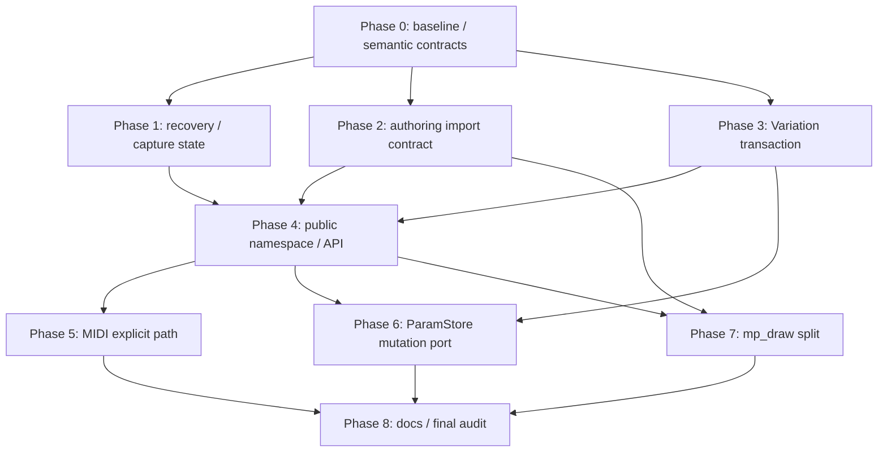

# `src/grafix` ポストレビュー実装改善計画（2026-07-23）

- 根拠レビュー: `docs/review/src_grafix_post_implementation_code_review_2026-07-23.md`
- 計画作成時 HEAD: `4bc4cf6`
- 計画作成時 branch: `main`
- 計画作成前 working tree: 既存の変更・未追跡ファイル 138 件
- 対象 Finding: R3-001〜R3-010
- 状態: **承認待ち・未着手**

計画作成前から、前回の R2 実装とレビューに関する多数の差分が存在する。本計画はそれらを含む現在の
working tree を実装基準とし、既存差分の整理、巻き戻し、上書きを行わない。

本書のチェックボックスは、承認後の実装進捗を表す。計画作成時点ではすべて未完了とし、production code、
対象 test、文書、検証まで完了した項目だけを `[x]` にする。

## 1. 目的

前回改善で大きな layer 違反は解消されたが、公開名、state lifetime、transaction の確定点に不整合が
残った。次の三原則へ戻すことで、アーキテクチャ、責務分離、美しさ、シンプルさ、可読性を同時に改善する。

1. **一つの名前に一つの意味**
   - package/module と callable を同じ dotted name で表さない。
   - Python 標準の import、introspection、stub の意味を一致させる。
2. **一つの state に一つの owner**
   - current parameter schema/load state は `ParameterSession` が所有する。
   - config path は composition root、ParamStore mutation は ParamStore の port が所有する。
3. **一つの transaction に一つの確定点**
   - authoring candidate は全件検証後にだけ実行・採用する。
   - Variation は domain validation 後に一度だけ commit する。
   - revision、history、cache invalidation は同じ mutation commit で確定する。

全面 rewrite は行わない。既存の immutable DTO、`CleanupErrors`、snapshot import、capture staging、
`_PendingStoreMutation`、spawn worker contract を再利用し、新しい汎用 framework は作らない。

## 2. 承認境界と進行規則

- 本計画への明示承認を得るまで、production code、test、stub、既存文書は変更しない。
- 承認後は Phase を順番に実装し、focused test と静的検証が成功してから次へ進む。
- 各 Phase の完了時に、本書のチェックボックスと実施記録を更新する。
- 実装開始時に改めて HEAD、branch、`git status --porcelain` を記録する。
- 計画作成前からある差分は依頼外差分として扱い、`restore`、`reset`、移動、削除、整形を行わない。
- 対象 file が並行作業で変更された場合は、最新内容を読み直して差分を統合し、意味が衝突する場合は停止する。
- dependency 追加・更新、snapshot 更新、破壊的 repository 操作、commit、push、release は別途承認を得る。
- full pytest、長時間 benchmark、GUI/process soak は実行前に確認する。
- compatibility wrapper、deprecated alias、旧 module re-export shim、dual behavior、dual write は作らない。
- source-shape test より behavior、ownership、capability、lifetime の test を優先する。

次のいずれかが判明した場合は、その Phase を止め、設計差分と影響範囲を本書へ追記して確認を求める。

- Geometry ID、cache identity、parameter JSON schema、capture manifest schema の変更が必要になる。
- repository の正式な sample/document が function/class-local relative import を意図的に必要としている。
- authoring root の `__init__.py` 実行が既存の正式契約として必要である。
- recovery action と schema reload が別 thread から並行実行される契約である。
- thumbnail capture が PNG と manifest 以外の artifact を公開し、rollback owner が全成果物を特定できない。
- thumbnail に同期 exception だけでなく process-crash recovery が必要である。
- `ParamStore` mutation port の導入に parameter JSON、history、revision の意味変更が必要になる。
- parameter hot path の代表値が baseline 比 10% 以上退行し、局所修正で解消できない。
- `mp_draw` の field/queue 意味、generation、timeout、restart protocol 自体を変更する必要がある。
- 公開 callable の新名称 `save` が、CLI や利用者契約上採用できないことが判明する。

## 3. 計画時 baseline

### 3.1 規模と既存検証

レビュー時の参考値は次のとおりであり、本計画の最終検証結果ではない。

```text
src/grafix: 285 Python files / 96,580 lines
interactive/runtime/mp_draw.py: 1,925 lines
focused pytest: 104 passed in 8.36s
ruff check src/grafix tests/architecture: All checks passed
mypy src/grafix: Success: no issues found in 285 source files
```

full pytest、GUI manual test、長時間 process soak はレビュー時に実行されていない。

### 3.2 変更前 inventory

- custom `ModuleType` facade は root と `grafix.api` の 2 箇所にある。
- configured authoring root は `.grafix/config.yaml` の `../sketch/presets` である。
- repository の configured authoring source には、現時点で deferred relative import は見つかっていない。
- `sketch/__init__.py` は存在するが、configured preset root 自体の `__init__.py` ではない。
- `ParamStore` 外の parameter module には mutable `_..._ref()` 呼び出しが多数残る。
- `ParamStore` 外の parameter module には手動 `_touch()` 呼び出しが多数残る。
- production で `RenderSession.param_store` を使う主 consumer は `api/variation_batch.py` である。
- `capture_service=` の public variation batch 注入は production callsite になく、主に test seam である。
- `definitions=` / `config_fallback=` は repository 内では internal composition と test で使われ、documented な
  external use case は確認できていない。

Phase 0 で AST/annotation/callsite inventory を再取得し、件数ではなく「違反が 0 になる対象」を固定する。

## 4. この計画で固定する設計判断

### 4.1 authoring import contract

- `preset_module_dirs` の各 root は、通常 package ではなく **synthetic namespace source root** と定義する。
- root 直下の `__init__.py` は、capture/load の preflight で path と理由を示して拒否する。
- nested package の `__init__.py` は通常の package initializer として一度だけ実行する。
- relative import は module lexical scope にだけ許可する。
  - module 直下の `if`、`try`、`with` 等は許可する。
  - `FunctionDef`、`AsyncFunctionDef`、`ClassDef` の内側は load 前に拒否する。
- deferred relative import を支える長寿命 finder/module registry は作らない。
- pure validator は private `grafix._source_import_policy` に置き、authoring load と source reload が共有する。
- `grafix._snapshot_import` は compile/exec、finder、module registry の process-global primitive に限定する。
- 全 candidate source を一件も実行する前に検証し、invalid candidate の前に並ぶ module の副作用も起こさない。
- filesystem capture と手製/pickle 復元 recipe は、いずれも正式な authoring load entrypoint の全件
  preflight を通す。
- source reload は dependency を enqueue する前に同じ validator を通す。
- error は source path、line number、禁止された scope を含む。

### 4.2 parameter recovery と capture state

- current `KnownOperationSchemaSnapshot` の owner は `ParameterSession` だけにする。
- `ParamStoreRecoverySession` は構築時 schema を保持せず、Keep 実行時に明示引数で current schema を受ける。
- Keep/Discard action の dispatch、load result の採用、autosave/history 更新は `ParameterSession` が行う。
- headless/interactive が共有する `ParameterCaptureState` を frozen/slots の小さな value として定義する。

```python
@dataclass(frozen=True, slots=True)
class ParameterCaptureState:
    source: ParameterLoadMode
    load_provenance: LoadProvenance
```

- `ParameterSession.capture_state()` は一つの load state sample から二項目を同時に導出する。
- `CaptureProvenanceBuilder` は static state または provider を一つだけ受け、各 frame で一度だけ sample する。
- headless は construction-time の static state、interactive は session-owned provider を使う。

### 4.3 Variation と thumbnail の確定順

- domain validation と snapshot capture を行う immutable `VariationDraft` を、thumbnail capture より先に作る。
- draft 作成は store を変更せず、名前、重複、note、seed、時刻、snapshot をすべて検証する。
- thumbnail callback は private な owned artifact を返す。

```python
class VariationThumbnailArtifact(Protocol):
    path: Path
    def discard(self) -> None: ...
```

- runtime adapter は PNG と capture manifest の path/file identity を所有し、`discard()` で今回公開した
  generation だけを削除する。
- draft は prepare 時の store revision token を保持する。
- capture success 時は path を検証済み draft へ付与し、commit 時に revision token と duplicate を再確認して
  一度だけ Variation を追加する。
- capture failure 時は thumbnail なしで同じ draft を commit し、Variation 保存を成功扱いにする。
- commit failure 時は owned artifact を discard し、domain state と artifact の片残りを防ぐ。
- callback は `ParamStore` を変更しない同期処理という contract にする。
- 想定可能な domain failure と allocation は外部 I/O 前に終え、最後は完成済み value の最小 commit にする。
- callback/concurrent change で revision token または duplicate check が失敗した場合も、state を変更せず
  artifact rollback 経路へ入る。
- 汎用 transaction manager、process-crash journal、外部 service registry は作らない。

### 4.4 公開 namespace

最終的な正規名を次のとおり固定する。

| 名前 | 意味 |
|---|---|
| `grafix.export` | export subsystem package |
| `grafix.api.export` | 保存 API module |
| `grafix.save` | `Frame` を保存する root 公開関数 |
| `grafix.api.export.save` | 同じ保存関数 |
| `grafix.render` | headless render の root 公開関数 |
| `grafix.api.render` | render API module |
| `grafix.api.render.render` | render 関数 |
| `grafix.run` | interactive runner の root 公開関数 |
| `grafix.api.runner` | runner API module |
| `grafix.api.runner.run` | run 関数 |
| `grafix.cc` | root から取得する `CcView` object |
| `grafix.api.cc` | `CcView` 定義 module |

正規利用形は次のとおりとする。

```python
from grafix import cc, render, run, save

frame = render(draw)
result = save(frame, "output.svg")
```

- root callable `export` は `save` へ破壊的に改名する。
- `src/grafix/cc.py` は `src/grafix/api/cc.py` へ移し、root `cc` と module 名の衝突をなくす。
- `grafix.api.render` / `grafix.api.export` は常に module とする。
- `render`、`save`、`run`、`render_variation_batch` は root または定義 module から取得し、
  `grafix.api` package 直下では re-export しない。
- authoring DSL の `effect`、`primitive`、`preset` と `E`、`G`、`L`、`P` はこの整理の対象外とする。
- root は通常の PEP 562 `__getattr__` と、定義 module/attribute の小さな静的 mapping だけを使う。
- `grafix.api` は衝突しない公開型だけを必要時に遅延解決してよいが、custom `ModuleType` は使わない。
- `_LazyPublicName`、module subclass、assignment guard、`sys.modules[__name__].__class__` 変更を全削除する。
- `api/render.py` と `api/export.py` は通常 module のまま維持し、機械的な `_render.py` 移動は行わない。
- `api/runner.py` は正規 signature/docstring を持つ軽量 public wrapper とする。
- heavy GUI composition は private `api/_runner_application.py` へ移し、`run()` 呼び出し時だけ import する。

### 4.5 公開型と mutable capability

- `definitions=` は `RenderSession` / `render()` の public signature から削除する。
- public render は draw に付与済みの generation snapshot、または config authoring snapshot を通常規則で選ぶ。
- exact definitions を渡す SceneRunner/source reload/test は private composition helper または generation-aware
  draw proxy を使う。
- `config_fallback=` は public `run()` から削除し、fallback diagnostic は config を解決する private
  composition entrypoint だけが渡す。
- `config=` は確定済み immutable config の public injection として維持し、`RuntimeConfig` を正式公開する。
- 少なくとも次の型は `grafix.api` の安定 public path から取得可能にする。
  - `RuntimeConfig`
  - `ParameterLoadMode`
  - `ParameterLoadState`
  - `ParamStoreLoadDiagnostic`
  - `LoadProvenance`
  - `CaptureProvenance`
  - `SessionProvenance`
  - `FrameStyle`
  - `RealizedLayer`
- provenance の direct nested public field 型も annotation inventory から監査し、正式 re-export または
  明示的な public DTO のどちらかに統一する。
- 利用頻度が高く public signature に直接現れる config/load 型は root facade にも出す。
- concrete `CaptureService` は public `render_variation_batch()` の引数から削除する。
- batch の test seam は module-private な最小 capture callback/helper に置き、public Protocol を増やさない。
- `RenderSession.param_store` は削除し、mutable `ParamStore` を public session capability にしない。
- variation batch には、variation 名の immutable 列と一時適用/render scope だけを提供する package-private
  capability を作り、raw store を貸し出さない。
- documented use case がないため、汎用 `ParameterSessionView` はこの Phase では作らない。

### 4.6 MIDI path ownership

- MIDI persistence の path は composition root が一度だけ確定する。
- leaf controller/factory/storage helper は exact `snapshot_path: Path` を必須で受ける。
- `profile_name + save_dir` から path を再構築する経路、`save_dir=None` fallback、
  `default_cc_snapshot_path()`、leaf の `runtime_config_loader` import を削除する。
- live load/save、frozen fallback、reconnect、discard は同じ exact path を使う。
- reconnect closure は同じ path value を capture し、再探索しない。
- MIDI device 制御と JSON storage の package 分割は、独立変更理由が増えるまで行わない。

### 4.7 ParamStore mutation ownership

- `ParamStoreState` 全面 rewrite ではなく、既存 store に一つの private `_ParamStoreMutation` port を置く。
- port だけが mutable container と `_PendingStoreMutation` を扱う。
- `_PendingStoreMutation` は revision 集約器であり、rollback transaction ではないことを明記する。
- sibling command module は immutable/read-only view から検証・計画し、完成した plan を一度だけ commit する。
- port は raw `dict`、`set`、mutable `ParamState`、`ParamStoreRuntime` を返さない。
- validation、allocation、history-before snapshot は live mutation の前に完了させる。
- 小さな command は、完成済み value を使う決定的な mutation だけを commit 中に適用する。
- 複数 container を変更する bulk command は、影響 container の replacement を外で完成させ、store 内で
  reference swap と revision commit を行う。
- commit 中に validation、allocation、外部 callback、failure injection を行わない。
- revision、table/value/style/favorite revision、history observer、snapshot cache invalidation は port が
  同じ commit で確定する。
- no-op は revision を進めず、validation failure は state/cache/history を変更しない。
- `_..._ref()` と store 外 `_touch()` / mutation batch 操作を最終的に 0 件にする。
- `merge_ops` は hot path なので最後に移行し、性能計測なしに algorithm や cache owner を変えない。

### 4.8 `mp_draw` の責務分割

- private module を次の四責務に分ける。
  - `_mp_draw_protocol.py`: pickle DTO、result/error model、wire validation
  - `_mp_draw_state.py`: 親側の pure state transition
  - `_mp_draw_worker.py`: spawn 可能な top-level worker entrypoint と worker evaluation
  - `mp_draw.py`: 親 process、queue、restart、timeout、close の resource owner
- `interactive.runtime.mp_draw` は canonical import path として result/error/stats 型を再公開してよい。
  これは削除 path の互換 shim ではなく、owner facade の正式 surface とする。
- telemetry は frozen `MpDrawStats` に一括し、`MpDraw.stats` が同一時点の snapshot を返す。
- stats は既存の main-thread owner state から一度に組み立て、stats のためだけに lock を追加しない。
- scalar telemetry forwarding property は削除し、repository の consumer を `stats` へ一括移行する。
- generation や timeout 等、制御 contract に必要な property だけを残す。
- wire field、generation、timeout/restart、last-good、close 順の意味は変えない。
- abstract executor、ABC、event bus、generic process pool は作らない。

## 5. 意図する破壊的変更

repository 方針に従い、次の変更に compatibility shim は作らない。

| 旧 | 新 |
|---|---|
| `from grafix import export` | `from grafix import save` |
| `export(frame, path)` | `save(frame, path)` |
| `from grafix.api.export import export` | `from grafix.api.export import save` |
| `from grafix.api import render` | `from grafix import render` または `from grafix.api.render import render` |
| `from grafix.api import run` | `from grafix import run` または `from grafix.api.runner import run` |
| `from grafix.cc import cc` | `from grafix import cc` |
| `import grafix.cc` | `import grafix.api.cc` |
| public `render_variation_batch(..., capture_service=...)` | public 引数を削除し、内部 test helper へ移動 |
| public `RenderSession(..., definitions=...)` / `render(..., definitions=...)` | 通常の draw/config 解決。exact generation は private composition |
| public `run(..., config_fallback=...)` | public `config` / `config_path`。fallback diagnostic は private composition |
| `RenderSession.param_store` | raw store 非公開。variation batch 用の限定 internal capability |
| MIDI `save_dir` / default path fallback | exact `snapshot_path: Path` |
| `MpDraw` の scalar telemetry properties | `MpDraw.stats` |

`python -m grafix export` の CLI command 名、`grafix.export` package、`ExportFormat`、`ExportResult`、
capture/parameter persistence schema は変更しない。

改善後の `from grafix import export` は Python 標準規則により `grafix.export` package を取得し得る。
旧 callable と同じようには失敗しないため、repository consumer と migration 文書では必ず `save` へ明示移行し、
警告付き alias や callable/package の dual behavior は追加しない。

## 6. 非目標と後続計画

### 6.1 非目標

- Geometry DAG、Geometry ID、operation/preset catalog、cache key の再設計。
- parameter JSON、capture manifest、workspace、MIDI JSON schema の変更。
- deferred relative import を実行時まで支える長寿命 finder。
- `exec()` / `importlib.import_module()` による任意の動的 local import の静的解析。
- arbitrary Python sandbox。
- public mutable `ParamStore` API または汎用 read/write repository。
- event sourcing、service locator、DI container、汎用 transaction manager。
- thumbnail の process-crash journal。
- MIDI device/storage の先行 package 分割。
- generic multiprocessing executor。
- external dependency の追加。

### 6.2 後続の独立した小計画へ送る項目

次は R3-001〜R3-010 の完了条件に混ぜず、本計画完了後に一対象ずつ計画する。

1. `table_view.py` の cache を一つの Store へ束縛し、query/facet mask を pure helper へ分ける。
2. Parameter GUI MIDI cell の scalar/vec3 描画を一成分 helper へ統合する。
3. `warp`、`mirror`、`displace` の独立 numerical phase を小さな pure/`@njit` helper へ分ける。
4. primitive 全体の無変換型 suffix 別名を関数単位で整理する。
5. `export/variation_batch.py` から filename policy を先に分離し、cleanup failure を観測可能にする。

## 7. Finding と Phase の対応

| Finding | 主 Phase | 補助 Phase | 完了の要点 |
|---|---:|---:|---|
| R3-001 | 4 | 8 | 一つの dotted name が一つの module/callable 意味を持つ |
| R3-002 | 2 | 7, 8 | deferred relative import を全 candidate 採用前に拒否 |
| R3-003 | 1 | 8 | Keep が実行時の current schema を使う |
| R3-004 | 1 | 8 | parameter source/provenance を一 state から一度に sample |
| R3-005 | 3 | 6, 8 | domain validation、capture、commit、rollback の順を一方向化 |
| R3-006 | 2 | 8 | root init は明示拒否、nested init は通常実行 |
| R3-007 | 5 | 8 | MIDI leaf から ambient config discovery を排除 |
| R3-008 | 6 | 3, 8 | mutable ref と revision commit を一 port へ集約 |
| R3-009 | 7 | 8 | protocol/state/worker/process owner を module 分離 |
| R3-010 | 4 | 6, 8 | public 型を閉じ、mutable store/concrete test seam を非公開化 |

## 8. 依存順と checkpoint



- Phase 1〜3 は概念上並行可能だが、同じ working tree では順番に実装する。
- Phase 4 の runner 分割は recovery/provenance wiring の修正後に行い、移動と correctness 修正を混ぜない。
- Phase 4 で public `param_store` を閉じてから、Phase 6 で package 内 mutation backdoor を閉じる。
- Phase 7 は独立 change set とし、correctness/public API diff と混ぜない。
- 各 checkpoint で `git diff --check`、対象 Ruff、focused tests を実行する。

## 9. Phase 0 — baseline と semantic contract の固定

### 9.1 作業状態

- [ ] 実装開始時の HEAD、branch、`git status --porcelain` を本書へ記録する。
- [ ] 本計画対象 file と既存・並行差分を分離して記録する。
- [ ] R3 ごとの production callsite、test、public/deep import、stub/docs を inventory 化する。
- [ ] full test、benchmark、GUI/process test の実行許可範囲を確認する。

### 9.2 regression を先に失敗状態で固定

- [ ] fresh subprocess の標準 import matrix を追加する。
- [ ] function-local relative import の採用後 failure を authoring/source reload の両方で再現する。
- [ ] action install → schema 交換 → Keep の data-loss 再現 test を追加する。
- [ ] Keep/Discard 後の provenance pair 不整合を再現する。
- [ ] 81 文字名で thumbnail orphan が残る再現 test を追加する。
- [ ] root/nested `__init__.py` の現行挙動を明示する test を追加する。
- [ ] MIDI leaf の ambient config import と path 再探索を architecture/unit test で再現する。
- [ ] ParamStore mutation ごとの revision/history/cache/rollback characterization test を追加する。
- [ ] `MpDraw` の protocol/state/restart/close/stats behavior を移動前に固定する。

### 9.3 baseline measurement

- [ ] parameter edit/hotpath/interactive scenario の代表 case と測定方法を固定する。
- [ ] `MpDraw` の submit/result/restart throughput と hard failure count の代表 case を固定する。
- [ ] baseline 数値、環境、試行回数、ばらつきを実施記録へ残す。
- [ ] 行数や private helper 名を成功条件にせず、semantic contract だけを固定する。

Phase 0 完了条件:

- [ ] 各 R3 の失敗または構造的違反を一つ以上の test/inventory が表す。
- [ ] 現在の working tree を誤って clean HEAD と比較していない。
- [ ] 実装後に比較する behavior/performance baseline が再実行可能である。

## 10. Phase 1 — recovery schema と atomic capture state（R3-003、R3-004）

主対象:

- `src/grafix/interactive/runtime/parameter_recovery.py`
- `src/grafix/interactive/runtime/parameter_session.py`
- `src/grafix/core/parameters/runtime.py`
- `src/grafix/export/capture_provenance.py`
- `src/grafix/interactive/runtime/draw_window_system.py`
- `src/grafix/api/runner.py`
- `src/grafix/api/render.py`
- 関連 tests/benchmarks

### 10.1 current schema ownership

- [ ] `ParamStoreRecoverySession` から構築時 `known_operations` field を削除する。
- [ ] `keep(*, known_operations=...)` の明示 command に変更する。
- [ ] diagnostic action の install/dispatch を `ParameterSession` method へ寄せる。
- [ ] Keep callback は dispatch 時の `self.known_operations` を一度だけ sample する。
- [ ] accepted generation だけが `replace_known_operations()` される既存規則を維持する。
- [ ] failed generation が current schema を変更しないことを確認する。
- [ ] Keep の write/finalize failure で live store、recovery journal、load state を変更しない。

### 10.2 atomic capture state

- [ ] frozen `ParameterCaptureState` を core parameter runtime value として追加する。
- [ ] `ParameterSession.capture_state()` を追加し、一つの `_load_state` sample から pair を返す。
- [ ] source と provenance を別々に読む interactive capture 経路を削除する。
- [ ] `CaptureProvenanceBuilder` の二引数を static state/provider 一引数へ統合する。
- [ ] builder は各 frame で provider を一度だけ呼び、二 field を同時に `replace()` する。
- [ ] DWS は同じ provider を初期 generation と reload 後 generation の双方へ渡す。
- [ ] headless `RenderSession` は static capture state を使う。
- [ ] benchmark/test helper を新しい一状態 contract へ一括移行する。
- [ ] 旧二引数形式の shim は残さない。

### 10.3 focused verification

- [ ] `tests/api/test_runner_parameter_recovery.py`
- [ ] `tests/interactive/runtime/test_parameter_recovery.py`
- [ ] `tests/core/test_capture_provenance.py`
- [ ] `tests/interactive/runtime/test_draw_window_system.py`
- [ ] capture queue、recording、presented frame の関連 tests
- [ ] Keep/Discard と schema 複数回交換の end-to-end tests

Phase 1 完了条件:

- [ ] recovery object/action closure に schema snapshot が残っていない。
- [ ] Keep は action install 後に採用された最後の schema を使う。
- [ ] `recovery/primary` 等、同一 manifest 内の矛盾した pair が生成されない。
- [ ] frame ごとの parameter state provider 呼び出しが一回である。
- [ ] headless static state と interactive current state の owner が明確である。

## 11. Phase 2 — authoring import と package entrypoint（R3-002、R3-006）

主対象:

- 新規 `src/grafix/_source_import_policy.py`
- `src/grafix/_snapshot_import.py`
- `src/grafix/authoring_loader.py`
- `src/grafix/interactive/runtime/source_reload.py`
- authoring/source reload tests、README/architecture

### 11.1 deferred relative import の fail-fast 化

- [ ] pure AST validator を `_source_import_policy.py` に一箇所だけ定義する。
- [ ] module lexical scope と function/class lexical scope を path/line 付きで区別する。
- [ ] authoring recipe load は import plan/fingerprint/finder 作成前に全 source を preflight する。
- [ ] filesystem capture と直接/pickle recipe の双方が同じ正式 load entrypoint を通る。
- [ ] config authoring は invalid candidate より前の module も実行しない。
- [ ] source reload は dependency 探索/adopt 前に拒否し、last-good draw/catalog を維持する。
- [ ] 存在しない deferred helper を「将来現れる dependency」として watch 対象にしない。
- [ ] failure 後に candidate finder/package/module が `sys.meta_path` / `sys.modules` に残らない。
- [ ] parent と spawn worker が同じ source contract を使う。

### 11.2 root/nested `__init__.py`

- [ ] filesystem capture 時に root `__init__.py` を検出し、recipe 採用前に拒否する。
- [ ] 直接構築/pickle 復元された recipe も load 時 validation を迂回できないようにする。
- [ ] root initializer bytes を黙って fingerprint へ含める経路をなくす。
- [ ] nested package initializer を parent-before-child の安定した通常 import で実行する。
- [ ] nested initializer だけの preset/operation declaration を一度だけ登録する。
- [ ] nested initializer の定数を child module の relative import から参照できるようにする。
- [ ] fingerprint 対象 source と実際に実行可能な source の意味を一致させる。

### 11.3 focused verification

- [ ] `tests/test_authoring_loader.py`
- [ ] `tests/interactive/runtime/test_source_reload.py`
- [ ] root rejection、nested initializer、module-scope import、deferred rejection の matrix
- [ ] initial failure、reload failure、last-good、module/finder cleanup tests
- [ ] authoring recipe pickle/spawn roundtrip tests

Phase 2 完了条件:

- [ ] 採用済み callable が deferred relative import 由来の `ModuleNotFoundError` を起こさない。
- [ ] invalid source を含む candidate/generation が一部実行または成功扱いにならない。
- [ ] root `__init__.py` が成功扱いで無視される経路がない。
- [ ] nested initializer の実行と fingerprint が通常 package 意味論と一致する。
- [ ] finder を snapshot/generation 終了後も保持する実装がない。

## 12. Phase 3 — Variation validation、capture、commit（R3-005）

主対象:

- `src/grafix/core/parameters/variations.py`
- `src/grafix/interactive/parameter_gui/variation_controller.py`
- `src/grafix/interactive/parameter_gui/variation_panel.py`
- `src/grafix/interactive/runtime/variation_thumbnail_capture.py`
- variation/capture tests

### 12.1 domain prepare/commit

- [ ] `VariationDraft` または同等の private immutable value を定義する。
- [ ] prepare は name/note/seed/t/snapshot/duplicate を検証し、base store revision を記録する。
- [ ] commit は exact draft と optional validated thumbnail path だけを受け、revision/duplicate を再確認する。
- [ ] public `create_variation()` は prepare + commit の同じ一経路を使う。
- [ ] commit は Variation を一件追加し、store revision を一度だけ進める。
- [ ] stale revision、no-op、validation、duplicate failure で state/revision を変更しない。

### 12.2 owned thumbnail artifact

- [ ] GUI contract を raw `Path` から `path + discard()` の最小 structural contract へ変更する。
- [ ] runtime adapter は `CaptureService` の実出力 PNG と manifest を同じ artifact owner にする。
- [ ] artifact は publish 直後の file identity を保持する。
- [ ] export success 後の artifact owner 構築失敗でも、PNG/manifest family の cleanup を最後まで試す。
- [ ] `discard()` は外部から差し替えられた同名 file を削除しない。
- [ ] cleanup は PNG と manifest の両方を最後まで試す。
- [ ] secondary cleanup failure を notice/diagnostic から観測可能にする。

### 12.3 controller の一方向 flow

- [ ] `prepare -> capture -> commit` の順にし、validation 前に capture しない。
- [ ] capture failure は thumbnail なし commit と user notice に変換する。
- [ ] capture success は実際に publish された exact path を commit する。
- [ ] commit failure は artifact を discard し、Variation を追加しない。
- [ ] callback が store を変更しないことを contract/test で固定する。
- [ ] success 後の selection、draft clear、notice の既存 UX を維持する。

### 12.4 outcome matrix

| 経路 | Variation | Thumbnail artifact |
|---|---|---|
| domain validation/prepare failure | なし | なし |
| capture failure | あり、path なし | なし |
| export success 後の owner 構築 failure | あり、path なし | rollback、cleanup failure は診断 |
| commit failure | なし | rollback 済み |
| 成功 | あり、実 path あり | PNG + manifest あり |

- [ ] `tests/core/parameters/test_variations.py`
- [ ] `tests/interactive/parameter_gui/test_variation_controller.py`
- [ ] `tests/interactive/runtime/test_variation_thumbnail_capture.py`
- [ ] 81 文字名、duplicate、不正 note/seed/t、不正 capture result の tests
- [ ] capture/owner 構築/commit/discard failure と success の matrix tests

Phase 3 完了条件:

- [ ] domain failure より先に filesystem publish する経路がない。
- [ ] capture failure でも Variation 保存という現行 UX を維持する。
- [ ] commit failure で今回の artifact family が残らない。
- [ ] success では Variation metadata と CaptureService の実 path が一致する。
- [ ] 汎用 transaction framework を追加していない。

## 13. Phase 4 — 標準 namespace と閉じた public API（R3-001、R3-010）

主対象:

- `src/grafix/__init__.py`
- `src/grafix/api/__init__.py`
- `src/grafix/cc.py` → `src/grafix/api/cc.py`
- `src/grafix/api/export.py`
- `src/grafix/api/render.py`
- `src/grafix/api/runner.py`
- 新規 `src/grafix/api/_runner_application.py`
- `src/grafix/api/variation_batch.py`
- stub generator、checked-in API stub、project-local root proxy tests、docs/migration

### 13.1 import semantics を先に固定

- [ ] fresh subprocess で `grafix.export` package import を固定する。
- [ ] `grafix.export.variation_batch` の nested dotted import を固定する。
- [ ] `grafix.api.render` / `grafix.api.export` が通常 module であることを固定する。
- [ ] `type(grafix) is ModuleType`、`type(grafix.api) is ModuleType` を固定する。
- [ ] submodule import 前後で root callable identity が変わらないことを固定する。
- [ ] `grafix.__all__`、star import、root object identity を明示する。

### 13.2 名前衝突の除去

- [ ] `api.export.export()` を `save()` へ改名し、repository consumer を一括移行する。
- [ ] root `export` callable を削除し、root `save` を定義 module から遅延解決する。
- [ ] `cc.py` を `api/cc.py` へ移し、repository import を一括移行する。
- [ ] `grafix.api` package-level の `render` / `save` / `run` / `render_variation_batch` re-export を削除する。
- [ ] authoring DSL/decorator の package-level surface は維持する。
- [ ] root/API から `_LazyPublicName` と custom module class を削除する。
- [ ] root PEP 562 mapping は公開名から exact 定義 module/attribute を直接引く。
- [ ] `getattr(grafix.api, name)` を root resolver として使わない。
- [ ] `grafix.export` package、CLI `export` command、export result/format 名は維持する。

### 13.3 `run` signature と lazy composition

- [ ] 現在の runner correctness 修正を終えた状態で heavy application を private module へ機械的に移す。
- [ ] `api/runner.py` の public `run()` に唯一の正規 signature/docstring を置く。
- [ ] wrapper module は core/public type/default だけを import する。
- [ ] config loading、pyglet、interactive composition は関数呼び出し時に private moduleから import する。
- [ ] `inspect.signature(grafix.run) == inspect.signature(grafix.api.runner.run)` を固定する。
- [ ] `grafix.run` の参照、`help()`、signature inspect だけでは `pyglet` / `grafix.interactive` を load しない。
- [ ] generic `*args, **kwargs` wrapper と signature の二重定義を残さない。

### 13.4 public type graph

- [ ] public function/class signature と public dataclass field の annotation graph を抽出する。
- [ ] stdlib/typing 以外の各型を root、`grafix.api`、定義 public module のいずれかから取得可能にする。
- [ ] 4.5 の列挙型と provenance nested 型を `__all__` / stub へ反映する。
- [ ] public `RenderSession` / `render()` から `definitions=` を削除し、internal generation-aware caller を移行する。
- [ ] public `run()` から `config_fallback=` を削除し、devtool/loader diagnostic を private composition へ移す。
- [ ] `AuthoringDefinitionsSnapshot` / `RuntimeConfigFallback` が public annotation graph に残らないことを確認する。
- [ ] root に出す common type と `grafix.api` のみの advanced type を固定 test にする。
- [ ] runtime `__all__`、generated/checked-in API stub、project-local root proxy、mypy fixture を一致させる。

### 13.5 mutable capability と test seam の閉鎖

- [ ] public `render_variation_batch()` から concrete `capture_service` 引数を削除する。
- [ ] fake capture を使う tests は module-private callback/helper を通す。
- [ ] `RenderSession.param_store` property を削除する。
- [ ] variation batch は raw store でなく限定 internal session capability を使う。
- [ ] batch scope は適用、render、rollback を session owner 内で完結させる。
- [ ] public surface に `ParamStore` または mutable state borrow が現れないことを negative test にする。
- [ ] public read-only view は実際の use case がない限り追加しない。

### 13.6 stub、migration、focused verification

- [ ] `src/grafix/devtools/generate_stub.py`
- [ ] checked-in `src/grafix/api/__init__.pyi`
- [ ] generator の `_ROOT_STUB` と project-local `typings/grafix/__init__.pyi` proxy test
- [ ] `tests/api/test_lazy_facade.py` を標準 import behavior test へ置換
- [ ] render、variation batch、stub、mypy public import tests
- [ ] repository の `export(...)` / `from grafix.api import render` / `grafix.cc` を 0 件にする
- [ ] 新規 R3 migration document に旧→新の import/signature を記載する

Phase 4 完了条件:

- [ ] 一つの dotted name が一つの意味だけを持つ。
- [ ] `grafix` / `grafix.api` が通常の `ModuleType` である。
- [ ] 標準 import matrix、nested import、introspection が成立する。
- [ ] `run` は正規 signature を持ち、GUI import は呼び出し時まで遅延される。
- [ ] public annotation graph が正式 public path だけで閉じる。
- [ ] mutable `ParamStore` と concrete capture test seam が public API から消える。
- [ ] root/API/runtime/stub/docs/migration が同じ surface を説明する。

## 14. Phase 5 — MIDI の explicit snapshot path（R3-007）

主対象:

- `src/grafix/interactive/midi/midi_controller.py`
- `src/grafix/interactive/midi/factory.py`
- `src/grafix/api/_runner_application.py`
- MIDI/runner/architecture tests

### 14.1 composition と leaf contract

- [ ] runner は `output_path_for_draw()` 等の既存 composition policy で exact MIDI path を一度だけ作る。
- [ ] `create_midi_session()` / `create_midi_controller()` は exact path を受ける。
- [ ] controller constructor は `persistence_path: Path` を必須にする。
- [ ] frozen load/maybe-load/save/discard helper も同じ `snapshot_path: Path` を受ける。
- [ ] reconnect closure は最初に解決した同じ path を使う。
- [ ] `save_dir`、optional path、profile からの path 再構築を削除する。
- [ ] `default_cc_snapshot_path()` と leaf の `output_root_dir()` fallback を削除する。
- [ ] `interactive.midi` から `runtime_config_loader` import を削除する。
- [ ] 旧 signature の wrapper/alias は残さない。

### 14.2 tests と architecture gate

- [ ] live controller の load/save が exact path を使う。
- [ ] controller 不在時の frozen load が exact path を使う。
- [ ] reconnect 後も同じ path を使う。
- [ ] discard が同じ path を空 snapshot へ更新する。
- [ ] MIDI disabled 時の fallback behavior を維持する。
- [ ] non-`Path` を明確に拒否する。
- [ ] 複数 RuntimeConfig/session の path が相互干渉しない。
- [ ] `interactive/{gl,midi,parameter_gui} -> runtime_config_loader` を architecture test で禁止する。
- [ ] `rg 'runtime_config_loader|output_root_dir' src/grafix/interactive/midi` が 0 件である。

Phase 5 完了条件:

- [ ] MIDI leaf の挙動が CWD/HOME/YAML 探索に依存しない。
- [ ] load/save/frozen/reconnect/discard が一つの exact path を共有する。
- [ ] config discovery は composition root より下へ戻らない。
- [ ] MIDI package を不要に細分化していない。

## 15. Phase 6 — ParamStore mutation port（R3-008、R3-010 補助）

主対象:

- `src/grafix/core/parameters/store.py`
- `src/grafix/core/parameters/variations.py`
- `labels_ops.py`、`effect_order_ops.py`、`ui_ops.py`
- `codec.py`、`style_ops.py`、`snapshot_ops.py`
- `prune_ops.py`、`reconcile_ops.py`、`merge_ops.py`
- `runtime.py`、`invariants.py`
- parameter tests/benchmarks/architecture gates

### 15.1 mutation invariant suite

- [ ] no-op は全 revision/history/cache identity を維持する。
- [ ] real command は必要な revision だけを一度進める。
- [ ] structure/value/style/favorite revision の組み合わせを command 種別ごとに固定する。
- [ ] history transaction と undo/redo の単位を固定する。
- [ ] transient rollback が state/revision/cache を元へ戻すことを固定する。
- [ ] snapshot cache の reuse/rebuild と value patch behavior を固定する。
- [ ] validation failure と injected planning failure が state を変更しないことを固定する。
- [ ] multi-container planner の failure が live commit 前で state を変更しないことを固定する。
- [ ] test のための production failure-injection hook は追加しない。

### 15.2 read view と mutation port

- [ ] sibling module が必要とする read capability を immutable snapshot/view として列挙する。
- [ ] `_ParamStoreMutation` と既存 `_PendingStoreMutation` の owner/lifetime を store 内に閉じる。
- [ ] `_PendingStoreMutation` は revision aggregation だけで rollback を提供しないことを code/docstring に明記する。
- [ ] port は domain-specific mutation method だけを持ち、raw container を返さない。
- [ ] port が touched/structure/value/style/favorite/history/cache 情報を集約する。
- [ ] validation、allocation、history-before snapshot を live mutation 前に完成させる。
- [ ] commit は完成済み replacement の swap と revision/cache/history 確定だけを行う。
- [ ] commit 中は validation、allocation、外部 callback、test failure injection を行わない。
- [ ] context/commit の正常終了後に pending owner が残らず、planning failure では context を開始しない。
- [ ] bulk plan は完成済み replacement を atomic に swap し、途中で外部 callback を呼ばない。
- [ ] command module は `validate -> plan -> commit` の順で読めるようにする。

### 15.3 段階移行

- [ ] 第1段階: variations、labels、effect order、favorites の低リスク command を移行する。
- [ ] 第2段階: codec、style、snapshot、prune、reconcile の bulk/multi-container command を移行する。
- [ ] 第3段階: runtime/invariants の mutable read を immutable view へ移す。
- [ ] 第4段階: `merge_ops` の hot path を baseline measurement 付きで最後に移行する。
- [ ] 各段階で raw ref、手動 touch、revision/history behavior を再検索・検証する。
- [ ] `_labels_ref()`、`_variations_ref()`、`_runtime_ref()` 等の mutable ref API を削除する。
- [ ] store 外の `_touch()`、`_touch_favorites()`、mutation batch 操作を削除する。
- [ ] private mutable backdoor の再導入を architecture test で禁止する。

### 15.4 performance と focused verification

- [ ] parameter store/command/history/reconcile/variation tests
- [ ] parameter GUI commit、variation batch、storage codec の integration tests
- [ ] parameter edit benchmark before/after
- [ ] parameter hotpath benchmark before/after
- [ ] interactive scenario benchmark before/after
- [ ] checksum、revision、rebuild count、hard failure count を比較する。
- [ ] 10% 以上の退行は計測ノイズと hot path を調査し、未解消なら停止条件に従う。

Phase 6 完了条件:

- [ ] `ParamStore` 外に mutable `_..._ref()` 呼び出しがない。
- [ ] `ParamStore` 外に手動 `_touch()` / mutation batch 操作がない。
- [ ] revision、history、rollback、derived cache の commit owner が一つである。
- [ ] validation/planning failure が partial state を残さない。
- [ ] domain command の計画責務は sibling module、aggregate mutation は store port に分かれている。
- [ ] parameter persistence/GUI behavior と代表性能を維持する。

## 16. Phase 7 — `mp_draw` protocol/state/worker/resource owner 分割（R3-009）

主対象:

- 新規 `src/grafix/interactive/runtime/_mp_draw_protocol.py`
- 新規 `src/grafix/interactive/runtime/_mp_draw_state.py`
- 新規 `src/grafix/interactive/runtime/_mp_draw_worker.py`
- `src/grafix/interactive/runtime/mp_draw.py`
- `scene_runner.py`、tests/benchmarks

### 16.1 mechanical module split

- [ ] pickle DTO、wire decode/validation、result/error model を protocol module へ移す。
- [ ] `_MpDrawState` と純粋 transition を state module へ移す。
- [ ] spawn top-level entrypoint、worker loop、worker-side evaluation/cleanup を worker module へ移す。
- [ ] `MpDraw` に parent process/queue/restart/timeout/close ownership だけを残す。
- [ ] child target が module top-level の pickle 可能 callable であることを固定する。
- [ ] internal DTO の `__module__` 変更が persistent/external wire contract でないことを確認する。
- [ ] canonical `interactive.runtime.mp_draw` から必要な result/error/stats 型だけを正式に再公開する。
- [ ] old private module path の shim は作らない。

### 16.2 immutable stats

- [ ] frozen/slots `MpDrawStats` に telemetry field を集約する。
- [ ] `MpDraw.stats` は main-thread owner の同じ state sample から一 snapshot を返す。
- [ ] stats のためだけに lock/thread-safety abstraction を追加しない。
- [ ] repository の scalar property consumer を一つの stats snapshot へ移行する。
- [ ] scalar telemetry forwarding property を削除する。
- [ ] control/lifecycle に必要な property と telemetry を分類して文書化する。
- [ ] stats 読み取り中に generation/restart counter の矛盾した組が出ないことを test する。

### 16.3 lifecycle/protocol tests

- [ ] protocol valid/invalid payload と error roundtrip
- [ ] pure state transition の submit/ready/result/stale generation
- [ ] spawn pickling と worker startup handshake
- [ ] timeout、crash、restart、last-good result
- [ ] old generation の stale message 無視
- [ ] normal close、startup failure、partial acquisition failure
- [ ] child process/queue/thread が close 後に残らない
- [ ] parent root error と secondary cleanup error の保持
- [ ] `MpDrawStats` の atomic consistency

### 16.4 performance verification

- [ ] split 前後で submit/result throughput を比較する。
- [ ] representative scene の result checksum を比較する。
- [ ] restart/timeout test の hard failure count が 0 であることを確認する。
- [ ] import time/worker startup time の意味ある退行がないことを確認する。
- [ ] 長時間 soak が必要なら承認境界に従う。

Phase 7 完了条件:

- [ ] protocol、state、worker、parent resource owner が別 module で一意に所有される。
- [ ] `mp_draw.py` の主制御 flow が DTO と scalar accessor に埋もれていない。
- [ ] spawn/restart/timeout/last-good/close の意味が変わっていない。
- [ ] telemetry は一つの immutable snapshot から読める。
- [ ] generic executor/event framework を追加していない。

## 17. Phase 8 — documentation、migration、最終監査

### 17.1 architecture と利用文書

- [ ] `architecture.md` に source import lexical-scope/root init contract を記載する。
- [ ] `ParameterSession` の current schema/load/capture state ownership を記載する。
- [ ] Variation の prepare/capture/commit/rollback 順を記載する。
- [ ] root/API namespace 表と標準 import contract を記載する。
- [ ] MIDI path を composition root が所有する依存図へ更新する。
- [ ] ParamStore read-plan/mutation-port の責務境界を記載する。
- [ ] `mp_draw` の protocol/state/worker/resource owner 図を記載する。
- [ ] `docs/architecture_visualization.md` を実装と同期する。
- [ ] README/developer guide の import、save、authoring、MIDI 例を更新する。
- [ ] 新規 R3 migration document に全破壊的変更と代替 API を記載する。
- [ ] public API/stub を generator から再生成し、手編集差分がないことを確認する。

### 17.2 static/focused validation

- [ ] Phase 1〜7 の focused tests
- [ ] `PYTHONPATH=src pytest -q -p no:cacheprovider tests/architecture`
- [ ] fresh subprocess import/introspection matrix
- [ ] stub generation dry-run と byte-for-byte check
- [ ] public mypy fixture
- [ ] `ruff check src/grafix tests`
- [ ] `mypy src/grafix`
- [ ] parameter/`MpDraw` benchmark before/after
- [ ] `git diff --check`
- [ ] `git status --porcelain` で既存・依頼外差分を触っていないことを確認する。

### 17.3 full validation

- [ ] 許可確認後に full `PYTHONPATH=src pytest -q` を実行する。
- [ ] 必要な場合だけ GUI smoke/process soak を許可確認後に実行する。
- [ ] failure を本計画差分、既存 working tree、環境依存へ切り分ける。
- [ ] 未解消 failure を「完了」とせず、実施記録へ明記する。

### 17.4 traceability audit

- [ ] R3-001〜R3-010 の各根拠箇所を再検索し、削除・移動・semantic test 化を確認する。
- [ ] old import/signature/private mutable backdoor の残存を `rg` / AST で確認する。
- [ ] compatibility shim、dual behavior、不要な abstraction がないことを確認する。
- [ ] source/test/stub/docs/migration が同じ最終 contract を説明する。
- [ ] 後続計画へ送った低優先度項目を本計画の完了と誤記しない。

## 18. 最終 Definition of Done

- [ ] R3-001: root/API が標準 import semantics と正規 runtime signature を持つ。
- [ ] R3-002: deferred relative import を含む source が採用前に拒否される。
- [ ] R3-003: recovery Keep が dispatch 時の current schema を使い、新 schema の値を失わない。
- [ ] R3-004: parameter source/load provenance が同じ state sample から生成される。
- [ ] R3-005: domain failure/commit failure が thumbnail artifact を孤立させない。
- [ ] R3-006: root init は明示拒否、nested init は通常実行され、fingerprint と意味が一致する。
- [ ] R3-007: MIDI leaf が ambient config discovery を行わず、exact path を受ける。
- [ ] R3-008: ParamStore mutation/revision/history/cache の owner が private port 一箇所である。
- [ ] R3-009: protocol/state/worker/process owner が分かれ、stats が immutable snapshot である。
- [ ] R3-010: public type graph が正式 path で閉じ、mutable store/concrete test seam を公開しない。
- [ ] focused、architecture、Ruff、mypy、stub/import tests が成功する。
- [ ] parameter/`MpDraw` の correctness checksum と代表性能に意味ある退行がない。
- [ ] 許可された場合は full pytest と必要な smoke/soak が成功する。
- [ ] architecture、README、developer guide、migration、stub が実装と一致する。
- [ ] parameter/capture schema、外部 dependency、compatibility shim、依頼外変更を追加していない。

## 19. 実施記録（承認後に更新）

| Phase | 状態 | 完了内容 | 未完了・判断 |
|---|---|---|---|
| 0 | 未着手 | なし | 承認待ち |
| 1 | 未着手 | なし | 承認待ち |
| 2 | 未着手 | なし | 承認待ち |
| 3 | 未着手 | なし | 承認待ち |
| 4 | 未着手 | なし | 承認待ち |
| 5 | 未着手 | なし | 承認待ち |
| 6 | 未着手 | なし | 承認待ち |
| 7 | 未着手 | なし | 承認待ち |
| 8 | 未着手 | なし | 承認待ち |

### 19.1 検証記録

| 検証 | 結果 | 備考 |
|---|---|---|
| focused tests | 未実施 | 承認後、各 Phase で実施 |
| architecture tests | 未実施 | 承認後に実施 |
| Ruff | 未実施 | 承認後に実施 |
| mypy | 未実施 | 承認後に実施 |
| stub/import checks | 未実施 | 承認後に実施 |
| parameter benchmark | 未実施 | 承認後に baseline と比較 |
| `MpDraw` benchmark | 未実施 | 承認後に baseline と比較 |
| full pytest | 未実施 | 実行前に許可確認 |
| GUI/process soak | 未実施 | 必要性が判明した場合だけ許可確認 |
